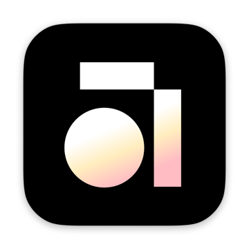

<p align="center">
    <a href="https://doc.anytype.io">
        
    </a>
</p>

# Contributing to the Anytype Docs

ℹ️ Please read our [Code of Conduct](https://github.com/anytypeio/community/blob/main/README.md#code-of-conduct) before contributing.
You are welcome to propose changes in a pull request and to join the discussion in the
[Improvements for doc.anytype.io](https://community.anytype.io/t/improvements-for-doc-anytype-io/2862) topic.

The site is built with [Astro Starlight](https://starlight.astro.build/). Pages are
plain Markdown with a small YAML frontmatter block.

## Contribution process

1. Fork this repository and create a branch from the latest `main`
2. Make your changes (`npm install && npm run dev` for a live preview at `localhost:4321`)
3. Check the site still builds: `npm run build`
4. Open a pull request

## File structure

* English pages live in `src/content/docs/`; translations live in
  `src/content/docs/es/` and `src/content/docs/fr/` at the same relative paths.
  Untranslated pages automatically fall back to English.
* A folder's landing page is its `index.md`.
* Navigation is defined in [`sidebar.mjs`](sidebar.mjs) — add new pages there
  (with a `translations` entry if the title is translated).
* Images live in [`public/assets/`](public/assets) and are referenced with
  absolute paths: ``.

## Conventions

Every page starts with frontmatter, and the page title comes from it (don't add
an `# H1` to the body):

```md
---
title: "Vault"
---
```

Standard Markdown applies elsewhere. Callouts use
[Starlight asides](https://starlight.astro.build/guides/authoring-content/#asides):

```md
:::note
Helpful information.
:::

:::tip
A success message or handy trick.
:::

:::caution
Warning — read before proceeding.
:::

:::danger
Destructive or irreversible actions.
:::
```

Videos are embedded with the site's responsive wrapper:

```html
<div class="video-embed"><iframe src="https://www.youtube-nocookie.com/embed/VIDEO_ID" title="Video" allowfullscreen loading="lazy"></iframe></div>
```

### Media guidelines

* **Images:** PNG or JPG; **videos:** MP4. Keep files under **5 MB** —
  1000px-wide media is plenty legible.
* **Naming:** use human-readable, kebab-case names:

  ```
  ✔️ loading-screen-intro.png
  ❌ Screenshot 2021-11-05 at 18.45.31.png
  ```

* All media should be captured in light mode.
