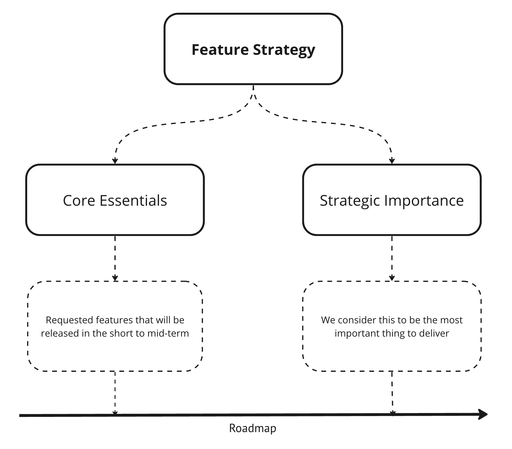
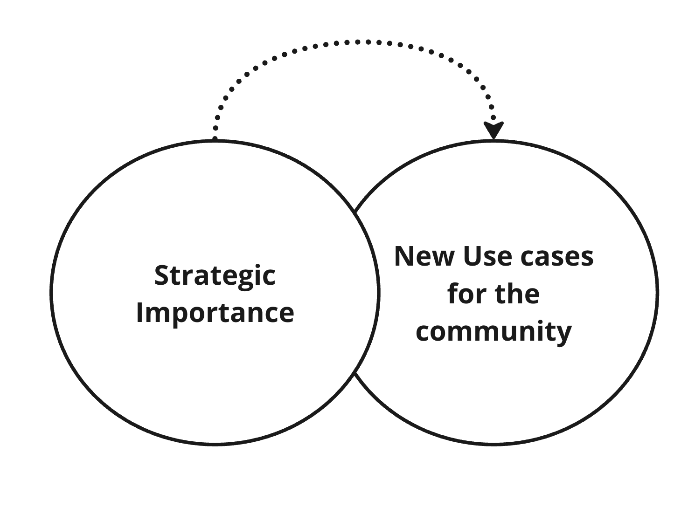

# Product Workflow

### Why we build what we build

The community has been the cornerstone of our work since Day 1. Today, we will attempt to open the product processes behind Anytype. This will be the first step and we hope to continue it in the future with more details if it is deemed valuable to the community.

_There are always two critical questions regarding product work:_

<figure><figcaption></figcaption></figure>

Before jumping to these ones, let's cover the basics.

### Work process

* Our year is divided into three seasons. Our aim is to have two-three releases per season.
* Product team has two parts for each season: delivery and discovery.
* During delivery, we focus on executing our plans, while in discovery, we gather insights for future planning.

<figure><figcaption>
Scheme of year planing process
</figcaption></figure>

### Discovery ⟶ Delivery

The discovery process is typically behind the scenes, but it's crucial part since only during this part we can understand `What? Why? How?` .

During the planning for each season, we consider two types of features:

<figure><figcaption></figcaption></figure>


On our [public roadmap](https://github.com/orgs/anyproto/projects/1), you can find the features that have been delivered or have gone through the discovery process and are due to be delivered.


**Strategic importance**

* Multi-spaces, with any level of work granularity
* Multiplayer and truly secure collaboration between people
* Experience library and community use cases
* Files as an object as new dimension of file work
* Log in process and account security

<figure><figcaption></figcaption></figure>

### We hear you!

Things that will be covered based on the community requests:

* [Calendar & Timeline views](https://community.anytype.io/t/calendar-timeline-views/1576/35)
* [Make “toggle” a feature of every block instead of/in addition to a block type](https://community.anytype.io/t/make-toggle-a-feature-of-every-block-instead-of-in-addition-to-a-block-type/1001/1)
* [Automatic Bi-directional linking + Rollups](https://community.anytype.io/t/automatic-bi-directional-linking-rollups/1600/46)
* [Support for inline creation and display of sets](https://community.anytype.io/t/support-for-inline-creation-and-display-of-sets/1527)
* [Web Clipper](https://community.anytype.io/t/web-clipper/993/26)
* [Open and modify attached files directly instead of downloading them](https://community.anytype.io/t/open-and-modify-attached-files-directly-instead-of-downloading-them/1003/1)
* [Notification System: Larger Proposal for Discussion](https://community.anytype.io/t/notification-system-larger-proposal-for-discussion/1024/1)
* [Add a “sidebar” for viewing/editing multiple pages at once / ](https://community.anytype.io/t/add-a-sidebar-for-viewing-editing-multiple-pages-at-once/978/12)[Add Tabs to show multiple pages](https://community.anytype.io/t/add-tabs-to-show-multiple-pages/1455/1)
* [Share menu on mobile apps](https://community.anytype.io/t/share-menu-on-mobile-apps/1271/21)
* [Deeplinking](https://community.anytype.io/t/deeplinking/4651/21)
* [Widgets for Mobile Devices](https://community.anytype.io/t/widgets-for-mobile-devices/1593/1)
* [Custom Storage Location](https://community.anytype.io/t/custom-storage-location/994/13)
* [Voice Recorder](https://community.anytype.io/t/voice-recorder/2363/1)
* [Ability to simultaneously edit Relations for multiple objects in a Set](https://community.anytype.io/t/ability-to-simultaneously-edit-relations-for-multiple-objects-in-a-set/1574/17)
* [Ability to insert Relations Inline with text](https://community.anytype.io/t/ability-to-insert-relations-inline-with-text/1535/15)

…_And much more!_
