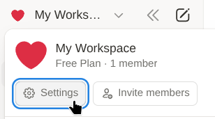
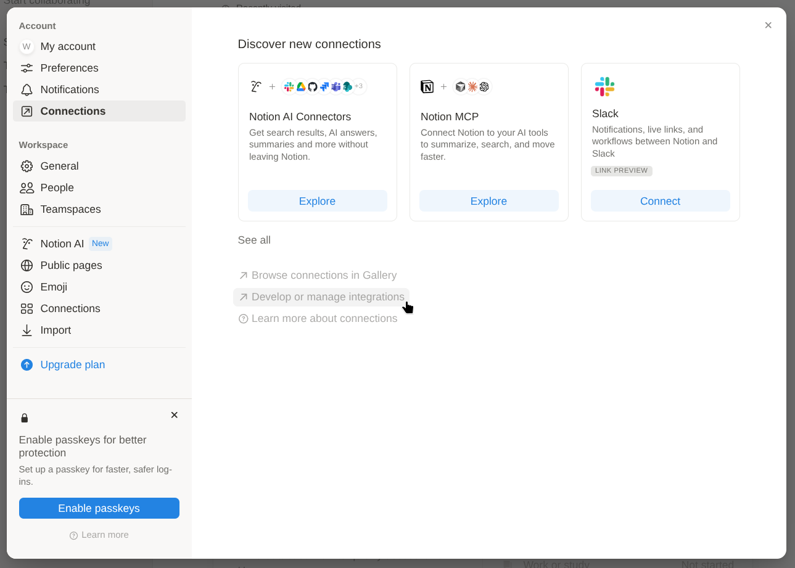
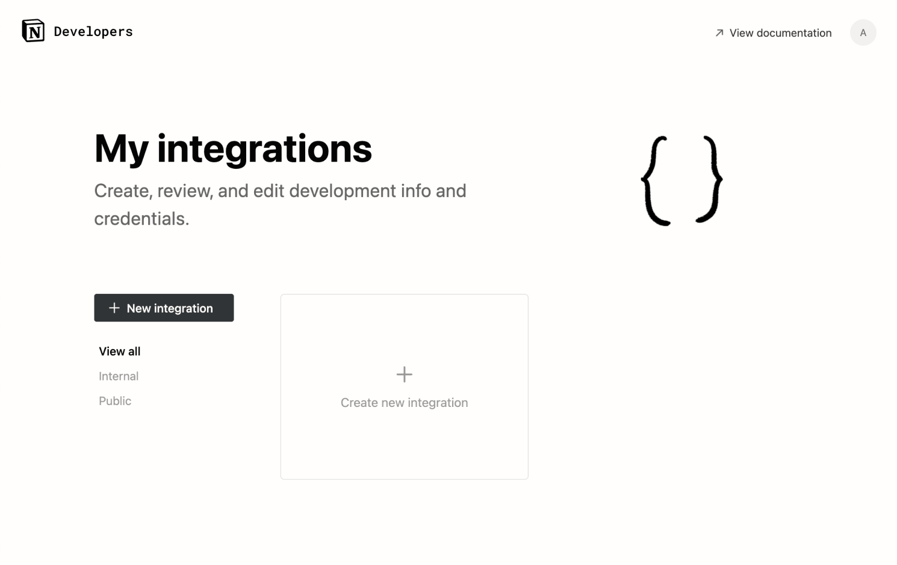
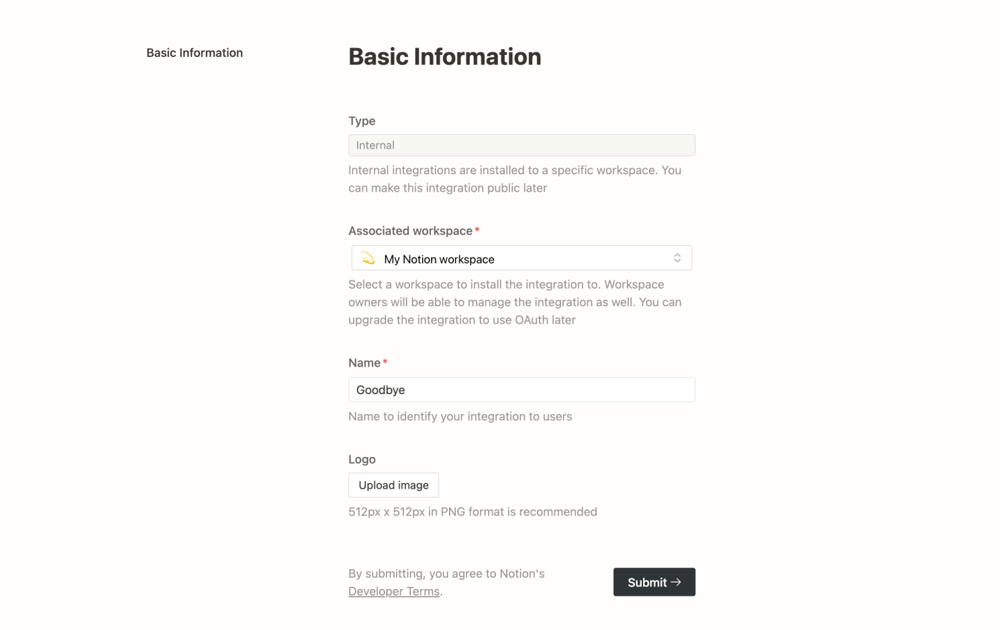
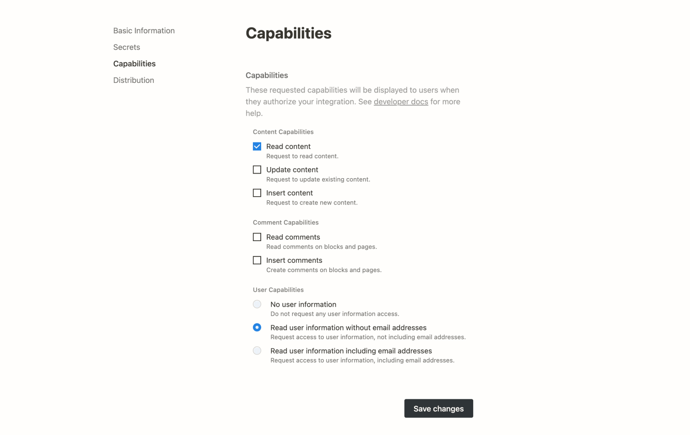
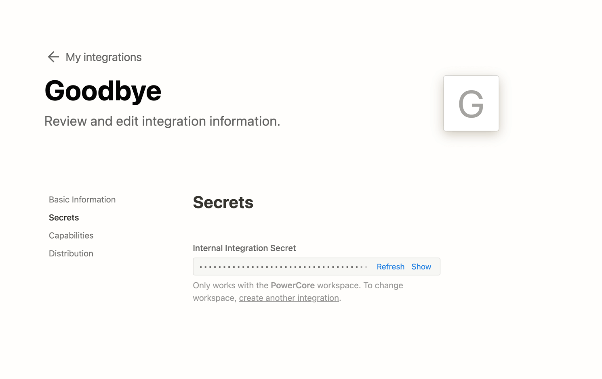
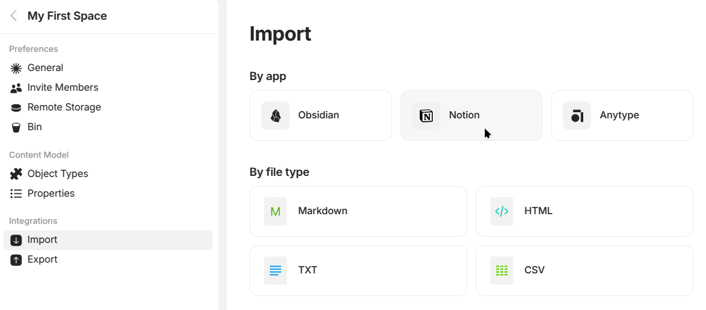
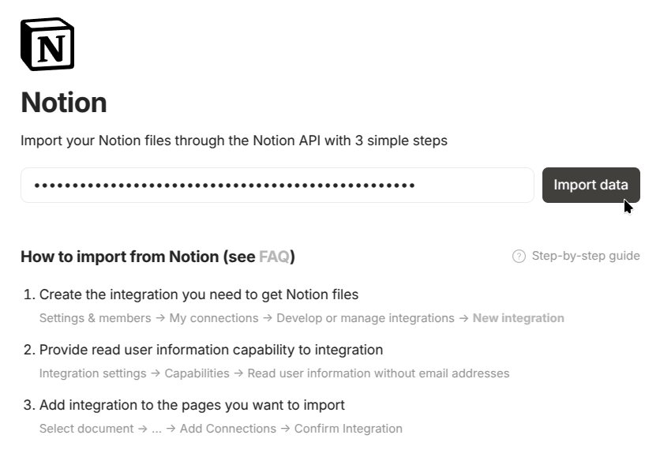

# Migrate from Notion

### Steps

**Step 1**

1.  **Open Settings & members.**\

    <figure><figcaption></figcaption></figure>
2.  **Open My Connections and then click Develop or manage integrations.**\

    <figure><figcaption></figcaption></figure>
3.  **Click New integration or Create new integration.**\

    <figure><figcaption></figcaption></figure>
4.  **Select your workspace and set a Name for the integration.**\

    <figure><figcaption></figcaption></figure>
5. **Important!**\
   Go to **Capabilities** and select the following capabilities, then press **Save changes**:

* Read content
*   Read user information\

    <figure><figcaption></figcaption></figure>

6.  **Copy Internal Integration Secret** for connecting and importing your data.\

    <figure><figcaption></figcaption></figure>

**Step 2**

**Add the integration to the pages you want to import into Anytype.** Pages will be imported with all children documents.

1.  **Click on the three dots in the upper right corner, then click Connect to (you may need to scroll the menu).** Select your Anytype integration.\

    <figure><figcaption></figcaption></figure>
2. **Ensure you select all root pages** to avoid broken links in Anytype after the import.
3.  **Add the Integration to each page's connection** to ensure that the pages and their linked content are imported correctly.\

    <figure><figcaption></figcaption></figure>

**Step 3**

**Finalize the import and ensure a smooth process:**

1. **Paste your Internal Integration Token into Anytype.**
2. **Prepare for a smooth import:**

* Use a good internet connection, especially if you have a large number of files.
* Keep your computer plugged into power.
* Disable sleep mode on your computer to allow the import process to complete without interruptions.


Some Notion data may **not be imported correctly** as not all Notion features are supported in Anytype.


### FAQ

Why wasn't some Notion data imported correctly?

As not all Notion features are supported in Anytype, we cannot guarantee that all Notion data will be imported correctly.&#x20;

Examples:

* User mentions (@) will be converted to plain text.
* Date ranges are imported as text.
* Formulas & summary data are imported as values.

Why do I see "page not found" instead of links after importing from Notion to Anytype?

This issue occurs when you have links to pages that are not nested within your Notion workspace structure. These pages may not have been properly connected to the integration during the import, leading to broken links in Anytype.

**Solution:**

* **Check Page Connections:** Ensure that all pages in your Notion workspace are connected before starting the import process. If a page is not properly connected to the integration, it may not import correctly. See the Step 2 of the [Notion Import Step-by-Step Guide](migrate-from-notion.md#notion-import-step-by-step-guide) for more details.
* **Repeat the import:** If a page did not import, add a missing Connection and repeat the import.

Why are some files missing after importing from Notion to Anytype?

There are two main reasons for missing files:

* **Missing Connection:** Make sure that the page containing the files in Notion is properly connected to the integration before import. If this connection is missing, the files may not be imported.
* **Slow Internet Connection:** If you have a slow internet connection and a large number of files, the links to these files might expire during the download process, resulting in missing files.

**Solution:**

* **Ensure Proper Connection:** Double-check that all pages and their respective files are connected in Notion before importing.
* **Use a Faster Internet Connection:** If possible, use a faster internet connection during the import process to prevent link expiration.
* **Manually Add Missing Files:** If files are missing after the import, you may need to manually upload them to Anytype.

Why did the Notion import to Anytype take so long?

The import process uses the Notion API to ensure data is transferred as accurately as possible. This method, though more reliable than exporting to Markdown, requires multiple queries. Over time, Notion may start rate-limiting these queries, leading to delays.

**Solution:**

* **Plug in Your Device:** Make sure your computer is plugged into a power source during the import.
* **Disable Sleep Mode:** Prevent your computer from going to sleep to allow the import process to continue uninterrupted.
* **Be Patient:** Allow the import process to run until it completes. It may take some time, especially if there is a large amount of data.

I have some other problem with Notion import, or I no longer have access to my Notion workspace

If you encounter issues with the Notion import (which works via the Notion API) or you lose full access to your Notion workspace, you can export your workspace from Notion as Markdown & CSV files and import them into Anytype using the Markdown import option.

Be aware that importing via Markdown & CSV files is more lossy compared to using the Notion API. This is because Notion’s way of linking documents and CSV files may not be fully preserved in the Markdown format, potentially leading to loss of structure or links between documents.

**Solution:**

* **Export from Notion:** In your Notion workspace, export your data as Markdown & CSV files.
* **Import into Anytype:** Use Anytype’s Markdown import feature to bring the exported content into your Anytype workspace.

