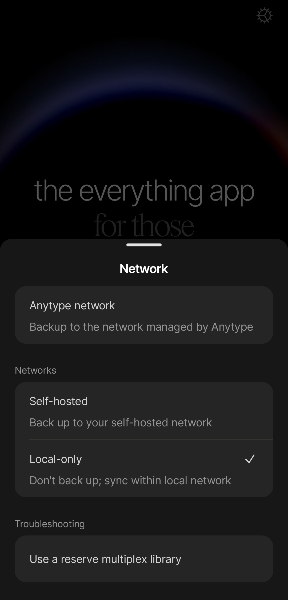

# Local-only

If you don't want to use any backup solutions at all, you can use our local-only mode. This will disable the backup node completely, and you will only be able to sync between your devices if they are connected to the same local network. Regularly exporting your spaces or backing up your work directory is recommended if you decide to use this mode since your data is not backed up anywhere else.

### How to switch to local-only mode

#### Desktop

1. Log out from your current identity.
2. On the onboarding screen, click a gear icon in the top right corner.
3. In the “Network” field choose the “Local-only” option.
4. Click the “Save” button.
5. Create a new identity or log in with an existing one.

<figure><figcaption></figcaption></figure>

#### Mobile

1. Log out from your current identity.
2. On the onboarding screen, click a gear icon in the top right corner.
3. Click on “Local-only” in the “Networks” sub-menu.&#x20;
4. Create a new identity or log in an existing one.

<figure><figcaption></figcaption></figure>
