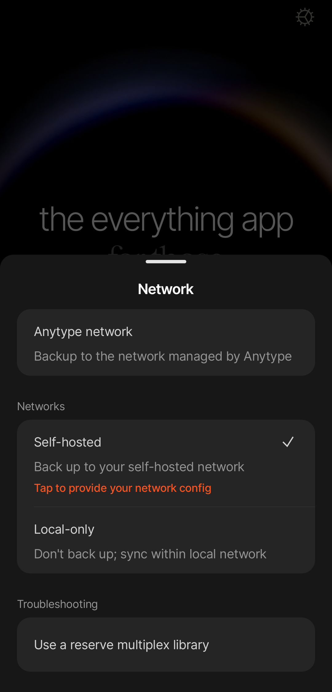

# Self-hosted

To back up your spaces and data to a self-hosted network, you need to have a network configuration. If you don’t run your own network yet, see this [how-to guide](https://tech.anytype.io/how-to/self-hosting). There's also a [docker image](https://github.com/anyproto/any-sync-dockercompose) that's maintained by the team. One of our developers also created this video guide for anyone who want's to set up their own self-hosted network:



### How to switch to a self-hosted network

We strongly recommend using dedicated identities for each network. If you already have an identity in Anytype Network and want to switch to a self-hosted network, export all your spaces, and import them into a new identity after switching the network mode.

Please note that all your devices should be manually switched to the same self-hosted network.

#### Desktop

1. Log out from your current identity.
2. On the onboarding screen, click a gear icon in the top right corner.
3. In the “Network” field choose the “Self-hosted” option.
4. Upload your self-hosted network configuration (\*.yml file) to the corresponding field.
5. Click the “Save” button.
6. Create a new identity or log in with an existing one.

<figure><figcaption></figcaption></figure>

#### Mobile

1. Log out from your current identity.
2. On the onboarding screen, click a gear icon in the top right corner.
3. Click on “Self-hosted” in the “Networks” sub-menu.&#x20;
4. Click on “Tap to provide your network configuration” to upload your self-hosted network configuration (\*.yml file).
5. Create a new identity or log in an existing one.

<figure><figcaption></figcaption></figure>
