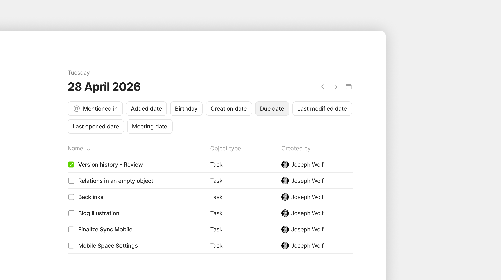

# Dates

### Dates as first-class Objects

In Anytype, **every date is its own Object**. When you mention `@today`, set a Due Date, or open a Calendar view, the dates aren't just text or metadata — they exist as Date Objects in your Channel that you can open, link to, and use as a hub for everything happening on that day.

Click on a date anywhere — a property value, a mention, a calendar slot — and you open the Date Object. You'll see:

* Every Object that mentions this date
* Every Object created on this date
* Every Object whose Date Property points to this date
* Discussion posts and Chat messages timestamped to this date

This makes the Date Object a **temporal index** — a single page that shows you everything connected to a specific point in time.

<figure><figcaption></figcaption></figure>

### Three ways dates appear

Dates show up in Anytype in three forms:

#### 1. Mentions in text

You can type `@date` or `/date` to open the date picker and select date (or choose **Today**).

The mention appears as a clickable date — click to open the Date Object.

#### 2. Date Properties

You can add a Date Property to any Type — Due Date, Started On, Published, Last Reviewed, Birthday. The Property accepts a date (and optionally a time):

* **Date only** — useful for due dates, birthdays, deadlines
* **Date and time** — useful for meetings, events, time-stamped logs

Click the Date Property value on an Object to open the date picker and change it.

#### 3. Automatic date Properties

Every Object has built-in date Properties Anytype manages automatically:

* **Created Date** — when the Object was first created (immutable)
* **Modified Date** — last time the Object was edited
* **Last Opened** — last time you viewed the Object (per device)

You can show or hide these in any View, filter by them, sort by them, and reference them in formulas.

### Date as Object: what's there

Open any Date Object — by clicking a mention, a date Property, or a calendar slot — and you see:

* **Mentions of this date** — every text mention of `@thisdate` across your Channel
* **Objects with this date as a Property value** — every Object whose Due Date, Started, etc. equals this date
* **Objects created on this date** — auto-grouped by Created Date
* **Objects modified on this date** — auto-grouped by Modified Date

Each section is a list you can scan or click into. You can also add notes directly to the Date Object — write a daily journal entry, add a top-of-day plan, log meeting notes — all attached to that day forever.

### Calendar view

Any Query or Collection can switch to **Calendar view** if it includes a Date Property. Click the layout switcher and choose **Calendar**:

* Objects appear on the date matching their selected Property
* Click an Object to open it
* Click an empty calendar slot to create a new Object on that date
* Drag Objects between dates to update their Date Property

You choose which Property powers the Calendar in the View settings — for example, a Tasks Calendar might use **Due Date**, while a Journal Calendar uses **Created Date**.

### Locale-aware date inputs

Date fields in filters and pickers respect your operating system's locale. If your system uses MM/DD/YYYY, that's what you'll see. If it uses DD/MM/YYYY, you'll see that instead.

You can also set this manually in **Vault Settings > Application > Language & Region > Date & Time formats**.

The same setting controls:

* Date format (DD/MM/YYYY, MM/DD/YYYY, YYYY-MM-DD, etc.)
* Time format (12-hour or 24-hour)
* Whether to use relative dates (today / tomorrow) or always show the literal date
* Week start day (Sunday or Monday)

### Tips


**Use Date Properties for project timelines.** A project Object with Started, Target, and Completed Date Properties lets you build a timeline View that updates as work progresses.

