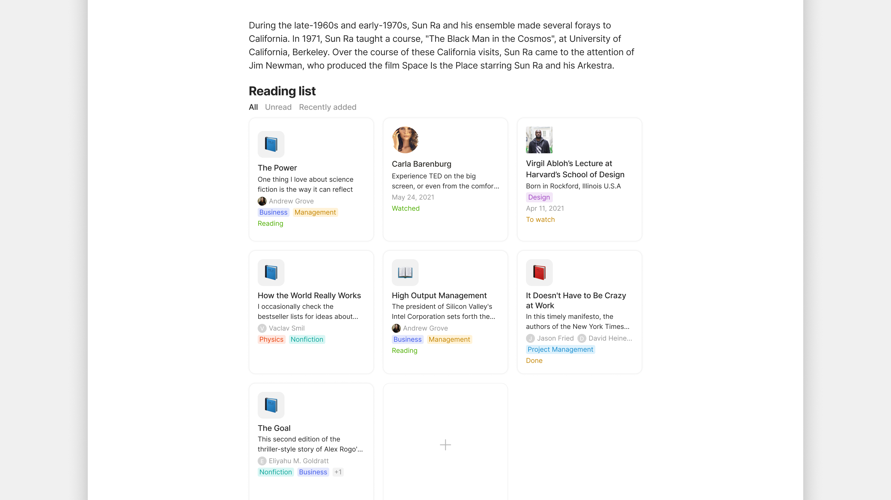

# Inline Lists

### What is an Inline List?

An **Inline Query** (or **Inline Collection**) is an embedded Object inside another Object. Instead of opening a separate Query as its own page, you display the Query's results directly in the editor — alongside your text, images, and other blocks.

The Query stays live: as Objects are added, modified, or removed in your Channel, the inline display updates automatically.

<figure><figcaption></figcaption></figure>

### Why it matters

Inline Queries and Collections turn ordinary pages into **dashboards**. A project page can show:

* A list of all open tasks for that project
* A gallery of related documents
* A status board grouped by progress
* Recent activity from team members

…all rendered live, all in one Object. You don't have to click into a separate Query page to see what's happening — it's right there.

### Creating an Inline Query

#### Method 1: Embed an existing Query

If you've already created a Query you want to show in another Object:

1. In the editor, type `/inline`.
2. Choose **Inline Query** from the menu.
3. Search for the existing Query by name and select it.
4. The Query renders inline using the default view from the source.

#### Method 2: Create a new inline Query from scratch

If you want a one-off Query that lives only inside this Object:

1. Type `/inline`.
2. Choose **New Inline Query**.
3. Pick the source: **Query by Type** or **Query by Property**.
4. Configure filters and sort as you would for any Query.
5. The new Query is saved as a standalone Object too — you can find it in the sidebar and reuse it elsewhere.

You can also embed an Inline Collection the same way — useful for manually-curated lists embedded in a project page.

### Customizing an Inline Query view

Click the inline Query block to focus it, then use the standard Query controls:

* **Layout** — switch between Grid, List, Gallery, Board, Calendar, Graph
* **Properties** — toggle which columns or fields show
* **View-level filters** — add filters that apply only to this inline display
* **Sort** — within this view's results
* **Grouping** — for Kanban view, choose the property to group by

These changes are saved to the inline block, not back to the source Query.

<figure><figcaption></figcaption></figure>

### Dynamic filter values

Inline Queries pair beautifully with [dynamic filter values](advanced-filters.md). Two especially useful values:

* **Current User** — filters Objects by who's viewing. Embed the same `Tasks where Assignee = Current User` Query in a shared dashboard, and every member sees their own tasks.
* **This Object** — filters Objects related to the Object containing the inline Query. Embed `Tasks where Project = This Object` in a Project Object, and the Query automatically scopes to that project. Move the same Object to a different Project, and the inline Query updates.

This means you can build a single Project template with an inline `Tasks for This Object` Query and reuse it for every project — no manual filter setup per project.

### Multiple inline Queries on one Object

You can put as many inline Queries as you want on a single Object:

```
# Today

[Inline Query: Tasks where Status = In Progress AND Assignee = Current User]

# This week

[Inline Query: Notes where Created in last 7 days]

# Reading

[Inline Query: Books where Status = Reading]
```

Each Query block is independent. They render side by side, refresh in real time, and let you build a personal "command center" page.

### Tips


**Build a daily homepage with inline Queries.** Set this Object as your Channel Homepage (Channel Settings > Preferences > Homepage). Every time you open the Channel, you see today's view.



**Use This Object filtering for templates.** A Project template with an inline `Tasks where Project = This Object` Query becomes a dynamic project hub for every project you create from the template.



**Mix Inline Collections and Queries.** Use an Inline Collection for "things I manually want here" (curated reading list, key references) and Inline Queries for "things matching criteria" (active tasks, recent edits). The combination is powerful.

