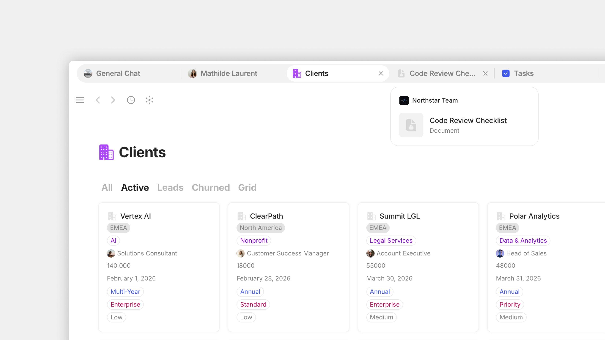

# Tabs

**Tabs** let you keep multiple Objects open at once in the same window — just like in a browser. Each tab is one Object. Click between tabs to switch instantly without losing your scroll position or your edit cursor.

<figure><figcaption></figcaption></figure>

Most knowledge work involves jumping between things — a note while you're editing a doc, a task while you're in a meeting, a reference while you're writing. Tabs make this fluid:

* **Keep context open** — read your notes in one tab, write the report in another
* **Compare side by side** — open two related Objects and reference them simultaneously
* **Stack work in progress** — open every Object you're touching today, close them as you finish
* **Restore your session** — open tabs come back when you relaunch the app

## Opening a tab

There are several ways to open an Object in a new tab:

| Method                                      | When to use                                                   |
| ------------------------------------------- | ------------------------------------------------------------- |
| **Cmd/Ctrl + Click** an Object link         | Quickest — works on any link in the editor, sidebar, or Graph |
| **Right-click an Object > Open in new tab** | When you're already in a context menu                         |
| **Middle-click** (on three-button mice)     | Same as Cmd/Ctrl + Click                                      |
| **Cmd/Ctrl + T** in the tab bar             | Opens a new tab                                               |

## Display modes

Open **Vault Settings > Application > Preferences** and look for **Tabs** to choose:

* **Contextual** — the tab bar only appears when you have more than one tab open. With a single tab, you see the full editor surface (recommended for most users)
* **Always visible** — the tab bar is always on screen, even with one tab. Useful if you frequently switch between contexts and want the bar's actions always at hand

## Using tabs

### Focus mode

You can create your own [focus mode](../../basics/sidebar/#focus-mode) with the 'Toggle Vault & Channel Sidebar' [keyboard shortcut ](../settings/keyboard-shortcuts.md)to hide both sidebars at the same time. This mitigates distractions and stops you from navigating away from your active tab.&#x20;

<figure><figcaption></figcaption></figure>

### Reordering tabs

Drag tabs left or right to reorder them. The order persists between sessions.

### Pinning tabs

Important tabs you want to keep around can be **pinned** — they shrink to icon-only, move to the left side of the tab bar, and don't disappear when you close other tabs.

To pin a tab:

1. Right-click the tab.
2. Choose **Pin**.

To unpin, right-click again and choose **Unpin**.

Pinned tabs survive app restarts and stay pinned even if you accidentally try to close them (the close button is hidden for pinned tabs — you have to unpin first).

### Drag a tab out to a new window

To move a tab to its own window:

1. Click and drag the tab downward, away from the tab bar.
2. Release to drop it as a new window.

The Object now lives in a separate window. This is especially useful with multiple monitors — keep your task tracker on a second screen while editing on your primary one.

### Restoring tabs after a relaunch

When you quit Anytype and reopen it, your tabs come back the way you left them — same Objects open, same order, same active tab.&#x20;

## Tips


**Pin your daily-driver Objects.** Pin your "Today" page, your active project, and your inbox as the leftmost tabs. They're always one click away and survive restarts.



**Use Cmd/Ctrl + Click in the sidebar instead of regular click.** This builds a habit of keeping your current context open while you peek at something else — far less disruptive than navigating away.

