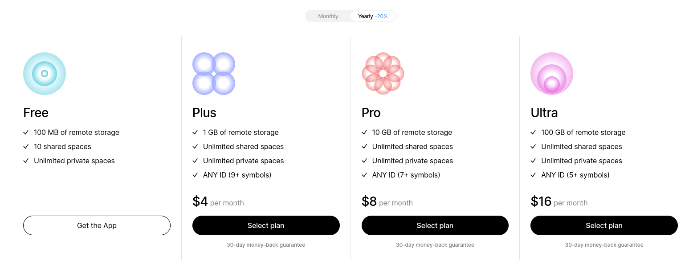

# Memberships

Our memberships are designed to reflect the same core principles that have always guided Anytype’s development: unrestricted access to our software and an open ecosystem where contributions are fairly rewarded.

For more information about the philosophy behind our membership and its planned evolution, please visit this blog post: [Our Membership Philosophy](https://blog.anytype.io/our-memberships-philosophy/).

## Membership Model & Plans

<figure><figcaption></figcaption></figure>

**Free Membership:**

* 100 MB of remote storage
* 10 shared spaces
* Unlimited private spaces

**Plus Membership:**

* 1 GB of remote storage
* Unlimited shared spaces
* Unlimited private spaces
* ANY ID (9+ symbols)

**Pro:**

* 10 GB of remote storage
* Unlimited shared spaces
* Unlimited private spaces
* ANY ID (7+ symbols)

**Ultra:**

* 100 GB of remote storage
* Unlimited shared spaces
* Unlimited private spaces
* ANY ID (5+ symbols)

## Pricing for Contributors

We offer a 50% discount to active contributors to our codebase, gallery, tutorials, and community. Email us at [association@anytype.io](mailto:association@anytype.io) to receive your discount.

If you believe that your contribution status is incorrect, please write us at [association@anytype.io](mailto:association@anytype.io).

## Pricing for Self-Hosters

Self-hosters can manage the limits of Viewers/Editors they invite to their Channels themselves. Those who would like to purchase a name in the Anytype naming system or access priority support, can purchase a membership at the same price as other beta testers.

In the future, we will introduce membership discounts for self-hosters. For those who would like to support the network in the meantime, we welcome your donation [here](https://stripe.pay.anytype.io/b/4gw0337MrdvbejK28f) (thank you!).

### Want to dig deeper into Memberships?

Check out the [#collaboration](../faqs.md#collaboration "mention") and [#memberships](../faqs.md#memberships "mention")FAQs.

## FAQ

### Memberships

What happens to my shared channels if I choose not to renew my membership?

You can choose _not_ to renew your paid membership up to any moment before the membership cycle renews. Please do so by visiting the site of the payment provider you used to pay for your membership (Stripe, App store, Google Play).

**Your global name**

Your name will be released and free for purchase one year or 3 years from when you first purchased your membership, depending on which kind of membership you purchased

**Your spaces**

When you do not renew your membership, all participants of your shared spaces (including yourself) will see a popup notification with two options: _Delete_ or _Export_ the space. Only if participants export the space and re-import it to a new space, will they continue to have access to the space data through Anytype (though changes will no longer be synced).

**Your data**

Encrypted backups of your data will be deleted from the Anytype backup node after 30 days.

What payment methods can I use?

All major credit cards are accepted. Memberships are priced in USD and will be converted to your local currency using conversion rates on Stripe, if you purchase your membership from the Desktop app.

If you purchase your membership from the iOS or Android apps, payment will be processed by the App Store or Play Store, and prices will be automatically adjusted to your local currency by the respective platform.

What if I want to add additional members to my channel?

In our next iteration of memberships, we will have a tier for B2B and educational use cases, with the option to add up to 20 additional editors per space.

What happens if I exceed the storage &#x26; sync limits?

Your spaces will stop syncing with each other through the backup node and use local sync/storage only.

Is there a student / educational plan?

We offer a 50% discount to anyone who contacts us at [membership-upgrade@anytype.io](mailto:membership-upgrade@anytype.io) using their university-associated email address.

