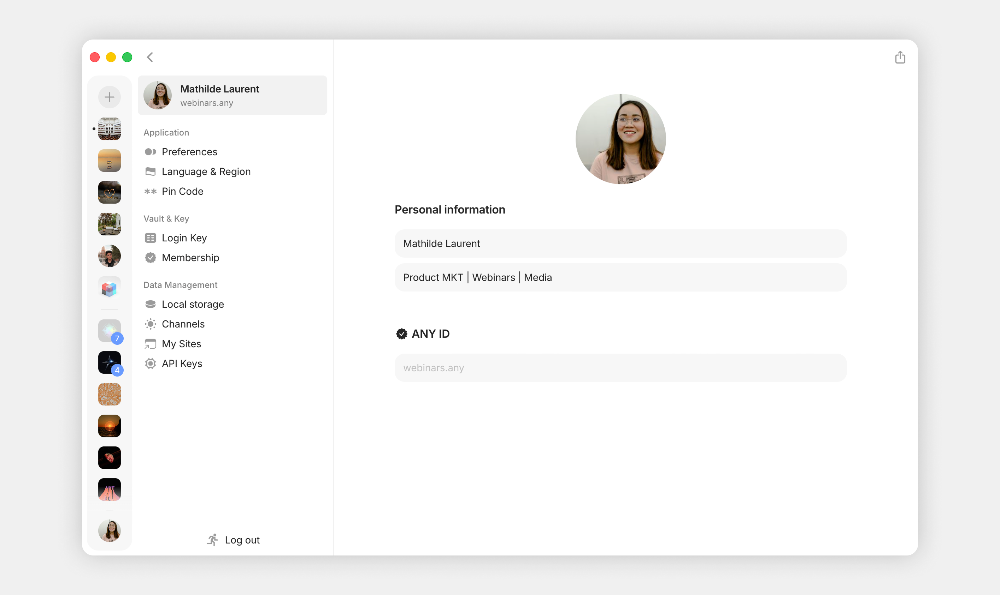
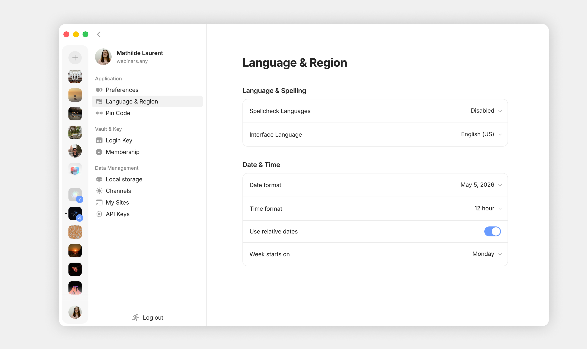
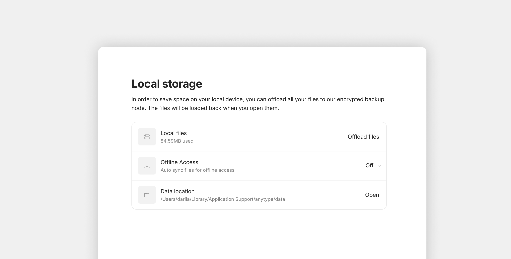
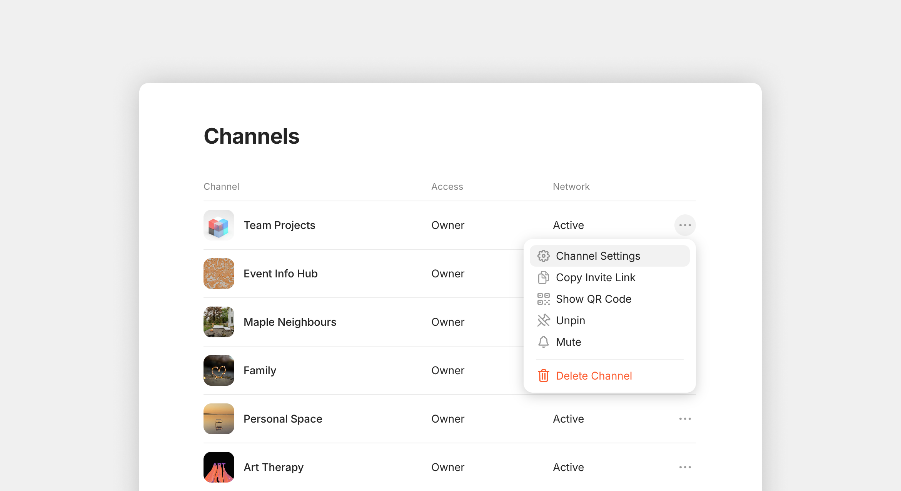

# Vault Settings

You can access your vault settings from one of these 3 places:

* Click on your **Profile picture in the left bottom corner** on the Vault (List of Channels)
* Open **Anytype menu** on the top app bar > **Settings** > **Vault**
* Open **Global Search** > Type "**Profile**"

## Profile

Here you can add your **name, bio,** and **profile picture.** Your profile represents an Object in your Anytype Graph which you can freely link to other Objects.

<figure><figcaption></figcaption></figure>

## Application

### Preferences

<figure><figcaption></figcaption></figure>

#### Appearance

**Set color mode:** Choose between light, dark or auto color modes.

**Notification sound:** "Off" or Choose between a few pleasant tones.

#### Interface

**Channels hub density: Compact** (Stripe view) or with **Messages Previews**

**Always show tab bar:** Choose whether you want the tab bar to always be visible&#x20;

**Automatically show and hide sidebar:** With this option disabled the sidebar won't automatically pop out when you hover over the left side of the screen.

<figure><figcaption></figcaption></figure>

#### Content & Views

**Open objects in fullscreen:** You can decide whether you want all objects to be opened in fullscreen by default or in a modal window

**Object link style:** You can decide which style should the /link command use by default (either card or text)

**File block style:** Choose whether you want the file block to use the embedded style or be displayed as a simple link

**Click to edit title in Grid view:** A lets you choose whether clicking a title in Grid view enters edit mode or opens the Object directly:

<figure><figcaption></figcaption></figure>

#### Messaging

Send messages in Chats / send comments in Discussions with `Enter` or `Cmd+Enter` .

### Language & Region

<figure><figcaption></figcaption></figure>

#### **Language & Spelling**

**Spellcheck Languages:** You can enable automatic spellcheck from 40+ languages, or disable the spellcheck.

**Interface Language:** You can choose amongst the community-translated versions to localize your interface.

#### Date & Time

**Date & Time formats**: Here you are able to choose which date and time formats you want to use across your whole vault.

**Use relative dates:** You can decide whether you want relative dates like today / tomorrow to be used, or whether you want all dates to show the exact date.

**Week starts on**: You can now choose whether your week starts on Sunday or Monday. Head to your updated settings to make the switch in the date-picker.

### Pin Code (Desktop)

If you want more privacy, like when sharing a computer, you can set up a PIN code. This will lock the app and keep your Key safe. You'll just need to enter the PIN each time your Anytype session ends (after 1 minute, 5 minutes, 10 minutes, or 1 hour) or when you need to access your Key.

<figure><figcaption></figcaption></figure> <figure><figcaption></figcaption></figure>


We do not store this data so we cannot help you in recovering your vault in the case it is lost. Make sure to write down your pin code next to your Key.


## Vault & Key

### Login Key

<figure><figcaption></figcaption></figure>

You can access your Key or scan the QR code to connect your mobile device. For more details, please check [key.md](../../basics/key.md "mention").

**Vault Deletion:** Also, if you would like to delete your vault, you can do it in this section.

## Data Management

### Local Storage

<figure><figcaption></figcaption></figure>

**Local Files:** You can choose to offload files stored in Anytype to our Anytype Network.

**Offline Access: Y**ou can choose a storage threshold (Off, 20MB, 100MB, 250MB, 1GB, or Unlimited) to control how much data is auto-synced for offline use.

**Data Location:** You can also decide where your data is stored (desktop only).

### Channels

<figure><figcaption></figcaption></figure>

Here you can find a list of all of your channel, your access roles and their network status.

In the Three-dot menu you can also find the "Invite Link", QR Code, and "Delete Channel" option.

### My Sites

<figure><figcaption></figcaption></figure>

Here you are able to find and manage all objects that you've previously published.

### API Keys

<figure><figcaption></figcaption></figure>

Here you are able to find and manage all API keys that you have you've previously created, as well as to create new ones.
