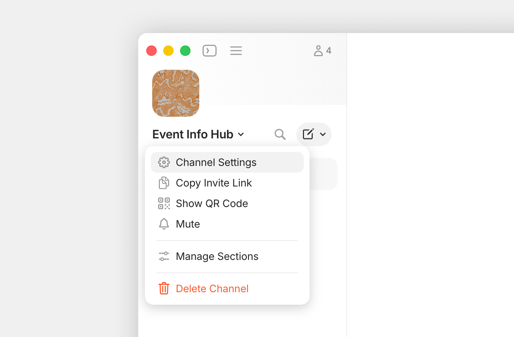
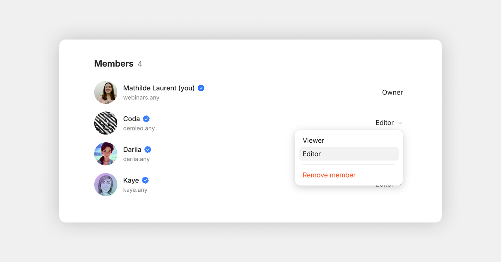
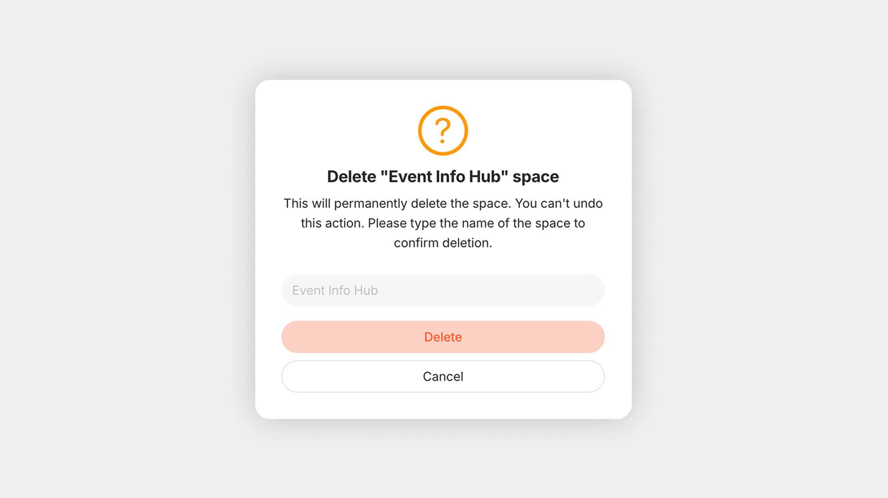

# Channel Settings

Channel Settings is where you control everything about a Channel — its name and icon, who has access, how notifications behave, what loads first when members enter, and how Types and Properties are managed.

To open Channel Settings, click the Channel name at the top of the sidebar (or right-click the channel icon in the Vault).

<figure><figcaption></figcaption></figure>

### Preferences

The **Preferences** section covers your Channel's identity and basic behavior.

<figure><figcaption></figcaption></figure>

#### **Channel name and icon**

Your Channel's name and icon are how it appears in everyone's Vault.

* **Icon** — automatically generated during onboarding. To change it, click the icon and choose from the icon library, pick an emoji, or upload your own image.
* **Name** — Hover over the icon area and click **Edit** in the top-right, type the new name, and click **Save**.

#### **Homepage**

The Homepage is what loads when you (or any member) open the Channel, plus a dedicated **Home** widget is added to your sidebar.

It can be any Object — pick whatever you want members to see first when they enter the Channel.

* **For conversation-focused Channels**, choose a Chat Object as the Homepage so members land in the live discussion.
* **For documentation, wikis, or knowledge Channels**, choose a Page Object — usually a "welcome" or "overview" page that links out to the rest.
* **For project Channels with mixed content**, choose a Collection that brings together everything in scope.
* **Leave it empty** and the last opened Object will load when you re-enter the Channel.

#### **Default Object Type**

Sets which Object Type is used when you create a new Object without specifying a Type (for example, by pressing Cmd/Ctrl + N or clicking the **+** in the sidebar without choosing).

***

### Members

Manage who has access to the Channel and what they can do.

Choose what type of **Invite link** to generate:

* **Editor link** — recipients can join immediately as Editors
* **Viewer link** — recipients can join immediately as Viewers
* **Request access link** — recipients land in a queue; you approve their role

You can also generate a QR code for easy in-person sharing — useful in workshops, meetings, or anywhere people can scan from their phone.

For more on invite types, role permissions, and member management, see [Collaboration](https://app.gitbook.com/s/uI82XLdf1100Q75OKbEQ/collaborate).

#### Member list

<figure><figcaption></figcaption></figure>

The Members tab shows every current member with their role. Owners can:

* Change a member's role (Editor ↔ Viewer)
* Remove a member entirely
* See and approve pending access requests

#### Transfer Channel ownership

Channel ownership can be transferred to another member — useful when team roles change, when a creator leaves, or when consolidating responsibilities.

To transfer:

1. Open the Members tab.
2. Click **Transfer ownership** next to the three-dot in the top right corner.
3. Select the future Owner from the list of members.
4. Confirm.

After the transfer:

* The member will become the new Owner.
* You'll become an Editor.
* Only the new Owner can transfer it again.
* The new Owner's membership limits will apply to this channel.

***

### Notifications

Set the default notification mode for messages in this Channel:

* **Enable all** — every new message produces a notification
* **Mentions only** — only @-mentions trigger notifications
* **Disable all** — no notifications (unread counter still updates, but muted)

Per-Chat and per-Object Discussion settings can override the Channel default.&#x20;

***

### Remote Storage

The Remote Storage tab shows total storage used in this Channel and your remaining storage allowance based on your membership plan.

***

### Content Model

The Content Model tab is the central place to manage your Channel's Types and Properties.

#### **Types**

A list of every Object Type available in this Channel. From here you can:

* Create new Types
* Edit existing Types — change name, icon, layout, default Properties, Templates
* Configure default behavior per Type

For full details, see [Types](../../organize/types.md).

#### **Properties**

A list of every Property defined in this Channel. From here you can:

* Create new Properties
* Edit and add new options&#x20;
* See which Types use Property

For full details, see [Properties](../../organize/relations.md).

***

### Import & Export

<figure><figcaption></figcaption></figure>

The Integrations tab covers everything related to bringing data in and out of the Channel:

* **Import** — bring data in from Notion, Evernote, Obsidian, or generic Markdown / CSV
* **Export** — back up the entire Channel to Markdown or AnyBlock format

***

### Delete Channel

In shared Channels, only the Owner can delete the Channel. Other members can leave the Channel instead, which removes their access without affecting other members.

<figure><figcaption></figcaption></figure>


**Deleting a Channel is permanent.** All Objects, Chats, Discussions, and history are removed for every member. There is no undo. If you might want the data later, export the Channel before deleting.&#x20;

