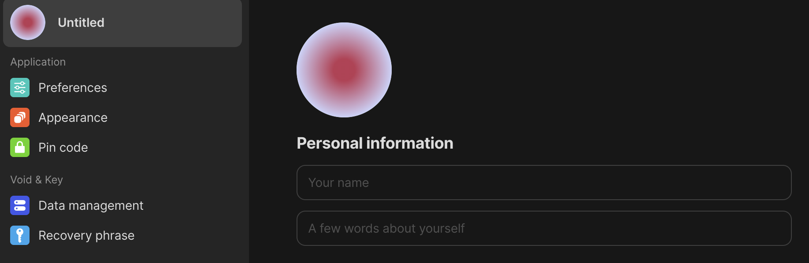

# Account settings

### Profile

Customizing your profile will serve more importance when we introduce what is to come in the future.

For now, you can add your **name, bio,** and **profile picture.**

Also, you can log out from this section.

<figure><figcaption>
Customizing your profile name in account settings — desktop v0.33.3
</figcaption></figure>

### Preferences

**Default object type**. You can choose a default object type (from the default set or your own types) — it defines the type of object that opens up when you create a new object (hitting the plus sign).

**Spellcheck**. Also, you can enable automatic spellcheck from 40+ languages or disable the spellcheck.

<figure><figcaption>
Desktop v0.33.3
</figcaption></figure>

### Appearance

You can set a color mode (light, dark, or system) and enable/disable automatically showing the sidebar:

<figure><figcaption>
Desktop v0.33.3
</figcaption></figure>

### Pin Code

If you need some extra privacy, e.g. while sharing a computer, you can set up a pin code that will lock the app while using and protect your recovery phrase. You will need to enter the pin code each time your Anytype session expires (1 min, 5 min, 10 min, or 1 hour) or if you want to access your recovery phrase:

<figure><figcaption>
After enabling a pin code, you will be able to set up the timeout — desktop v0.33.3
</figcaption></figure>

<figure><figcaption>
Your recovery phrase will be protected with a pin code — desktop v0.33.3
</figcaption></figure>


We do not store this data so we cannot help you in recovering. Make sure to write down your pin code next to your recovery phrase note.


### Data Management

If you want to delete your account, you can do it in this section:

<figure><figcaption>
Desktop v0.33.3
</figcaption></figure>

### Recovery Phrase

You can access your recovery phrase or scan the QR code to connect your mobile device. For more details, please check[recovery-phrase.md](recovery-phrase.md "mention")

<figure><figcaption>
Desktop v0.33.3
</figcaption></figure>
