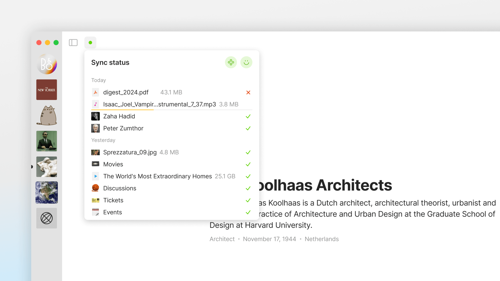

# Space

<figure><figcaption>
An explanation of various primitives inside Anytype
</figcaption></figure>

Inside your Vault, you have **Spaces**. A **Space** is a container for your graph of objects.

Similar to vault, space is an encrypted container. Unlike your Vault - each space has unique access rights - you can decide who has access to each space.


It's currently impossible to recover deleted spaces unless you previously exported them, so be careful when deleting them.


You’re able to create multiple separate spaces (up to 10), each with their own graph of objects, widget sidebar, and later on - privacy settings. You can have up to 3 shared spaces depending on your [membership](../../memberships/monetization/) plan.


Keep in mind that you are currently not able to delete nor share your initial Entry Space.


You can navigate between your existing spaces by using the new spaces sidebar. To create a new space, simply click on the plus button at the bottom of the list.

<figure><figcaption></figcaption></figure>

Use the [space management menu](space-settings.md) at the top of your sidebar to customize your space settings or delete your space.

<figure><figcaption></figcaption></figure>

You can also manage all of your spaces by going into `Settings >` [`Spaces`](space-settings.md).

<figure><figcaption></figcaption></figure>

### Global Sync Status

<figure><figcaption></figcaption></figure>

The old sync status has been updated, and it now shows you the sync status of all of your objects instead of it just showing the sync status of the currently opened object.
