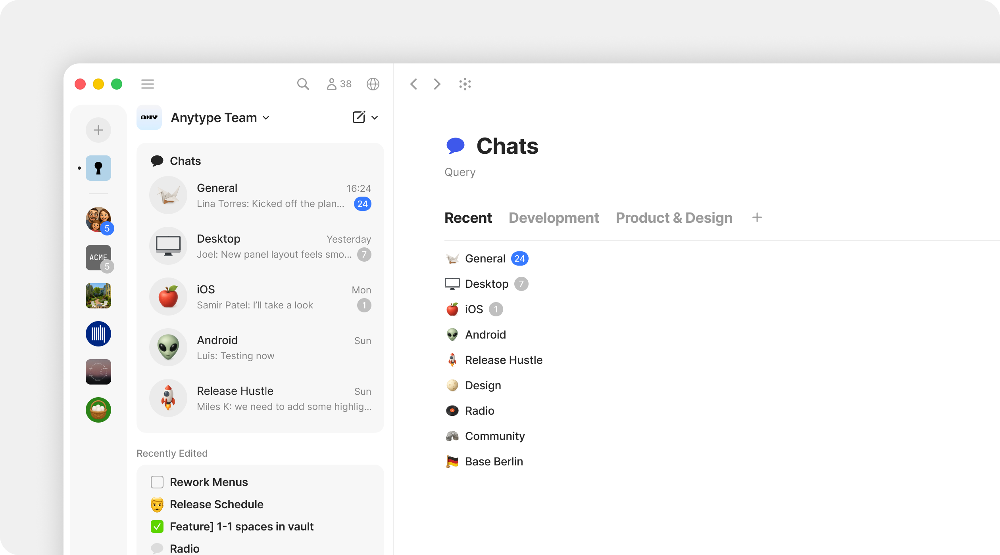
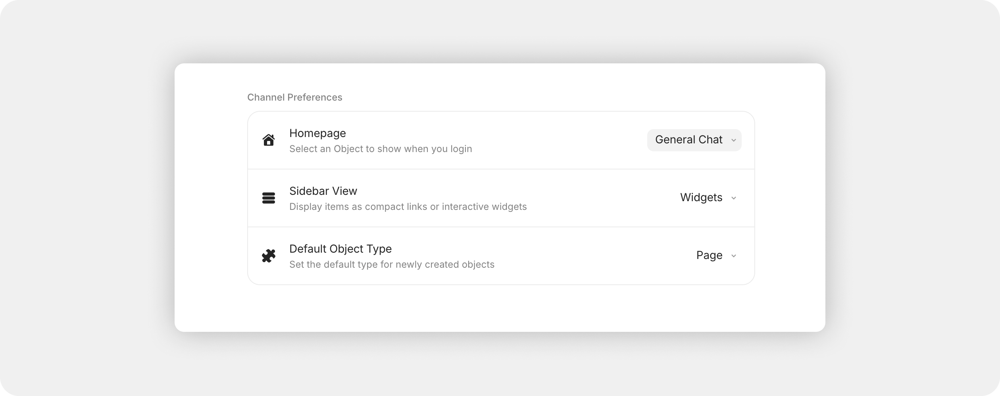

# Chats

A **Chat** is a real-time conversation thread inside a Channel. Unlike messages in a separate app, Chats live alongside your notes, tasks, and documents — discussions stay private, encrypted, and contextually linked to the work they're about.

Chats give you the rhythm of a messaging app — quick replies, reactions, file shares — but with a twist: every message can reference, create, or open Anytype Objects. A typed thought becomes a Page; a screenshot becomes a File Object; a question can be answered with an Object link that opens in a click.

## Why it matters

Conversations are where most knowledge starts — the question you asked your teammate, the screenshot you sent, the link you pasted. In most workflows, this all gets lost in a separate chat app.

Anytype keeps it together: chats live in the same Channel as the work, are searchable from the same search bar, and can be referenced, pinned, and organized like any other content. The conversation isn't separate from the work — it's part of it.

<figure><figcaption></figcaption></figure>

## Creating a Chat Object

#### From the sidebar

1. Click the **+** dropdown.
2. Choose **Chat**.
3. Name the Chat.

#### From the Type section

1. Open Chats in the Sidebar.&#x20;
2. Click **+ New Object.**
3. Name the Chat.

## Setting up Chats

#### Chat as a Channel Home

When you create a Channel, you can choose **Chat** as the Home — meaning the first thing anyone sees when they open the Channel is the live conversation.

Chat-Home Channels are great for:

* Team standups and async chat
* Communities and interest groups
* Family or friend Channels
* Work where conversation is primary, with documents as supporting cast

<figure><figcaption></figcaption></figure>

But even in a Page-Home or Collection-Home Channel, you can have one or more Chats — they live in the sidebar like any other Object. See [Creating a Channel](https://github.com/anyproto/docs-new/blob/main/getting-started/creating-a-channel.md).

#### Chat as an Object Type

Chats are **native Objects** in your Channel. This means a Chat:

* Lives in the sidebar's Objects section under the Chat Type
* Can have Tags or other Properties
* Can be included in Collections or Queries
* Can be `@`-mentioned from any Object for cross-referencing
* Has its own settings (name, notifications)

Chat is a system Type, so it doesn't support custom Templates or layout changes. But everything else about Chat behaves like a regular Object Type.

#### Multi-Chats in your Channel

A single Channel can hold multiple Chats — start topic-specific conversations right where the work happens. Examples:

* A team Channel might have separate Chats for #general, #design, #engineering, and a daily standup Chat
* A project Channel might have a Chat per workstream
* A community Channel might have one Chat per topic of interest

Discussions live alongside your notes, tasks, and documentation as part of your knowledge graph. You can `@`-mention a Note from a Chat, link to a Task from a message, or drop a Page directly into the conversation as an attachment card.

#### Chats Widget

The Chats Type Widget works like any other widget in your sidebar:

* Pin it to keep it always visible
* Adjust its appearance (compact, list, etc.)
* Pin individual Chats for quicker access
* Reorder by drag-and-drop

Unlike other widgets, **pinned Chats display counters and mention indicators directly in the sidebar**. This makes the sidebar function like a chat dock — you see at a glance which Chats have new messages or `@`-mentions for you.

#### Unread section

A temporary **Unread** section also appears automatically when new messages arrive in any Chat — listing Chats with unread content. As you catch up, the section shrinks and eventually disappears. Learn more in the [Sidebar](../../basics/customize-and-edit-the-sidebar/sidebar-sections.md) section.&#x20;

## Using Chat

#### Sending messages

The message input lives at the bottom of every Chat. You can send:

* **Text** — typed inline, with full markdown formatting
* **Mentions** — `@` to mention a member or any Object
* **Attachments** — drag in a file, paste an image, or share an Object using the 'plus' button.&#x20;

#### Send Message preference

Choose how messages are sent:

* **Enter** to send (Shift + Enter for a new line)
* **Cmd / Ctrl + Enter** to send (Enter for a new line)

Set this in **Vault Settings > Application > Preferences > Messaging**.

#### Auto-resolve pasted Anytype links

Paste an Anytype Object link into the Chat input and it automatically converts to an attachment card — recipients see a rich preview with the Object's title and Type, and can open it in a click.

#### Reactions

Hover over any message and click the smiley icon to react with an emoji.

When more than one person reacts with the same emoji, you'll see a counter next to that reaction. Click the reaction to add or remove your own.

#### Replies

Right-click a message (or hover and click the reply icon) to reply to it specifically. Your reply quotes the original at the top — recipients see the context immediately and can click the quoted preview to **jump to the original message**.

The scroll-down button takes you back to the reply first, then to the bottom of the chat — so you can navigate replies without losing your place.

#### Pinning messages

You can pin important messages in a Chat:

1. Right-click the message.
2. Choose **Pin**.

Pinned messages appear in a **persistent banner at the top of the conversation**. When multiple messages are pinned, click the banner to cycle through them from newest to oldest.

#### Chat message search

Search inside the active Chat with **Cmd/Ctrl + F** (or click the search icon at the top of the Chat). Results appear in a dropdown sorted by date, with navigation arrows to move through matches one by one.

For Channel-wide search across all Chats and Objects, use the global search (Cmd/Ctrl + K from anywhere).

#### Editing and deleting messages

Right-click your own message (or hover and use the three-dot menu) to:

* **Edit** — message stays in place but is marked as edited
* **Copy text** — copy the message content (with formatting preserved)
* **Delete** — remove the message entirely

You can only edit or delete your own messages. Channel Owners cannot edit other members' messages.

#### File attachments

Drag a file onto the Chat input or paste from clipboard. The file uploads and:

* Becomes a [File Object](https://github.com/anyproto/docs-new/blob/main/getting-started/files-and-media.md) you can find later
* Shows as a preview card in the chat&#x20;
* Is searchable from the global search

For images, the message includes a preview thumbnail. For audio/video, an inline player.

#### Notifications

Per-Chat notification settings let you control how loud each Chat is:

1. Right-click the Chat in the sidebar, **or** click the three-dot menu inside the Chat.
2. Open **Notifications**.
3. Choose:
   * **Enable all** — notifications for every message
   * **Mentions only** — only when you're `@`-mentioned
   * **Disable all** — no notifications (unread counter still updates)

These settings are per-Chat and override Channel-level defaults. See [Notifications](https://github.com/anyproto/docs-new/blob/main/getting-started/notifications.md) for the full picture.

#### Spell checking

Chat messages support spell checking with the same red underline and suggestions as the editor. It uses your existing language settings — no extra setup needed. Configure spellcheck languages in **Vault Settings > Application > Language & Region**.

## Direct Channels

For one-on-one conversations with others, use **Direct Channels** — private chats between two people, with no admin or hierarchy. See [Direct Channels](direct-channels.md) for more information.&#x20;

## Exporting Chats

Chat messages are tied to each member of the space, which are tied to unique encryption keys for each user. When you export a space and import it into a new space, this new space has different encryption keys and space members. Thus, it is not possible to export chat Objects and messages because they are inherently tied to the space itself.

### Tips


**Use multiple Chats for large Channels.** A single team Channel can have separate Chats for general talk, daily standup, project-specific discussions, and announcements. Mute the noisy ones, leave Mentions-only on others.



**Pin the welcome message.** When someone joins a Channel, the first thing they see is the pinned message at the top. Use this to set norms — what the Channel is for, how to engage.



**Drop Objects into Chat to share work in progress** — Note, Task, Page, even another Chat. The Object becomes a clickable attachment card. Recipients can open and edit immediately.



**For Object-specific feedback, use Discussions instead of Chat.** Discussions live on the Object and stay attached forever. Chats are for cross-Object conversations and stream-of-consciousness collaboration. See [Discussions](https://github.com/anyproto/docs-new/blob/main/getting-started/discussions.md).

