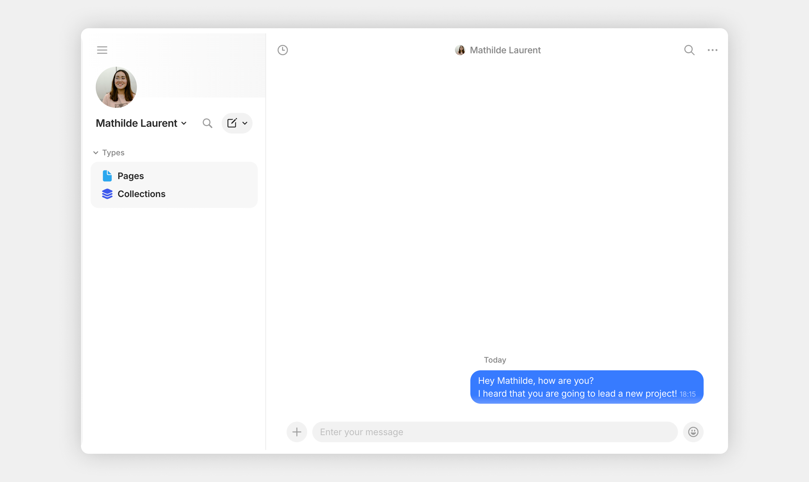
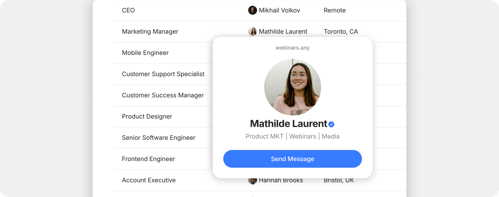

# Direct Channels

### What is a Direct Channel?

A **Direct Channel** is a private, one-on-one conversation between you and another member.&#x20;

Both participants have equal access: there's no admin, no role hierarchy, no permissions to set. It's a place for quick check-ins, a private discussion, creating new Objects, or a side conversation about something happening in another Channel.

<figure><figcaption></figcaption></figure>

### How it works

A Direct Channel is created automatically when you start a conversation with another member. Once created:

* Both members see the Direct Channel in their **Vault sidebar**
* Either member can post messages, share Objects, react
* Both can mute notifications independently

You can have a Direct Channel with any other member — including members of shared Channels you both belong to. The Direct Channel exists separately from those shared Channels.

### Starting a Direct Channel

1. Click any member's profile picture or name (in a Chat, in a Channel members list, or in their @-mention).
2. Click **Send message** in the profile popup.
3. The Direct Channel opens — type your first message and send.

<figure><figcaption></figcaption></figure>

### Notifications

By default, you'll be notified about every message in a Direct Channel. To change this:

1. Right-click the Direct Channel in the Vault, **or**
2. Click the three-dot menu inside the channel.
3. Choose **Mute.**

Each member sets their own notification preferences for the same Direct Channel.

### Leaving a Direct Channel

You can leave a Direct Channel by:

1. Right-clicking it in the Vault.
2. Selecting **Leave Channel**.

When you leave, the channel disappears from your Vault — but the other member's side remains. Any new messages they send won't reach you. If you want to reconnect, you will re-enter the original Direct Channel with them.

To leave permanently and clear all history, you can also delete the channel — but this only deletes your local copy. The other member retains their side.

### Tips


You can't add a third person to a Direct Channel. If a one-on-one conversation needs to expand, create a regular Channel and invite both people.

