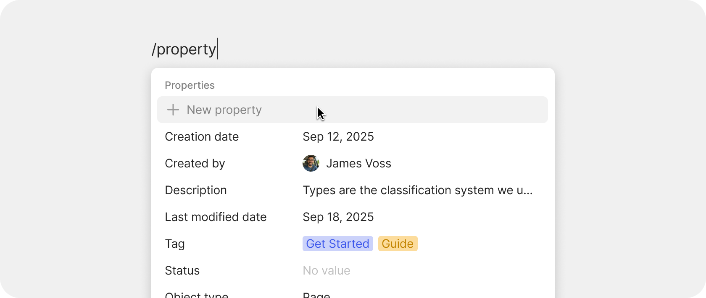

# Block Types

There are many different types of blocks, each serving a unique purpose. Feel free to add and test out as many as you like.&#x20;

<div data-with-frame="true"><figure><figcaption></figcaption></figure></div>

### Text blocks

| Block                          | What it's for                                                                                                                |
| ------------------------------ | ---------------------------------------------------------------------------------------------------------------------------- |
| **Paragraph**                  | Standard text                                                                                                                |
| **Title, Heading, Subheading** | Section structure, also known as headings (H1, H2, and H3)                                                                   |
| **Title**                      | Title of the object                                                                                                          |
| **Quote**                      | Quoted or highlighted text                                                                                                   |
| **Callout**                    | Boxed text for warnings, tips, or notes                                                                                      |
| **Code**                       | Monospaced code with syntax highlighting                                                                                     |
| **Toggle**                     | Collapsible block that hides nested content                                                                                  |
| **Toggled Heading**            | A heading that also toggles its section. See [Toggled Headings](../../advanced/feature-list-by-platform/toggled-headings.md) |

### List blocks

| Block                | What it's for                        |
| -------------------- | ------------------------------------ |
| **Bulleted list**    | Standard bullets                     |
| **Numbered list**    | Auto-numbered list                   |
| **Checkbox / To-do** | Tappable checkboxes for action items |

Press Tab inside a list item to indent it (creating a nested sub-list). Shift + Tab outdents.

### Media blocks

| Block     | What it's for                              |
| --------- | ------------------------------------------ |
| **Image** | Inline image (uploaded or embedded by URL) |
| **Video** | Embedded video player                      |
| **Audio** | Embedded audio player                      |
| **File**  | Generic file with download link            |
| **PDF**   | PDF preview                                |

Drag a file onto the editor to insert it. Each file becomes a [File Object](../../getting-started/files-and-media.md) you can find and reference elsewhere.&#x20;


**Tip:** Use the `/file` shortcut to add an existing image or file that's already in your space into a block. This way, you don't need to re-upload the same file. Instead, upload the file once and re-use it over and over again.&#x20;


### Structural blocks

| Block                 | What it's for                                                                    |
| --------------------- | -------------------------------------------------------------------------------- |
| **Divider**           | Horizontal line separator                                                        |
| **Table of Contents** | Auto-generated from your headings                                                |
| **Table**             | Spreadsheet-style data block                                                     |
| **Columns**           | Created by dragging blocks side by side (no separate "column block" — see below) |

#### Tables

Insert a table block via `/table`. The table starts as a small grid you can extend by dragging the right or bottom edge. Each column can be resized — drag the boundary between two columns to set a custom width. Custom widths are preserved when you export to PDF.

You can also select multiple cells at once:

* Click and drag across cells to select a range
* Apply formatting (bold, color) to the entire selection
* Copy multiple cells to paste elsewhere
* Delete the contents of the selection

### Reference blocks

| Block                 | What it's for                                                                                         |
| --------------------- | ----------------------------------------------------------------------------------------------------- |
| **Link to Object**    | Card or text reference to another Object                                                              |
| **Inline Date**       | Reference to a date in time                                                                           |
| **Inline Mention**    | Inline `@`-style mention to an Object                                                                 |
| **Inline Query**      | Embedded live Query — see [Inline Queries](../../advanced/feature-list-by-platform/inline-queries.md) |
| **Inline Collection** | Embedded Collection                                                                                   |
| **Inline Chat**       | Embedded Chat thread                                                                                  |

### Property blocks

| Block        | What it's for                                           |
| ------------ | ------------------------------------------------------- |
| **Property** | Add an Object's Property as a block in the body content |

Useful for surfacing key [relations.md](../../organize/relations.md "mention") prominently. The Property block stays in sync with the Property's value — change one and all others will update. This enables fancy templates and designs for all of your documents.&#x20;

<div data-with-frame="true"><figure><figcaption></figcaption></figure></div>

### Code blocks

Code blocks support:

* **Syntax highlighting** — pick the language from the dropdown in the block's top-right corner
* **Multi-line indentation** — select multiple lines and press Tab to indent them all, Shift + Tab to outdent
* **Copy** — a copy button appears on hover to copy the entire block to your clipboard
* **Wrap toggle** — long lines can wrap or scroll horizontally

Type ` ``` ` (three backticks) followed by space at the start of a line to convert it to a code block instantly. After creation, click the language dropdown to switch syntax highlighting.

### Embed blocks

See [Embeds](../../advanced/feature-list-by-platform/embeds.md) for the full list — LaTeX, YouTube, Miro, Mermaid, Figma, Excalidraw, and more.
