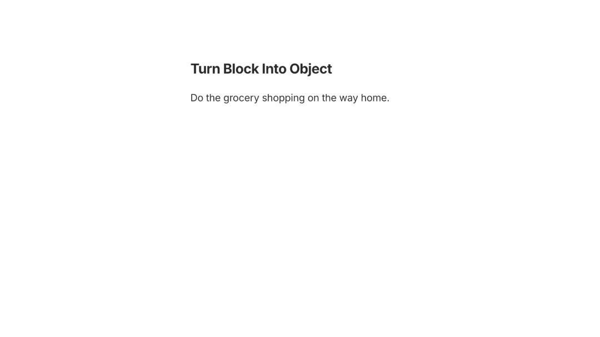

# Objects

In Anytype, everything you create is an Object. A page, task, project, person, image, recipe—all are Objects. If you've used other tools, you might be used to thinking in terms of files and folders in a tree-like hierarchy. But this is not how Anytype works.&#x20;

* **Folders ask "where does this go?"** You must decide if your note falls under the folder Meetings, Clients, or Projects. If you want it in more than one, you have to duplicate your note.&#x20;
* **Objects ask "what does this relate to?"** — Your note exists by itself and you can connect it to your Meetings, Clients, and Projects all at the same time. No duplication.&#x20;

With Anytype, you create an Object and add relationships over time. This builds a flexible system of interconnected knowledge that doesn't care where something is, just cares what it's related to.&#x20;

<figure><figcaption></figcaption></figure>

## Why it matters

Because everything is an Object, everything can connect to everything else. A task can link to a person. A meeting note can link to a project. You're building a graph of interconnected information, rather than sorting files into folder hierarchies.

This means:

* **Everything is easy to find.** A single person can be connected to a company, a project, a meeting, a task, and more—so you can reach them from any of those angles.
* **No duplicates.** Link the same image to multiple documents instead of copying it into each one.
* **Start with creation, not organization.** You never have to decide whether a note belongs under "Work" or "Personal"—it can be both at once.
* **Patterns emerge over time.** As you add more links, connections you didn't plan for start to surface on their own that can reveal insights.&#x20;

## How it works

Every Object has:

* [types.md](../../organize/types.md "mention") that categorizes what kind of thing it is, such as Note, Task, Project, Meeting, etc.
* [relations.md](../../organize/relations.md "mention") that hold its details, such as status, date, author, email, etc.&#x20;
* [linking-objects.md](../linking-objects.md "mention") to other Objects, such as a Recipe connected to a Person.&#x20;

Here is a simple example of how this works:&#x20;

1. You create a **Task**, which is a Type.&#x20;
2. You add a **due date**, which is a Property.&#x20;
3. You connect it to a **Project**, which is a Link. &#x20;

<figure><figcaption></figcaption></figure>

## Create Objects

#### Create Menu

Located at the top of the Sidebar next to the Channel name, is your main creation button used to get content into your space. There are two parts to the button:&#x20;

* **Create Button** — when clicking the 'Create' button, you’ll immediately create a new Object. The default [Type](../../organize/types.md) that is used for your Objects is set from your [Channel Settings](../../advanced/settings/space-settings.md)—by default it is 'Page'.
* **Create Dropdown** — when clicking the 'Create Dropdown' button, the downward arrow on the right, you'll be presented with a menu:&#x20;
  * Types that you'd like to create an Object straight into.&#x20;
  * Create from clipboard
  * Upload from computer

<figure><figcaption></figcaption></figure>

#### Types Section

You can create an Object directly from the Types section of the Sidebar by hovering over the [Type](../../organize/types.md) and clicking on the 'plus' button. Here you will also find Queries and Collections. Please note:&#x20;

* If this section is not showing, please see [Manage Sections](../../basics/sidebar/sidebar-sections.md#manage-sections) to reveal it.&#x20;
* Only Types with at least one Object in them will display in this section. If your desired category is not in the Types section, [use the create menu](./#create-menu) to create one object first, then it will reveal in this section.&#x20;

<figure><figcaption></figcaption></figure>

#### Command Menu

When working in the editor you can type `/` to bring up the command menu. If you already know which Type you want to use, you can just type it directly. If you're not sure which Type you want to use, you can scroll to the 'Types' section to choose.

Objects created this way will leave a block link on the page and set a [backlink](../linking-objects.md) to the newly created object.&#x20;

<figure><figcaption></figcaption></figure>

#### Use a Shortcut

For a quick creation of a new Object, you can use this shortcut: `Cmd/Ctrl + N` —this will perform the same action as clicking the "+" sign in the sidebar. Additionally, you can use `Cmd/Ctrl + Opt/Alt + N`  to perform the same action as clicking the arrow sign in the sidebar.

#### Turn Into Object

If you are working on an existing Object and would like to transform only a certain block into an Object, you can do that through the action menu by:

1. Hovering to the left side of the block that you are working on and clicking the 3 dots.
2. Click **Turn into object** and select your desired [Type](../../organize/types.md).&#x20;

<figure><figcaption></figcaption></figure>

## Locating Your Objects

#### Sidebar

You can now find all your objects in the [sidebar](../../basics/sidebar/ "mention"), grouped by their respective [types.md](../../organize/types.md "mention"). If this section is not showing, please see [Manage Sections](../../basics/sidebar/sidebar-sections.md#manage-sections) to reveal it.&#x20;

<figure><figcaption></figcaption></figure>

#### Search

To navigate to the search, you can:&#x20;

* Head to your sidebar and click on the search button.&#x20;
* Use the `Cmd / Ctrl + K` keyboard shortcut.

<figure><figcaption></figcaption></figure>

#### Graph

To find all of your objects and how they are connected, you can look to the [graph.md](../../advanced/feature-list-by-platform/graph.md "mention") for your main source of truth. When viewing an Object, click on the 'Graph' icon that is located near the back and forward buttons.

<figure><figcaption></figcaption></figure>

#### Bin

If you've previously removed some objects from your [space.md](../../basics/space.md "mention"), they will appear in your [finding-your-objects.md](../../advanced/data-and-security/data-storage-and-deletion/finding-your-objects.md "mention") unless you've already permanently deleted them.&#x20;

You can access you Bin from the Sidebar. If this section is not showing, please see [Manage Sections](../../basics/sidebar/sidebar-sections.md#manage-sections) to reveal it.&#x20;

## Bulk editing Objects

Objects have Types and Properties which are best visualized in [views.md](../../organize/views.md "mention"). To edit multiple objects at the same time, the best approach is to use the Views feature—[see more here](../../organize/views.md#bulk-editing-objects).&#x20;

## Set Default Object

To choose which Type is used when creating an Object by default:&#x20;

1. Click on the Create Dropdown arrow in the Sidebar
2. Hover over your desired Type
3. Click on the 'three dots' button
4. Select the option **Set as default**.&#x20;

Alternatively you can set this in the [Channel Settings](../../advanced/settings/space-settings.md).&#x20;

<figure><figcaption></figcaption></figure>

## Tips


**Use Views to make sense of your Objects.** Because there is no folder hierarchy for Objects, the best way to stay organized is to use [Views](../../organize/views.md).&#x20;

