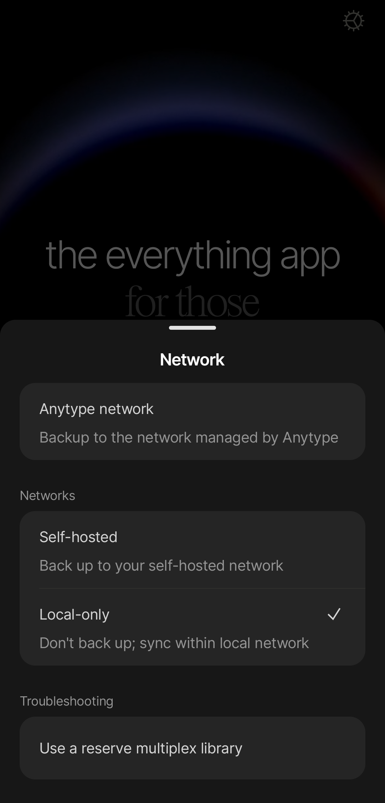

# Local-only

If you prefer to fully keep your data on your device without any server to sync between your desktop and mobile, you can enable local-only mode. This mode disables Anytype's backup node entirely—meaning multi-device syncing will only work over the same local network, and your data lives exclusively on your devices.


**Local-only mode is marked experimental** because manual backup management carries a high risk of accidental data loss. If you choose this mode, ensure you regularly export your data and manage your backups. Anytype has no ability to help you with recovering data loss from local-only mode.


## How it works

Anytype is built on [local-first principles](https://www.inkandswitch.com/essay/local-first/)—designed for people who love the convenience of modern cloud apps, but do not want to sacrifice their privacy, security, and ownership. To understand how local-only is different from local-first:

**Local-Only**

* Storage: Data lives exclusively on your device.
* Syncing: No syncing through a server.
* Risk: If your device breaks or gets lost, your data is gone forever.
* Backups: Entirely manual and your personal responsibility.

**Local-First (Anytype Network)**

* Storage: Data lives on your device and works fully offline.
* Syncing: Syncs automatically across your devices via end-to-end encryption whenever you're connected.
* Privacy: Only you hold the decryption keys—Anytype can never read your content.
* Recovery: If you lose all your devices, you can still restore it via Anytype's encrypted backup node.

In summary, local-only means no syncing with servers. Local-first means it works offline, syncs like a cloud app with end-to-end encryption, and is only accessible to you.

### Should I use local-only mode?

In short: the standard local-first mode using the Anytype Network is the better choice for most people.&#x20;

Anytype is built to be private by default. Because your encryption keys are generated locally and never leave your device, your data is completely inaccessible to anyone else—a design verified in our open-source code. The standard Anytype Network mode gives a fantastic balance between security and convenience.

By contrast, local-only mode offers very little additional security for the average person while dramatically increasing the risk of unrecoverable data loss. Unless your security model strictly requires complete network isolation (such as running on an air-gapped device), we recommend using standard local-first mode by connecting to the Anytype Network.

Use local-only mode at your own risk.&#x20;

## How to switch to local-only mode

#### Desktop

1. Log out from your current identity.
2. On the onboarding screen, click a gear icon in the top right corner.
3. In the “Network” field choose the “Local-only” option.
4. Click the “Save” button.
5. Create a new identity or log in with an existing one.

<figure><figcaption></figcaption></figure>

#### Mobile

1. Log out from your current identity.
2. On the onboarding screen, click a gear icon in the top right corner.
3. Click on “Local-only” in the “Networks” sub-menu.
4. Create a new identity or log in an existing one.

<figure><figcaption></figcaption></figure>

## Recovering data in local-only mode

In Local-Only Mode, your data is 100% your responsibility. Because Anytype has zero access to your device or encryption keys, we cannot assist with recovering lost, deleted, or corrupted data. There are no remote backups stored on our nodes.

**To protect your work from device failure or accidental deletion, you must regularly export and back up your spaces to a secure external location.**


**If you experience data loss in local-only mode, Anytype cannot help with recovery**. You can explore recovery methods based on your setup with at the Anytype community forum or other general forums.



**Do not use network drives or third-party services for sync**—this will likely cause data corruption. [Learn more here](local-only.md#third-party-services-and-network-drives).&#x20;

