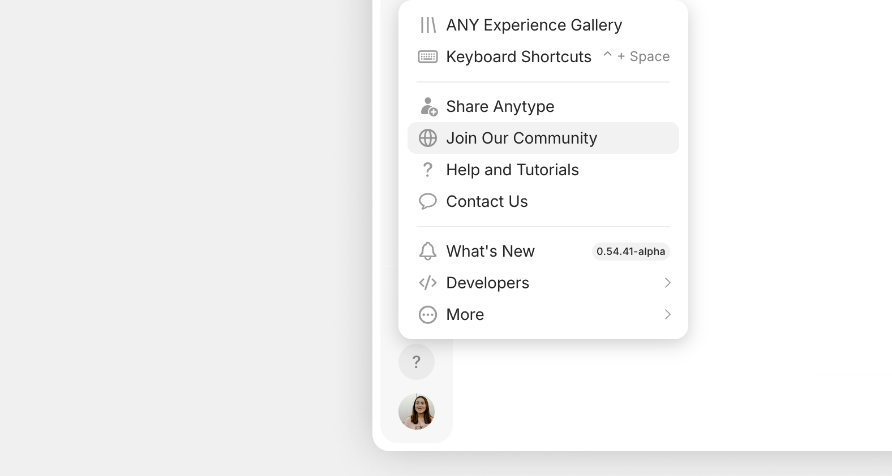

# Foro



En nuestra comunidad de habla inglesa encontrarás diversas **categorías** y **etiquetas** para buscar publicaciones de otras personas que hayan tenido experiencias parecidas a la tuya.

### ¿Cómo puedo formar parte de la comunidad?

Si quieres publicar en la comunidad de Anytype, necesitarás una cuenta.

En la aplicación de escritorio, haz clic en el botón **?** (Ayuda) que aparece en la esquina inferior derecha de la barra lateral, y luego en «[Únete a nuestra comunidad](https://community.anytype.io/invites/sig5xTU4ZZ)».

<figure><figcaption></figcaption></figure>

También puedes ir a la barra de menús de la parte superior de la ventana, debajo de la barra de título, y hacer clic en `Ayuda > Informar de un fallo`.

### ¡A por ellos!

¿Has encontrado fallos o cosas raras? Cuéntanoslo para que lo resolvamos. Queremos tener una aplicación lo más pulida posible.

Cuando vayas a crear un informe de fallo en el foro de la comunidad, se abrirá una plantilla con la información que necesita nuestro equipo para comprender el problema. Por favor, ajústate a ese formato e incluye detalles tan explícitos como puedas.

Una explicación del fallo clara y precisa ayudará a nuestro equipo de moderadores y Nightly Ops a reproducir el problema. De esta forma, sabrán si es un problema generalizado que deben enviar al equipo de desarrollo como prioridad.

 Para ver tu **Información técnica**, abre `Ayuda > Información técnica` en el escritorio o `Perfil > Información > Información técnica` en el móvil. 



### Solicitar y votar funciones

Aquí puedes publicar tus solicitudes de nueva funcionalidad, comentar las que ya estén publicadas y votar por ellas.

Organizamos las prioridades de desarrollo teniendo en cuenta los deseos de la comunidad.

Por eso, si ves algo que te interesa mucho, ¡exprésate y dale tu voto!

Atención: antes de añadir una recomendación, haz algunas búsquedas para ver si ya existe. No querrás ser una de esas personas que…



### ¡Recibe ayuda de la comunidad y el equipo de Anytype!

¿Buscas que alguien te eche una mano para estructurar y usar tu Anytype? Si no encuentras lo que buscas en esta documentación, puedes recurrir a la comunidad y ver si alguien ha hecho preguntas parecidas a las tuyas.

Encontrarás gran cantidad de sugerencias para crear tu estructura e podrás inspirarte viendo cómo usan Anytype otras personas.

¡Es el lugar perfecto para conseguir apoyo o atención si lo que te preocupa no es una solicitud de funcionalidad ni un fallo!



### Envía tus comentarios

¡Nos encanta charlar alrededor de la hoguera día y noche!

Y debatir sobre cualquier cosa relacionada con Anytype.

Cualquier Any-cosa.

Es decir, las que creas que no encajan en ninguna de las demás categorías.

Esta es la categoría en la que puedes publicarlas.

#### Nos encanta conocer tus ideas y comentarios.

Cuéntanos tus primeras impresiones, envía tus opiniones o sugerencias de mejora.

¿Has creado algo en Anytype que quieras exhibir? ¡Compártelo con la comunidad!

Pueden ser plantillas, ideas de organización. casos de uso, diseños, etc.


