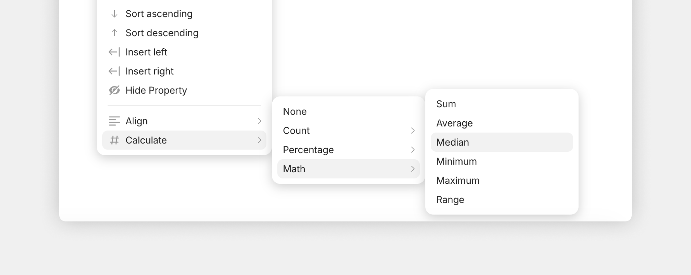

# Formulas

**Formulas** let you summarize and aggregate Property values across the Objects in a Query or Collection. When you're looking at your data in Grid view, you can show counts, sums, averages, minimums, maximums, and other calculations at the bottom of any column.

The result is a row of summary values right under your data — useful for things like:

* Total hours estimated across all tasks in a sprint
* Average rating across all books in your reading list
* Number of in-progress tasks per assignee
* Sum of expenses per category
* Count of Objects of each type

<figure><figcaption></figcaption></figure>

## Where Formulas appear

Formulas live at the **bottom of each column in Grid view**. Each column gets its own formula, so different columns can show different calculations.

To open the formula menu:

1. Open a Query or Collection in **Grid view**.
2. Click on the Property name in the header of a column.
3. Find # **Calculate** in the bottom of the menu.
4. Pick a option.

The result displays in the column footer and updates as your data changes.

<figure><figcaption></figcaption></figure>

## Available formulas

The formulas available depend on the Property type of the column. Here's the full list:

#### For all Property types

|Formula                 |What it calculates                            |
|------------------------|----------------------------------------------|
|**None**                |No formula (default)                          |
|**Count**               |Total number of Objects in the column         |
|**Count  Unique Values**|Number of distinct values                     |
|**Count Empty**         |Number of Objects with no value in this column|
|**Count Not Empty**     |Same as Count Values                          |
|**Percent Empty**       |% of Objects with no value                    |
|**Percent Not Empty**   |% of Objects with a value                     |

#### For Number Properties (Math)

|Formula    |What it calculates      |
|-----------|------------------------|
|**Sum**    |Total of all values     |
|**Average**|Mean value              |
|**Median** |Middle value when sorted|
|**Minimum**|Smallest value          |
|**Maximum**|Largest value           |
|**Range**  |Maximum − Minimum       |

## Limitations

* **Formulas are visual only** — they're shown in the column footer but you can't reference them in another Object or use them in filters
* **No custom expressions** — you choose from the list of available formulas; there's no way to write `column1 + column2`
* **Grid view only** — other layouts (List, Gallery, Board) don't show formulas
* **Per-View** — each View remembers its own formula choice, so a Grid View and a List View of the same Query don't share formulas

For more complex calculations, export the data to CSV and process it externally — or use the [Anytype Agents Skill](https://github.com/anyproto/docs-new/blob/main/getting-started/anytype-agents-skill.md) to run scripts against your data.

## Common patterns

#### Sprint hours estimate

```
Query: Tasks
Filter: Sprint = "Sprint 14"
Property: Estimated Hours (Number)
Formula: Sum
```

#### Reading stats

```
Query: Books
Property 1: Rating (Number) → Formula: Average
Property 2: Pages (Number) → Formula: Sum
Property 3: Status (Select) → Formula: Count by Option
```

#### Project portfolio

```
Query: Projects
Group by: Status
Property: Budget (Number) → Formula: Sum (per group)
```