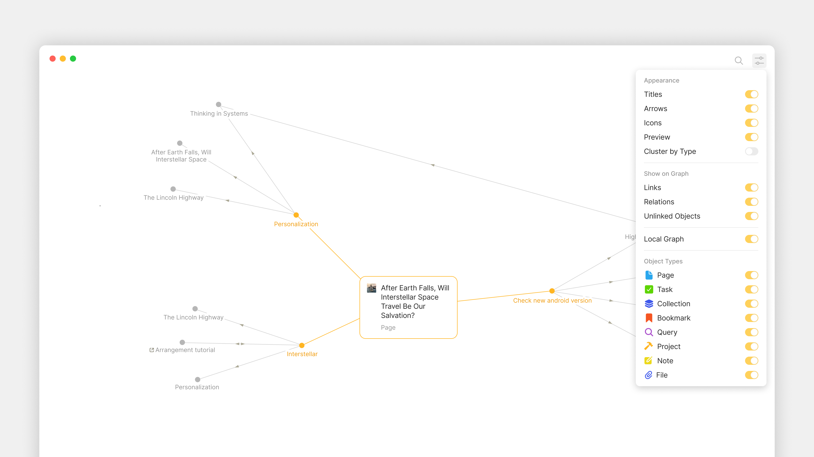

# Graph

The **Graph** is a live, visual map of every Object in your Channel and how they connect to each other. Each Object is a node; each link or Property reference is an edge. Open the Graph and you see your Channel's structure — what's central, what's isolated, what clusters around which projects.

## Opening the Graph

The Graph icon (a small node-and-edge symbol) appears at the top of every Object. Click it to switch to Graph view.

<figure><figcaption></figcaption></figure>

You can also press the keyboard shortcut listed in your shortcut settings to open Graph from any Object.

## Reading the Graph

Each **node** is an Object. Hover over a node to see its title and Type.

Each **edge** (line connecting two nodes) represents a relationship — either a link in the editor, an Object Property pointing to another Object, or a backlink.

The **direction of the edge** (when arrows are enabled) shows which Object references which:

* A → B means Object A links to or references Object B
* A bidirectional connection (A ↔ B) means both link to each other

## Display settings

Click the gear icon (or settings menu) on the top right of the Graph view to access display options:

#### Appearance

* **Show titles** — display Object names next to each node (toggle off for a cleaner view)
* **Show arrows** — show edge direction
* **Show icons** — display Object icons at each node

#### Connections

* **Show links** — show editor links between Objects
* **Show Properties** — show Object Property relationships
* **Show Unlinked** — show Objects with no connections (Orphans)

Each toggle changes the Graph in real time. You can build a focused view (e.g., "show only Property connections, hide editor links") to study one type of relationship at a time.

#### Filtering by Type

The **Filter by Types** menu lets you show only certain Object Types in the Graph:

1. Click the filter icon.
2. Toggle Types on or off.

This is the fastest way to study a slice — for example, "show only Tasks and Projects" to see how your work breaks down.

## Search in the Graph

The search at the top of the Graph lets you find specific Objects:

* Type any portion of an Object's title to highlight matching nodes
* Press Enter to navigate to the first match
* Use arrow keys to cycle through matches

Matched nodes are highlighted; the rest of the Graph dims so you can see them at a glance.
