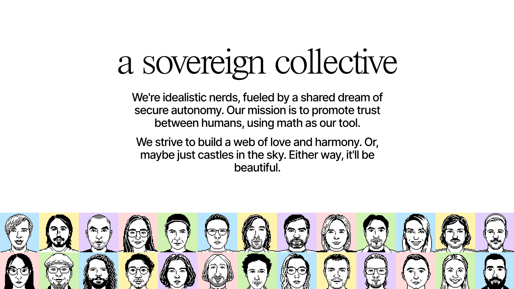

# Misión

<figure><figcaption><small>Un colectivo soberano</small></figcaption></figure>

### Por qué estamos construyendo Anytype

En nuestra concepción del mundo, las libertades digitales fundamentales son sagradas: la privacidad del pensamiento, la libertad para conectarnos con personas de nuestra confianza y la libertad para decidir el destino de nuestras creaciones digitales.

Creemos que estas libertades son tan importantes para el mundo de los bits como lo son los derechos humanos fundamentales para el mundo de los átomos.


**Estamos construyendo una alternativa para personas que valoran la libertad y la confianza. Para nosotros mismos.**


Ni la web actual ni gran parte del software que usamos respetan estas libertades digitales. Con la arquitectura actual de la web, los desarrolladores de aplicaciones son los guardianes de nuestras claves: las claves de las cuentas de usuario están bajo su control. Como guardianes de nuestras cuentas, deciden quién tiene acceso a ellas, quién no lo tiene y cómo se divulga la información.

Ahora que vivimos en línea gran parte de nuestra vida, estamos decididos a construir una alternativa.

### La cooperación como varita mágica

La cooperación, esa extraordinaria capacidad para avanzar en conocimientos y bienestar trabajando juntos, es nuestro superpoder. Ha permitido que nosotros, una especie modesta del África subsahariana, poblemos lugares de todo el planeta, construyamos las pirámides, descubramos los átomos y el ADN, e incluso nos lancemos al espacio.

Creemos que las herramientas para el pensamiento, la libertad y la confianza son lo que nos ha permitido crear todo el arte, la ciencia, las tecnologías, los dispositivos y las estructuras que vemos a nuestro alrededor. Con ellas hemos podido construir ciudades y alcanzar las estrellas.


**Nuestra misión es potenciar la cooperación sostenible creando de instrumentos para el pensamiento, la libertad y la confianza.**


Para alcanzar este nivel de cooperación, tuvimos que dominar el lenguaje. El lenguaje es un instrumento del pensamiento que nos ha permitido crear historias, algunas de las cuales son innovaciones sociales, potentes realidades intersubjetivas que solo existen cuando creen en ellas suficientes personas. Los seres humanos encontramos la forma de usar esas historias para construir confianza y libertad al mismo tiempo. Para cooperar aún más, necesitamos ambas cosas. Si tenemos confianza pero nos falta libertad, el resultado es una dictadura; si tenemos mucha libertad pero nos falta confianza, el resultado es la anarquía.

Vemos la web como el principal instrumento que existe hoy en día para el pensamiento, la libertad y la confianza, y nuestro objetivo es mejorarla:

* Como instrumento para el pensamiento, al convertir el gráfico en un lenguaje universal de los datos. 
* Como instrumento para la libertad, al integrar las libertades digitales universales. 
* Como instrumento para la confianza, al construir una capa descentralizada de confianza que sustenta la gobernanza del juego de suma positiva que crea la web. 

Creemos que con mejores instrumentos para el pensamiento, la libertad y la confianza podemos llegar aún más lejos. Podríamos trazar un rumbo hacia la verdadera sostenibilidad, con la cooperación como eje central.
