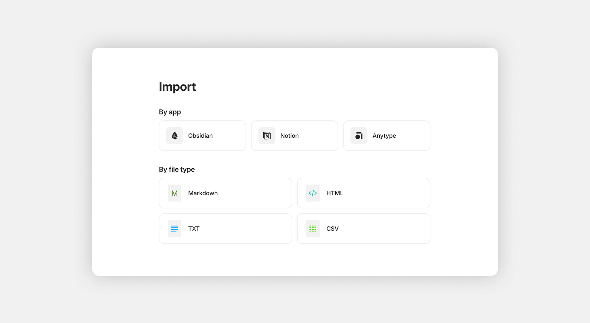

# Ajustes del canal

Channel Settings is where you control everything about a [Channel](../basics/channels.md) — its name and icon, who has access, how notifications behave, what loads first when members enter, and more. There are two ways to open Channel Settings:

1. Click the Channel name at the top of the Channel Sidebar.
2. Right-click the Channel icon in the Vault Sidebar.

<figure><figcaption></figcaption></figure>

## Preferencias

The **General** section covers your Channel's identity and basic behavior.

<figure><figcaption></figcaption></figure>

#### Channel name and icon

Your Channel's name and icon are how it appears in everyone's Vault.

* **Icon** — automatically generated during onboarding. To change it, click the icon and choose from the icon library, pick an emoji, or upload your own image.
* **Name** — Hover over the icon area and click **Edit** in the top-right, type the new name, and click **Save**.

#### Homepage

The Homepage is what loads when you (or any member) open the Channel, plus a dedicated **Home** widget is added to your sidebar.

It can be any Object — pick whatever you want members to see first when they enter the Channel.

* **For conversation-focused Channels**, choose a Chat Object as the Homepage so members land in the live discussion.
* **For documentation, wikis, or knowledge Channels**, choose a Page Object — usually a "welcome" or "overview" page that links out to the rest.
* **For project Channels with mixed content**, choose a Collection that brings together everything in scope.
* **Leave it empty** and the last opened Object will load when you re-enter the Channel.

#### Sidebar View

Changes how items in the Sidebar are displayed—either as Widgets or Links. See more here.

#### Default Object Type

Sets which Object Type is used when you create a new Object without specifying a Type (for example, by pressing Cmd/Ctrl + N or clicking the **+** in the sidebar without choosing).

## Miembros

Manage who has access to the Channel. Each user is referred to as a Space Member, and their access level is determined by their Role. For more details about shared spaces, see [Collaboration](../collaborate/collaboration.md).

<figure><figcaption></figcaption></figure>

### Roles

Space Members can have various roles, each with different privileges. Periodically check your members section to ensure everyone has the correct permissions. For details, see [Member Roles](../collaborate/collaboration.md#member-roles).

<table><thead><tr><th width="167.1015625">Role</th><th>Description</th></tr></thead><tbody><tr><td><strong>Viewer</strong></td><td>Can view content in the space but cannot edit documents, chat with others, participate in discussions, or delete anything.</td></tr><tr><td><strong>Editor</strong></td><td>Includes all Viewer privileges, plus the ability to edit content in the space and permanently delete items.</td></tr><tr><td><strong>Admin</strong></td><td>Includes all Editor privileges, plus the ability to manage Editors and Viewers.</td></tr><tr><td><strong>Owner</strong></td><td>Includes all Admin privileges, plus the ability to create Admins, create invitation links, and transfer Channel ownership.</td></tr></tbody></table>

### Access & Invitations

In this section, you are able to invite others into your space and set their permissions. For details on how it works, please see [collaboration.md](../collaborate/collaboration.md "mention").

* Copy link — a shareable URL link for people to join the space.
* QR code — A QR code suitable for sharing in public places.
* Manage link — settings to restrict and control invitation links.
* All — everybody who has access and their role.
* Requests — pending requests to join the space that require approval.
* Editors — display only users who are editors.
* Viewers — display only users who are viewers.

## Notificaciones

Set the default notification mode for messages in this Channel:

* **Enable all** — every new message produces a notification
* **Mentions only** — only @-mentions trigger notifications
* **Disable all** — no notifications (unread counter still updates, but muted)

Per-Chat and per-Object Discussion settings can override the Channel default.

<figure><figcaption></figcaption></figure>

## Remote Storage

The Remote Storage tab shows total storage used in this Channel and your remaining storage allowance based on your membership plan. The files listed are specific to the Channel, not your entire Vault.

<figure><figcaption></figcaption></figure>

***

## Content Model

The Content Model tab is the central place to manage your Channel's Types and Properties.

#### Types

A list of every Object Type available in this Channel. From here you can:

* Create new Types
* Edit existing Types — change name, icon, layout, default Properties, Templates
* Configure default behavior per Type

For full details, see [Types](../organize/types.md).

<figure><figcaption></figcaption></figure>

#### Properties

A list of every Property defined in this Channel. From here you can:

* Create new Properties
* Edit and add new options
* See which Types use Property

For full details, see [Properties](../organize/properties.md).

<figure><figcaption></figcaption></figure>

***

## Import & Export

The Integrations tab covers everything related to bringing data in and out of the Channel:

* **Import** — bring data in from Notion, Evernote, Obsidian, or generic Markdown / CSV
* **Export** — back up the entire Channel to Markdown or AnyBlock format

<figure><figcaption></figcaption></figure>

***

## Channel Ownership

Channel ownership can be transferred to another member — useful when team roles change, when a creator leaves, or when consolidating responsibilities.

To transfer:

1. Open the Members tab.
2. Click **Transfer ownership** next to the three-dot menu in the top-right corner.
3. Select the future Owner from the list of members.
4. Confirm.

After the transfer:

* The member will become the new Owner.
* You'll become an Editor.
* Only the new Owner can transfer it again.
* The new Owner's membership limits will apply to this channel.

<figure><figcaption></figcaption></figure>

## Delete Channel

In shared Channels, only the Owner can delete the Channel. Other members can leave the Channel instead, which removes their access without affecting other members. To delete a Channel:

1. Navigate to the General section in your Channel Settings.
2. Click the three-dot button in the top-right corner.
3. Select Delete Channel.
4. Enter the name of the Channel to confirm deletion.

<figure><figcaption></figcaption></figure>

 **Deleting a Channel is permanent.** All Objects, Chats, Discussions, and history are removed for every member. There is no undo. If you may need the data later, export the Channel before deleting it as a precaution. 
