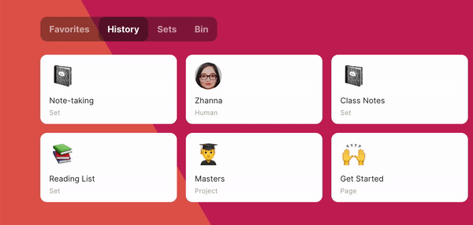
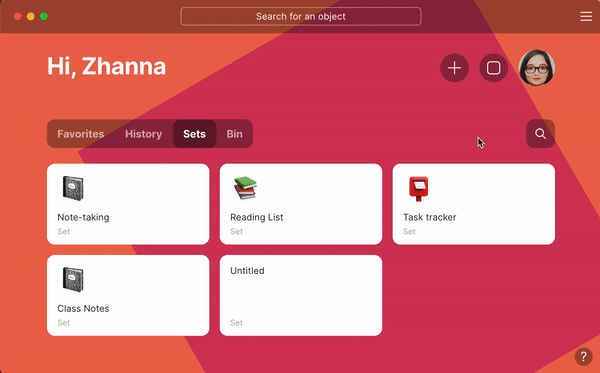
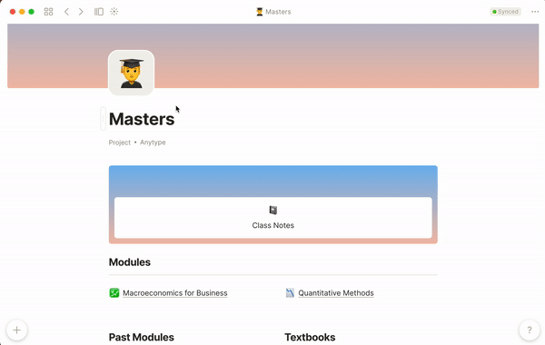

# Navigation

For navigation inside Anytype, you have 4 options: **`Home, Search, Graph View`, `Bi-Directional Navigation`** and **`Keyboard Shortcuts`**.

## Home

### Home tabs

* **Favorites.** Use this tab for frequently used objects. You can easily add any object to Favorites from the object Menu

* **History**. has objects that were opened recently
* **Sets** that you have ever created.
* **Bin** has recently deleted objects. You can put it back or delete it irrevocably.

## Search

Do a search across your knowledge graph, object types, and relations.

## Navigation Panel

Since all connections between objects have a certain direction(_from-object_ or _to-object)_, the navigation panel helps to see objects connected with the current one in terms of their direction. Read more about object connections in [#object-graph](navigation.md#object-graph "mention")

Navigation Panel helps to navigate between objects that have [Object Links](../fundamentals/object/blocks-and-canvas/relations-mentions-and-object-links.md#as-object-link) or [Relations](../fundamentals/relation.md) to each other. Hit .svg>) button on the top bar to open Navigation Panel.

The Navigation Panel consists of three blocks:

* **The current object** is the object that is currently in focus
* **Link from** is a list of objects containing a link or relation to the current object
* **Link to** is a list of objects that are referenced in the current object

If you want to change focus from one object to another, simply hit this object on the panel. It changes the current context to see updated connections according to the current thing.

## Object Graph

Displays a graph representation of the Links and Relations between your objects. You can see the power of Anytype relations, with connections showing how each object relates to another.

To access the Graph Mode, look for the  icon in the top-left corner from any opened object or just press `⌘ + Option + O` or `Ctrl + Alt + O`.

You can hover over each object to highlight its connections. Then, clicking on it will show additional information and options in a side panel.

* To pan around the canvas, drag the background.
* You can zoom in and out using a touchpad zoom function or by scrolling with a mouse wheel.

Use the search function at the bottom of the panel to the right to find a particular object. Matching objects will be highlighted in the network view.

## Keyboard Shortcuts

Alternatively, you can always use the keyboard to navigate. `< >` buttons can take you forward and backwards in your navigation history, or you can use the shortcuts `CMD / CTRL + [ / ]` to navigate.

***
