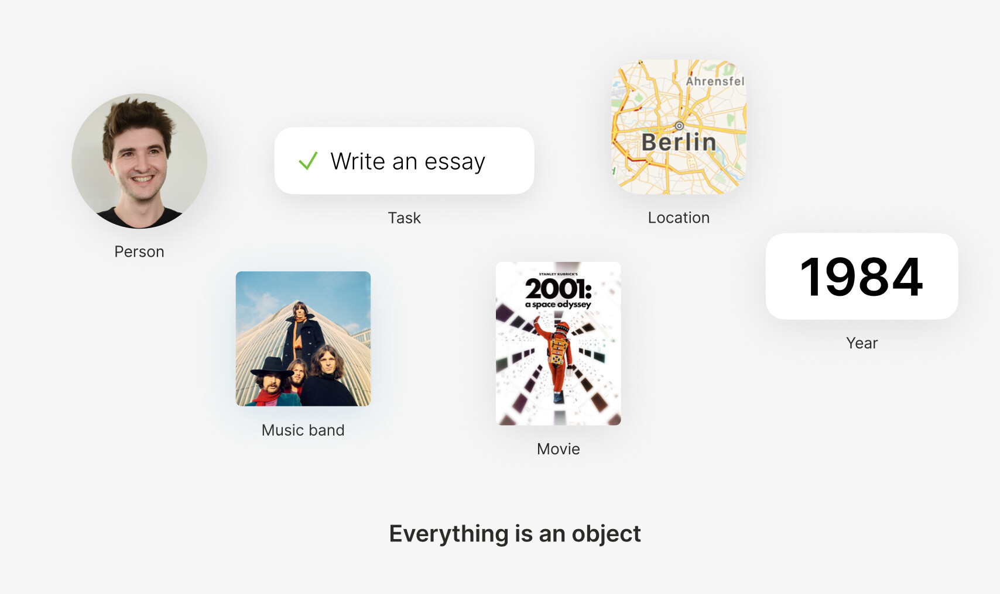
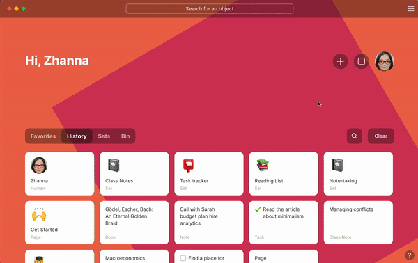

# Object

People, Books, Musicians, Documents, Ideas, Places, Numbers, or Files. For instance, a person named "Enda," an essay to write, the music by "Pink Floyd," the film "2001", a town called "Berlin," a year, or just a simple status like "Done". **Everything** inside Anytype is an Object.

### How to create object?

### Object Canvas

Every object has a flexible canvas made of simple blocks. Each block is a piece of information that you can freely move around the canvas. You can add any information you like by hitting the `+` button or in-line by typing `/`. Highlight a block to see its size or move it elsewhere on the canvas. To create a column, drag one block to the end of another block.


Check out [blocks-and-canvas](blocks-and-canvas/ "mention")for more details


### **Object Layout**

Layouts help you customize how your object looks. For example, you can align your text blocks, change the icon type, or set the page full-width.

**Anytype currently supports three kinds of layout:**

1. **Basic:** a classic view for notes, articles, and docs.
2. **Profile:** designed for contacts, people, and organizations.
3. **Action:** for getting things done. Perfect for tasks and plans.

We have designed layouts to be extendable. In the future, users will be able to make custom layouts too!


Primary and Profile layouts support either an emoji or a photo icon. All layouts, except Note support a cover image.

