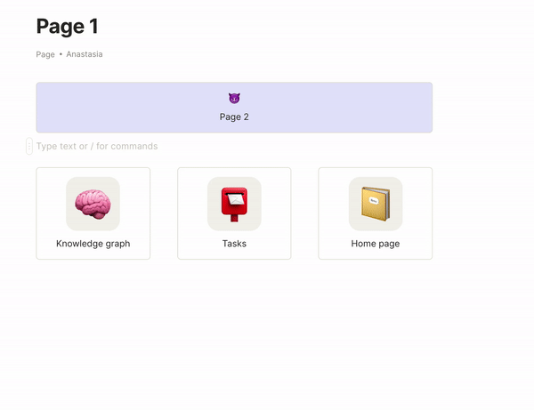

# Link block view & layout

### Blocks styling

Add some custom styling to your Object Link blocks using the block sidebar.&#x20;

### Multiple blocks styling

Select a few objects to apply common styling for them.

.gif>)

### Columns of blocks

Create a multi-column layout by moving a block to the beginning/end of another block. Drag vertical control between blocks in order to change column width.

