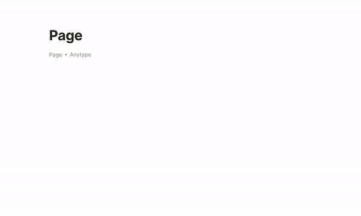

# Media

The following media blocks are available in this version of Anytype: **Images**, **Audio**, **Video**, **Files**. Add it on the canvas by hitting the `+` button or in-line by typing `/`. Or you can add it by **drag\&drop** on the canvas.

## &#x20;
