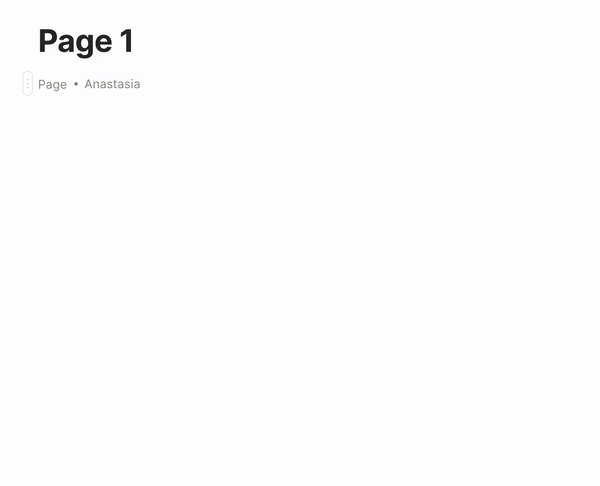

# Relations, Mentions & Object Links

There are several options to add another object to Canvas: as Relation, as Object Link, and as Mentions.&#x20;

### As Relation

You can add any Relation on the Canvas by hitting the `+` button or in-line by typing `/`. Type the name of a Relation or choose one from the list.

.gif>)

_Read more about how to create a new Relation: _[relation.md](../../relation.md "mention")

### As Object Link

You can add a link to any object from your Anytype to the Canvas even if it doesn't have a Relation with the current object.

.gif>)

This approach allows you to create "Home Page" style objects, where you are able to customize Object Link's view and layout. Read more about Object Link styling in [#block-styling](relations-mentions-and-object-links.md#block-styling "mention") section.

### As Mention

Mention is similar Object Link approach where you are able to add any object from your Anytype with a few differences. It is in-line entity, which allows you to add mention to another object inside the text block. It has default styling and it's not included in Navigation Panel. Read more about navigation in [navigation.md](../../../reference/navigation.md "mention") section

##
