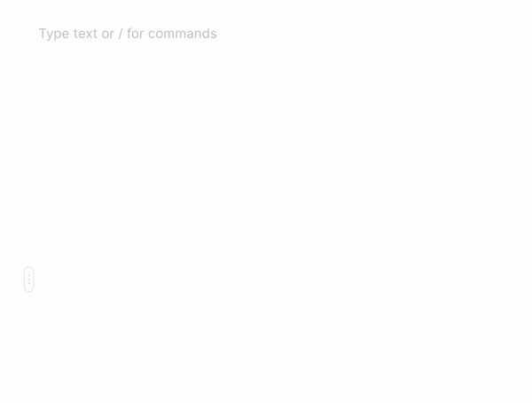

# Text editing

Adding content is very simple - just tap on an empty area and start typing. You can also drag and drop the input field on both Mac (from the sidebar) and iOS (from the bottom bar) in order to drop content at a specific location.

**The following blocks are available**:

* Text: title, heading, subheading, highlighted
* Lists: checkbox, bulleted list, numbered, toggle

## &#x20;
