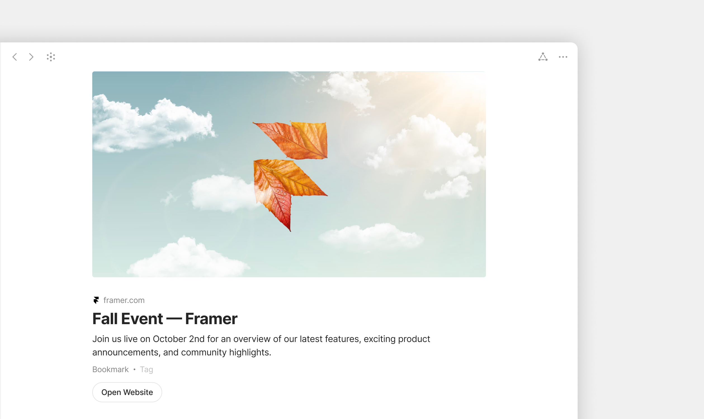

# Bookmarks

### What is a Bookmark?

A **Bookmark** is a special kind of Object that stores a link to a webpage. Instead of just dropping a URL into a note, you create a Bookmark Object that captures the page's title, preview image, favicon, and a description — making it easy to recognize, link to, and organize like any other Object.

### Why it matters

Bookmarks turn ad-hoc URLs into structured information. You can tag them, filter them, link them to projects, and find them in Queries — the same things you'd do with a Note or Task.

If you're collecting research, building a reading list, saving inspiration, or maintaining a list of references, Bookmarks give them a proper home in your knowledge graph rather than scattering URLs across pages.

### How it works

A Bookmark is its own Object Type. When you create one, Anytype fetches metadata from the URL — title, description, preview image, and favicon — and stores them as Properties on the Object.

You can then:

* Add your own Properties (Tags, Status, Priority, Project links)
* Add notes or annotations in the editor
* Link the Bookmark to other Objects
* Include it in Queries, Collections, and Discussions

### Bookmark layout

<figure><figcaption></figcaption></figure>

Bookmarks have their own dedicated layout, separate from the standard Page layout. Each Bookmark displays:

* The page's preview image at the top
* The page title (editable)
* A short URL with the site icon
* A prominent **Open Website** button

This layout is optimized for quickly identifying and opening saved links. You can still add blocks below the bookmark layout if you want to write notes, link to related Objects, or build out additional context.

### Creating a Bookmark

#### From a pasted URL

1. Copy a URL from your browser.
2. Paste it into any Object (or into the sidebar to create a standalone Bookmark).
3. The paste menu appears with four options:
   * **Mention** — insert as a clickable link inline with your text
   * **Bookmark** — create a Bookmark card visible in the editor
   * **Embed** — embed the page content (works for YouTube, Miro, etc.)
   * **Link** — paste as plain URL text
4. Choose **Bookmark** to create the card.

If you want this to become a standalone Bookmark Object (rather than an inline card), use the three-dot menu on the bookmark card and select **Turn into Object**.

#### From the Create menu

In the sidebar, click the **+** dropdown and choose **Bookmark**, then paste the URL when prompted.

#### From the slash menu

In the editor, type `/bookmark` and paste the URL.

#### From a browser extension

If you've installed the Anytype browser extension, click its icon on any page to save it as a Bookmark Object directly to a Channel of your choice. (See your platform's installation guide for setup.)

### Organizing Bookmarks

Because Bookmarks are Objects with their own Type, you can:

* **Filter by Tag** — create a "Reading List" tag, a "Research" tag, etc.
* **Pin a Bookmarks Query** to your sidebar to see all your saved links
* **Add an Object Property** linking each Bookmark to a Project or Topic
* **Use the Gallery layout** in a Query to see Bookmarks as visual cards

### Tips


**Use Tags or a Status property to track reading state.** Add states like "To read", "Reading", "Read", "Reference" so a single Bookmarks Query can serve as your reading queue, your library, and your reference shelf.



**Drag Bookmarks into Collections** when you want to group them by topic without setting up a tag system. A "Trip planning" Collection can hold flight bookings, AirBnB pages, and restaurant reviews side by side.

