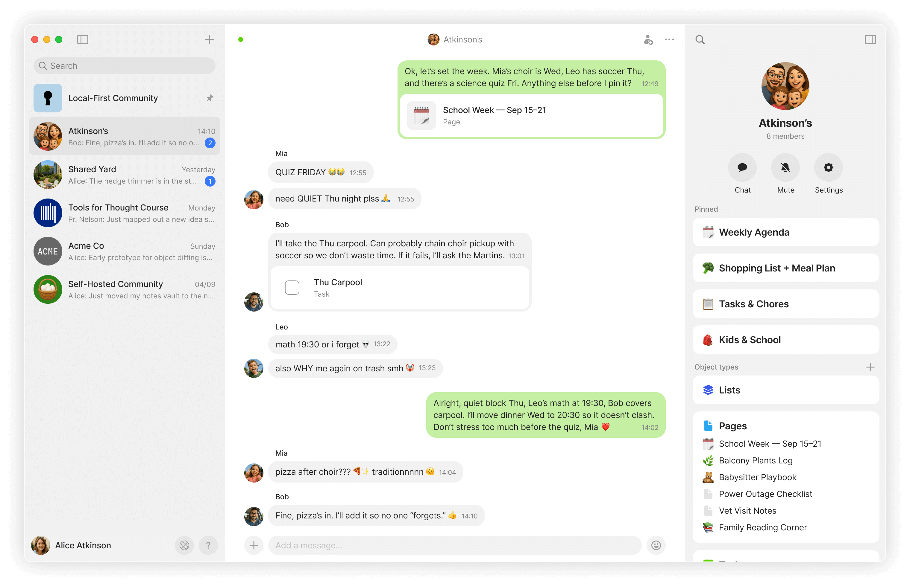

# Chats

### Chat as a Channel

Chat is a new type of channel in Anytype, designed for fast, conversational flow.

<figure><figcaption></figcaption></figure>

It gives you the familiar rhythm of chatting – replying, reacting, sharing files – but with a powerful twist: you can create and edit objects together in real time.

* Create Objects right from your chat window – turn thoughts into Pages, Tasks, or any other Type.
* Share existing Objects – anything you drop into Chat can be opened and edited right away.
* Keep things organized – uploads are added to the relevant Types (Audio, Images) and everything stays searchable and structured in your sidebar.
* Invite with ease – bring new members into a conversation instantly with links that don’t require approval.

### Multi-Chats in your Space

Space Channels now hold more than one conversation at a time. Start topic-specific chats right where your work happens – discussions now live alongside your notes, tasks, and documentation as part of your knowledge graph.

<figure><figcaption></figcaption></figure>

#### Chat as an Object Type

Chats are now native Objects in your Space. You can organize them into different views, assign tags to group related conversations, include them in Collections or Queries, and @-mention them from any Object for cross-referencing. As a system Type, Chat doesn’t support templates or layout changes.

<figure><figcaption></figcaption></figure>

#### Widget Behaviour

The Chats Type Widget works like any other widget: you can pin it to your Sidebar, adjust its appearance by choosing how many chats to show, and pin individual chats for quicker access.Unlike other Widgets, pinned chats display counters and mention indicators directly in the Sidebar. A temporary _Unread_ section also appears automatically when new messages arrive, listing chats with unread content.

<figure><figcaption></figcaption></figure>

#### Per-Chat Notifications

Right-click any Chat Object, or use the three-dots menu inside a chat window to open preferences and choose _Enable all_, _Mentions only_, or _Disable all_.

<figure><figcaption></figcaption></figure>

### Direct Channels

Sometimes you just need to talk to one person. Privately.

Direct Channel is a one-on-one connection between two members, where both participants have equal access: no admin, no hierarchy. Just a place for quick check-ins, sharing an object, or whispering memes in the middle of a project. It’s simple, it’s lightweight, and it just works.

<figure><figcaption></figcaption></figure>

To start a new direct channel, simply click on someone's profile and select 'Send message':

<figure><figcaption></figcaption></figure>
