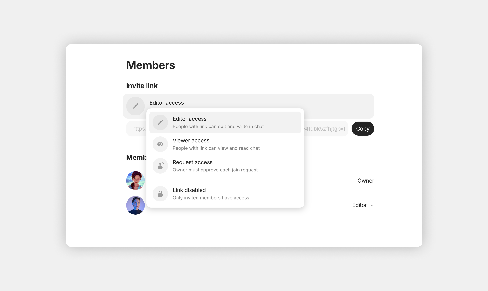

# Collaboration

### What is Collaboration in Anytype?

Anytype lets you share Channels with other people so you can work together. When you invite someone, they get access to everything in the Channel — Objects, Types, Properties, Chats — all syncing in real time across everyone's devices.

Unlike traditional cloud apps where a company mediates access, sharing in Anytype works **peer-to-peer**. Your data stays end-to-end encrypted, and only people you explicitly invite can decrypt and see it. Anytype's servers help with backup — but they can't read your content.

### Why it matters

Collaboration in Anytype isn't an add-on, it's part of the core architecture:

* **End-to-end encryption** — messages, Objects, and files are encrypted before sync; the network sees only ciphertext
* **Real-time sync** — changes appear instantly when members are online (or on the same network)
* **Offline-first** — work without connection, sync when reconnected
* **No vendor account required** — collaborators don't need a third-party email or paid account, just Anytype

This makes shared Channels suitable for sensitive contexts: legal teams, journalists, communities of practice, family planning — anywhere you'd want collaboration without surveilance.

### Member roles

Every Channel has three role levels:

| Role       | Edit Objects | Add/remove Objects | Edit Channel name/icon | Pin Object to Sidebar | Manage members |       Permanent delete      |
| ---------- | :----------: | :----------------: | :--------------------: | :-------------------: | :------------: | :-------------------------: |
| **Owner**  |       ✓      |          ✓         |            ✓           |           ✓           |        ✓       | All Objects (incl. others') |
| **Editor** |       ✓      |          ✓         |           ✓            |           —           |        —       |        Only their own       |
| **Viewer** |      —       |          —         |            —           |           —           |        —       |              —              |

#### Permanent delete permissions

In shared Channels, **Editors can only permanently delete Objects they created**, protecting the team from accidental data loss. Owners can permanently delete any Object and can also empty the entire Bin from a single action.

This means even if an Editor accidentally clicks "Empty Bin", they can only wipe out their own contributions — nothing of yours or other members' is at risk.

### Inviting members

Open the Channel you want to share, then go to **Channel Settings > Members**.

#### Generating an invite link

1. Click **Generate invite link**.
2. Choose the link type:
   * **Editor link** — recipients can join immediately as Editors
   * **Viewer link** — recipients can join immediately as Viewers
   * **Request access link** — recipients land in a queue; you approve their role
3. Copy the link.

<figure><figcaption></figcaption></figure>

#### QR codes

You can also generate a QR code for the invite link — useful when sharing in person or on a screen the recipient can scan with their phone. This is the same link, just rendered visually.

#### Limiting access

You can revoke an invite link at any time:

1. Open **Channel Settings > Members**.
2. Find the current access option and open the list.
3. Choose **Link Disabled**.

Members who already joined retain their access (revoke them individually if needed — see Managing members below).

#### Editor seat limits

Each Channel has a maximum number of Editors based on the Owner's plan. The default Free tier supports a small number of Editors per Channel. Higher-tier plans (Builder, Co-Creator, Ultra, Group memberships) increase this limit. See [Memberships](../advanced/monetization/).

Once you reach the limit, new joiners can only join as Viewers until either the limit is raised or an existing Editor is downgraded or removed.

### Joining a Channel

When you receive an invite link, clicking it opens Anytype:

1. If you're not logged in, you'll be prompted to log in or create a Vault.
2. Once logged in, you'll see a confirmation popup with the Channel name and the role you're being given.
3. Click **Accept** to join. The Channel appears in your Vault.

For Request-Access links, the flow is the same except instead of joining immediately, your request goes to the Owner. They'll see a notification and approve or decline; you'll see the Channel appear in your Vault when approved.

### Managing members

From **Channel Settings > Members**, the Owner can:

* **See the list** of all current members with their roles
* **Change a member's role** (Editor ↔ Viewer)
* **Remove a member** entirely (they'll receive a notification and lose access)
* **See pending access requests** for Request-Access invite links
* **Approve or deny** pending requests with a chosen role

#### Members in Chats and Discussions

Member display names and profile pictures (set in their own [Vault Settings > Profile](../advanced/settings/account-and-data.md)) appear next to their messages and posts. Click any member's name or profile to open their profile popup, where you can:

* See their full profile (name, bio, profile picture)
* Send them a Direct Message — opens a [Direct Channel](direct-channels.md)
* See which other Channels you both belong to (if any)

### Transferring Channel ownership

Channel ownership can be transferred to another member. Use this when:

* A team lead changes roles
* The original creator leaves the team
* You want to consolidate Owner responsibilities to someone else

#### How to transfer

1. The current Owner opens **Channel Settings > Members**.
2. Click **Transfer ownership** next to the three-dot menu in the top right corner.
3. Select the new Owner from the list of members.
4. Confirm the transfer.

After the transfer:

* The new Owner takes full control, including the ability to transfer ownership again
* You become an Editor (you keep your access but lose Owner-only privileges)

This way, Channels can be handed over as roles change without recreating them or losing history.

### Leaving a Channel

To leave a Channel you've joined:

1. Right-click the Channel in your Vault, **or** open Channel Settings.
2. Click **Leave Channel**.
3. Confirm.

You're removed from the Channel and lose access. Your past contributions (Objects you created, messages you sent) remain in the Channel — Anytype doesn't delete content when a member leaves.

If you're the **Owner**, you can't leave directly — you must first transfer ownership to another member. If there are no other members, you can delete the Channel entirely.

### Real-time sync and offline mode

When all members are online, changes propagate immediately:

* Edit an Object → other members watching the same Object see the change
* Add a Property → it appears in everyone's view of the relevant Type

When members go offline:

* Their changes are queued locally
* When they reconnect, queued changes sync up

### Privacy in shared Channels

Even when sharing, your data stays encrypted:

* **End-to-end encrypted** between members
* **No company access** — Anytype's network nodes hold encrypted data only; they can't decrypt content
* **No log of contents** — what you write, no one outside the Channel can read

For sensitive use, you can also use **self-hosted** networks where you control the relay nodes (see [Networks & Backup](../advanced/data-and-security/self-hosting/)) or **local-only** mode for fully air-gapped sharing on a local network.

### Tips


**Use Request-Access links for public-ish Channels.** A community Channel where you want people to find you but want to gate entry works best with Request-Access — the link can be shared widely, but you control who actually gets in.



**Make a backup before transferring ownership.** Export the Channel (Settings > Integrations > Export Channel) before handing over Owner rights. If anything goes wrong, you have a snapshot.



**Bring members in as Viewers for review.** If someone needs to read but not edit — for example, a stakeholder reviewing a project — Viewer is exactly right. They see everything, can react to messages, but can't accidentally change anything.



**Currently, you can only share entire Channels — not individual Objects.** If you want to share just one thing publicly with no access controls, use [Web Publishing](web-publishing.md) instead.



**Once a Channel is deleted, it can't be recovered** unless someone exported it before deletion. Be cautious with **Delete Channel** in shared spaces.

