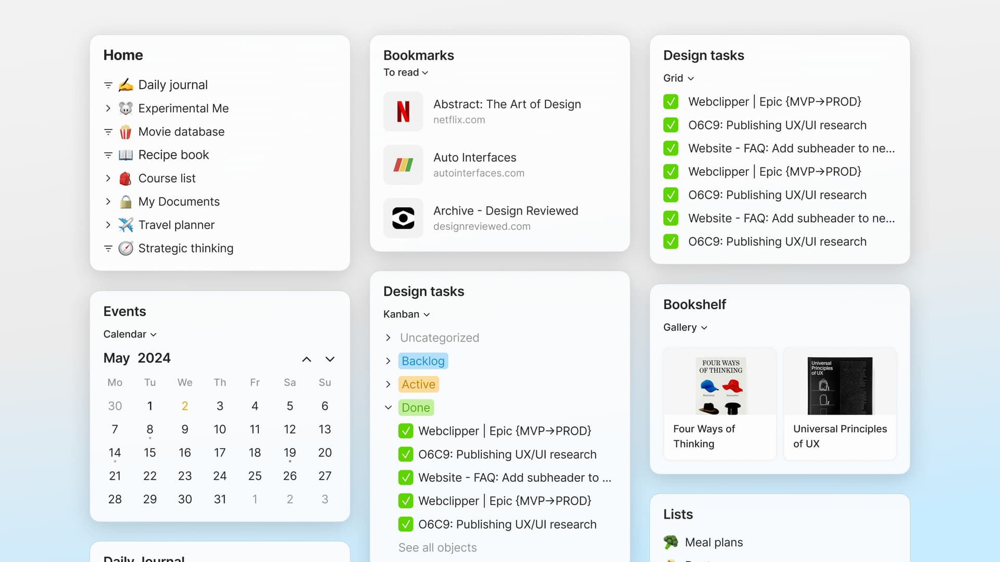

# Sidebar

Your sidebar is divided into three sections:

Your Space widget, which includes the Search button, Members button, and Settings button.

<figure><figcaption></figcaption></figure>

The Pinned section where you can find any object that you wish to pin to your sidebar.

<figure><figcaption></figcaption></figure>

The Objects section which allows you to view all your types, and by extension, all your objects.

<figure><figcaption></figcaption></figure>

### Pinning Objects

In general, you can pin any object that you've created using the Anytype editor to the sidebar. To do so, navigate to the pin button in the top right corner.

<figure><figcaption></figcaption></figure>

You can unlink them by clicking the same button or right-clicking on them in the pinned section and selecting this option:

<figure><figcaption></figcaption></figure>

### Adjust your Widget Appearance

Depending on the object type, you can choose from a variety of layouts.

<figure><figcaption></figcaption></figure>

Regular objects can choose between compact and tree layouts, while queries and collections can choose from compact, list, compact list, or object layouts.

Selecting the object layout allows you to choose any view from that particular query/collection, and it will also follow that view's layout.

<figure><figcaption></figcaption></figure>
