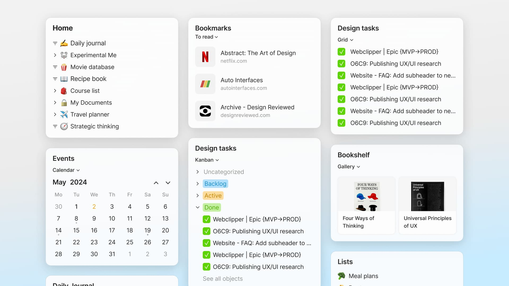

# Widgets

Your sidebar is comprised of customizable widgets which allow you to preview and navigate your Objects.

By default, your sidebar only includes the space widget. You can find the Search button there, and if your space is a shared one, you will also find a button that will lead you to a list of all of your space members above it.

<figure><figcaption></figcaption></figure>

### Add New Widgets

In general, _any_ object you've created using Anytype's editor can be used as a widget and formatted using link or tree view. Queries and Collections - Objects in and of themselves - can be used as widgets with a list of objects contained therein.

<figure><figcaption></figcaption></figure>

Additionally, Anytype provides several options for _non-object_ widgets which you can add or remove from your sidebar, including:

* Favorites: All objects which you've starred as a favorite, regardless of object type
* [anytype-library.md](anytype-library.md "mention"): A place to quickly find all of your objects
* Recently edited: Your recently edited objects (globally synced across devices)
* Recently opened: Your recently opened objects (device-specific)
* [finding-your-objects.md](../../advanced/data-and-security/data-storage-and-deletion/finding-your-objects.md "mention"): All of your archived objects

<figure><figcaption></figcaption></figure>

You are also able to add any Type as a widget by navigating to the Suggested sub-menu when adding widgets:

<figure><figcaption></figcaption></figure>

### Customize your Sidebar Widgets

At the bottom of your sidebar you'll find an "Edit" button, which upon clicking will reveal options to add or remove widgets from your sidebar.

<figure><figcaption></figcaption></figure>

Clicking "Add" will give you the choice to choose your widget source. Again, a widget source can be any object you've previously created or the list of widget options above.

On desktop, you can also drag & drop objects directly into the sidebar.

### Adjust your Widget Appearance

Depending on the widget source, you can choose from a variety of layouts.

<figure><figcaption></figcaption></figure>

It is possible to view widgets sourced from a single Object created in the editor (Pages, Notes, etc.) as a 'link' or a 'tree'. A link widget displays only the object name, whereas a tree widget displays all of objects connected to the source object by first and second-degree connections.

<figure><figcaption>
Above, 'the 'Self' widget is displayed using tree view whereas the 'Home' widget is displayed using link view.
</figcaption></figure>

When creating widgets from queries and collections on the other hands, you'll see the view options of 'List' or 'Compact list'. Both render a preview of objects contained within the given query/collection, with differences in line spacing and description previews.

<figure><figcaption>
Above, the 'Disco Room' widget displayed as a compact list (top) and list (bottom).
</figcaption></figure>

You can also simply choose Object view in the widget view settings for your widget to follow the query view layout.

<figure><figcaption></figcaption></figure>

### Mobile Widgets

#### Organizing your widgets

When you open your space on your mobile device you will see your current **Widgets** along with 3 navigation options at the bottom.

Your **Widgets** are customizable in the same way they are in the sidebar of your desktop application.

To edit and move your widgets around: scroll to the bottom of the list, where you'll find "Edit".

When you click the button, you'll see a small grey minus sign on the corner of each block. Now you can delete, add, or rearrange your widgets.

#### Using Widgets

The best way to customize and optimize your mobile usage of Anytype, widgets are your best friend.

Setting up your widgets for mobile allows you to create quick access and manage your preferred objects to visit.

Add specific Objects to the top for quick access.

Add Queries to your widgets, like task managers for a quick view of what's next to do.
