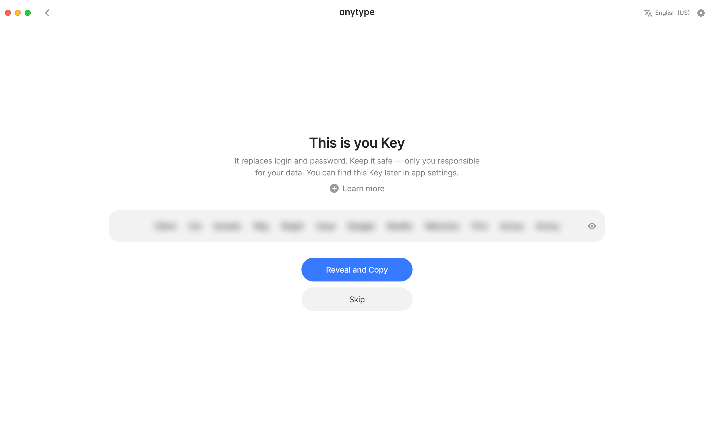

# Install

You can download the latest version of Anytype for your device at [download.anytype.io](https://download.anytype.io). It is available on macOS, Windows, Linux, iOS, and Android. Or you can search for 'Anytype' directly on your phone's app store.&#x20;

<figure><figcaption></figcaption></figure>

### Create your vault

<figure><figcaption></figcaption></figure>

If you haven't created a vault yet, you can easily create one by clicking on `I am new here` and following the provided instructions.

**Language:** If you would like to use a language other than English for the interface, you can select it in the top right corner.

<figure><figcaption></figcaption></figure>

#### Save your Key!

Your [key.md](../basics/key.md "mention") is the only way to access your account — treat it like an email and password combined that you can never reset. Store it somewhere secure and never share it with anyone. Anyone who has your Key has full access to your account.

If you lose your Key, your account cannot be recovered — by anyone, including Anytype. This is intentional: Anytype's security model lets anyone create an account without needing permission from on a central authority.


Store your [key.md](../basics/key.md "mention") somewhere safe and never share it with anyone. Whoever has access to your key has access to your account. It cannot be recovered.


<figure><figcaption></figcaption></figure>

#### Log-in using your Key

If you already have a vault, an Anytype account, click on `I already have a Key` and enter your [key.md](../basics/key.md "mention") to proceed.

<figure><figcaption></figcaption></figure>

#### Log-in using the QR code

In addition to using your [key.md](../basics/key.md "mention") to log in, you can also use the QR code to login faster. This is especially handy to sign in on your mobile devices if your desktop is close by.

To log in using the QR code, simply navigate to [#login-key](../advanced/settings/account-and-data.md#login-key "mention") in your Vault Settings.

<figure><figcaption></figcaption></figure>

### Import

If you would like to import some of your existing data into your Space, you can find the instructions on how to do so in [import-export](../advanced/data-and-security/import-export/ "mention").

### What to expect after install

Once you've created your Vault and saved your Key, you'll land in your first Channel — **Get Started** — already populated with example Objects to help you explore. This is your sandbox: poke around, open things, break stuff, no pressure.

When you're ready to start your own work, **create a new Channel** for it:

* Click the **+** button at the top of the Vault (the leftmost panel) to create a new Channel.
* Inside your new Channel, create your first Object — a Note, a Task, or a Page.
* Type `/` in any Object to start adding rich content: headings, lists, images, embeds.

If you'd like a quick overview of how Anytype's core concepts fit together, start with [learn-the-model.md](../basics/learn-the-model.md "mention").&#x20;
