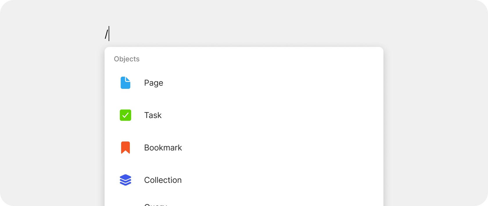
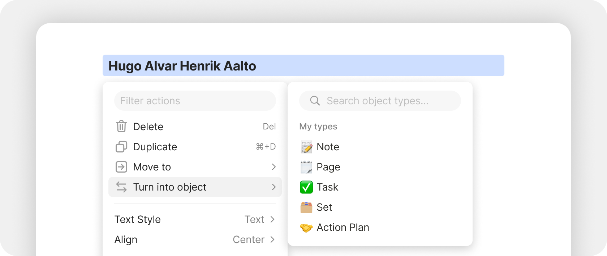
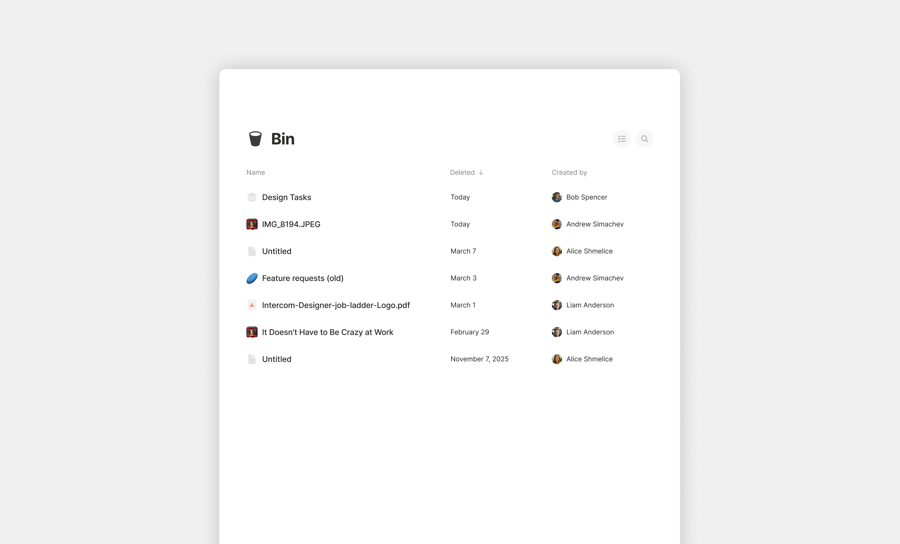

# Objects

### What is an Object?

In Anytype, **everything you create is an Object**. A page is an Object. A task is an Object. A note, a bookmark, a person, a recipe — all Objects.

If you've used other tools, you might be used to thinking in terms of files, documents, or database rows. In Anytype, there's just one concept: Objects. This keeps things simple — whether you're writing a journal entry or tracking a project, you're always working with the same building block.

### Why it matters

Because everything is an Object, everything can connect to everything else. A task can link to a person. A meeting note can link to a project. You're building a **graph** of interconnected information rather than organizing files into folders.

This means you don't have to decide upfront where something "lives." You create it, give it a Type (like Note or Task), add Properties (like a due date or a tag), and link it to other Objects. The structure emerges from the connections you make.

### How it works

Every Object has:

* A **Type** that describes what kind of thing it is (Note, Task, Book, etc.) — see [Types](../types/)
* **Properties** that hold its details (status, date, author, etc.) — see [Properties](../types/relations.md)
* **Blocks** that make up its content (text, images, embeds, etc.) — see [Blocks](blocks.md)
* **Links** to other Objects — see [Links](linking-objects.md)

You can think of an Object as a flexible document that also acts as a node in your knowledge graph.

### Ways to Create Objects

#### Sidebar

When clicking the "Create" button, you’ll immediately create a new object with the type that is set as your default object type in your channel settings.

When clicking the arrow button, you'll be presented with a menu of your types which you can sort to your liking. You can then choose which one you want to create.

#### Command Menu

When working in the editor you can type `/` to bring up the command menu. If you already know which Type you want to use, you can just type it directly. If you're not sure which Type you want to use, you can type `Objects` instead for the below menu to appear with all of your Types listed. Simply select the Object Type you'd like to create and it will be linked at your current place.

<figure><figcaption>
Command menu > Objects
</figcaption></figure>

#### Use a Shortcut

For a quick creation of a new Object, you can use this shortcut: `Cmd / Ctrl + N`

This will perform the same action as clicking the "+" sign in the sidebar.

Additionally, you can use `Cmd / Ctrl + Opt / Alt + N` to perform the same action as clicking the arrow sign in the sidebar.

#### Turn Into Object

If you are working on something in an existing Object and would like to transform only a certain block into an Object, you can do that through the action menu by either:

1. Hovering to the left side of the block that you are working on and clicking the 3 dots.
2. Using the `Cmd / Ctrl + /` keyboard shortcut.

<figure><figcaption>
Action menu
</figcaption></figure>

### Locating Your Objects

#### Sidebar

You can now find all your objects in the sidebar, grouped by type.

<figure><figcaption></figcaption></figure>

#### Graph

To find all of your objects and how they are connected, you can look to the [graph.md](../../advanced/feature-list-by-platform/graph.md "mention") for your main source of truth.

<figure><figcaption></figcaption></figure>

#### Search

To navigate to the search, either head to your sidebar, and click on the search button or use the `Cmd / Ctrl + K` keyboard shortcut.

<figure><figcaption></figcaption></figure>

#### Bin

If you've previously removed some objects from your [space.md](../vault-and-key/space.md "mention"), they will appear in your [finding-your-objects.md](../../advanced/data-and-security/data-storage-and-deletion/finding-your-objects.md "mention") unless you've already permanently deleted them.

<figure><figcaption></figcaption></figure>


**Tip:** Don't worry about getting the Type right when you first create an Object. You can always change an Object's Type later from the Type menu at the top of the editor.

