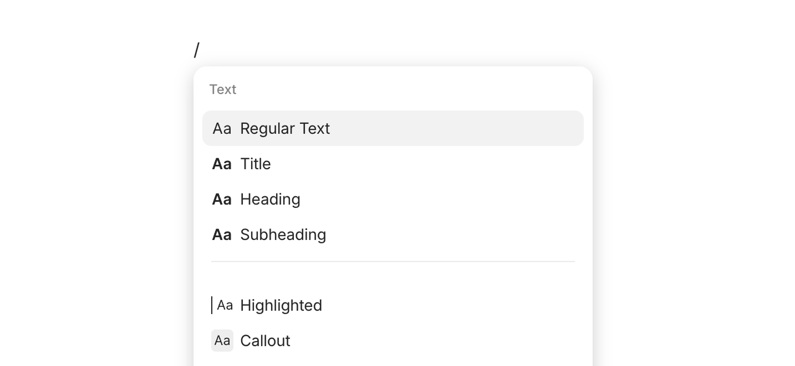
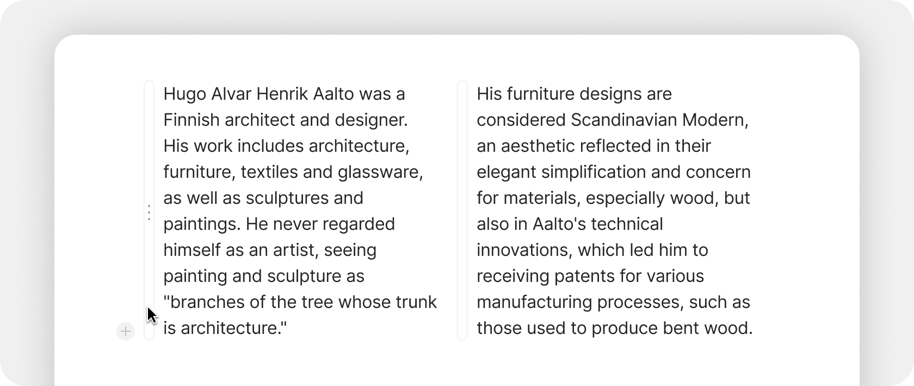
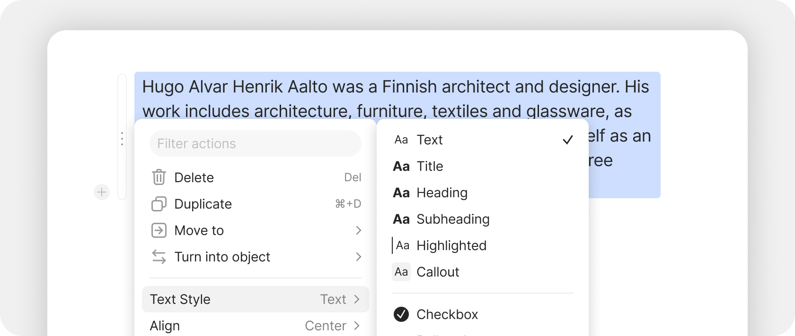

# Blocks

### What are Blocks?

**Blocks** are the building pieces of every Object. When you open an Object and start editing, you're adding and arranging Blocks — paragraphs, headings, images, lists, embeds, and so on. Each Block is independent and can be moved, restyled, or replaced without affecting the others.

If you've used Notion, this concept will be familiar. If you've used Microsoft Word or Google Docs, the difference is that Blocks are **discrete units** — you can drag them, nest them, turn one type into another, or build columns by placing them side by side.

### Why they matter

Blocks make your content flexible. You're not stuck with a single document format. You can:

* Drop an image between two paragraphs without disrupting the layout
* Split text into columns by dragging blocks side by side
* Nest blocks for outlines and structured lists
* Convert one type of block into another (paragraph → heading → toggle → checklist)
* Reuse content by linking to Object blocks rather than duplicating text

### Adding a Block

There are several ways to add a new block:

#### The slash menu

Type `/` anywhere in the editor. A menu appears with every available block type, organized by category. Type a few characters of the block name to filter — `/h2` for Heading 2, `/code` for code block, `/image` for an image.

This is the fastest way once you know what you want.

<figure><figcaption></figcaption></figure>

#### The plus button

Hover over the left side of any block. A plus icon appears — click it to insert a new block above. The same menu as the slash command opens.

#### Markdown shortcuts

For text-style blocks, you can use Markdown-style shortcuts at the start of a line:

| Type this        | To create         |
| ---------------- | ----------------- |
| `#` (with space) | Heading 1         |
| `##`             | Heading 2         |
| `###`            | Heading 3         |
| `>`              | Toggle            |
| `*` or `-`       | Bullet point      |
| `1.`             | Numbered list     |
| `[]`             | Checkbox / to-do  |
| `\`\`\` \`       | Code block        |
| `---`            | Divider           |
| `#>`             | Toggled Heading 1 |
| `##>`            | Toggled Heading 2 |
| `###>`           | Toggled Heading 3 |

These work in any text block. Press space after the shortcut and the line transforms.

### Block types

#### Text blocks

| Block               | What it's for                                                                                                                |
| ------------------- | ---------------------------------------------------------------------------------------------------------------------------- |
| **Paragraph**       | Standard text                                                                                                                |
| **Heading 1, 2, 3** | Section structure                                                                                                            |
| **Title**           | The H1 of the page (sometimes shown separately from body content)                                                            |
| **Quote**           | Quoted or highlighted text                                                                                                   |
| **Callout**         | Boxed text for warnings, tips, or notes                                                                                      |
| **Code**            | Monospaced code with syntax highlighting                                                                                     |
| **Toggle**          | Collapsible block that hides nested content                                                                                  |
| **Toggled Heading** | A heading that also toggles its section. See [Toggled Headings](../../advanced/feature-list-by-platform/toggled-headings.md) |

#### List blocks

| Block                | What it's for                        |
| -------------------- | ------------------------------------ |
| **Bulleted list**    | Standard bullets                     |
| **Numbered list**    | Auto-numbered list                   |
| **Checkbox / To-do** | Tappable checkboxes for action items |

Press Tab inside a list item to indent it (creating a nested sub-list). Shift + Tab outdents.

#### Media blocks

| Block     | What it's for                              |
| --------- | ------------------------------------------ |
| **Image** | Inline image (uploaded or embedded by URL) |
| **Video** | Embedded video player                      |
| **Audio** | Embedded audio player                      |
| **File**  | Generic file with download link            |
| **PDF**   | PDF preview                                |

Drag a file onto the editor to insert it. Each file becomes a [File Object](../files-and-media.md) you can find and reference elsewhere.

#### Structural blocks

| Block                 | What it's for                                                                    |
| --------------------- | -------------------------------------------------------------------------------- |
| **Divider**           | Horizontal line separator                                                        |
| **Table of Contents** | Auto-generated from your headings                                                |
| **Table**             | Spreadsheet-style data block                                                     |
| **Columns**           | Created by dragging blocks side by side (no separate "column block" — see below) |

#### Reference blocks

| Block                 | What it's for                                                                                         |
| --------------------- | ----------------------------------------------------------------------------------------------------- |
| **Link to Object**    | Card or text reference to another Object                                                              |
| **Inline Mention**    | Inline `@`-style mention to an Object                                                                 |
| **Inline Query**      | Embedded live Query — see [Inline Queries](../../advanced/feature-list-by-platform/inline-queries.md) |
| **Inline Collection** | Embedded Collection                                                                                   |
| **Inline Chat**       | Embedded Chat thread                                                                                  |

#### Embed blocks

See [Embeds](../../advanced/feature-list-by-platform/embeds.md) for the full list — YouTube, Miro, Mermaid, Figma, Excalidraw, and more.

#### Property blocks

| Block        | What it's for                                           |
| ------------ | ------------------------------------------------------- |
| **Property** | Add an Object's Property as a block in the body content |

Useful for surfacing key Properties prominently. The Property block stays in sync with the Property's value — change one, the other updates.

<figure><figcaption></figcaption></figure>

### Selecting and styling blocks

#### Single block

Click anywhere in a block to focus it. The block's options appear:

* **Block handle** (three dots on the left) — for moving, deleting, or transforming
* **Plus button** — for inserting a new block above
* **Style toolbar** (in some blocks) — for inline formatting

<figure><figcaption></figcaption></figure>

#### Multiple blocks

Click on a block, hold Shift, and click on another to select all blocks between. You can then:

* **Drag** them as a group to a new location
* **Delete** them all at once
* **Apply formatting** (bold, italic, color) to all selected text
* **Convert** them all to a different block type (e.g., turn five paragraphs into bullet points)

### Inline styling

Within any text block, you can format individual characters or words:

* **Bold** — Cmd/Ctrl + B, or `**text**`
* **Italic** — Cmd/Ctrl + I, or `*text*`
* **Strikethrough** — Cmd/Ctrl + Shift + S, or `~~text~~`
* **Inline code** — Cmd/Ctrl + Shift + L, or backticks: `` `code` ``
* **Underline** — Cmd/Ctrl + U
* **Link** — Cmd/Ctrl + K, then paste a URL or search for an Object
* **Highlight color** — select text, choose a color from the toolbar
* **Text color** — same as highlight, in the toolbar

Select text and a floating toolbar appears with these options.

<figure><figcaption></figcaption></figure>

### Inline LaTeX

Wrap mathematical notation with `$` symbols to render LaTeX inline:

```
The formula is $E = mc^2$ for energy.
```

For block-level math, use `$$...$$` or insert a dedicated math block via `/math`.

<figure><figcaption></figcaption></figure>

### Code blocks

Code blocks support:

* **Syntax highlighting** — pick the language from the dropdown in the block's top-right corner
* **Multi-line indentation** — select multiple lines and press Tab to indent them all, Shift + Tab to outdent
* **Copy** — a copy button appears on hover to copy the entire block to your clipboard
* **Wrap toggle** — long lines can wrap or scroll horizontally

Type ` ``` ` (three backticks) followed by space at the start of a line to convert it to a code block instantly. After creation, click the language dropdown to switch syntax highlighting.

### Columns

You can place blocks side by side to create columns:

1. Click the block handle (six dots) on the left of a block.
2. Drag the block to the right side of another block until you see a vertical drop indicator.
3. Release. The two blocks now sit side by side.

Repeat to add more columns. To break a column back into a single column, drag a block back below or above its sibling.

<figure><figcaption></figcaption></figure>

#### Columns work with all block types

You can put text next to images, embeds next to lists, or any other combination. This is the closest equivalent to a desktop publishing layout — useful for project pages, dashboards, and any Object where content benefits from side-by-side presentation.

### Tables

Insert a table block via `/table`. The table starts as a small grid you can extend by dragging the right or bottom edge.

#### Multi-cell selection

You can now select multiple cells at once:

* Click and drag across cells to select a range
* Apply formatting (bold, color) to the entire selection
* Copy multiple cells to paste elsewhere
* Delete the contents of the selection

#### Column widths

Each column can be resized — drag the boundary between two columns to set a custom width. Custom widths are preserved when you export to PDF.

### Block handles

Every block has a handle (six dots) on its left side that opens the block's action menu:

* **Turn into** — convert to another block type (paragraph → heading, list → toggle, etc.)
* **Move** — drag to relocate the block
* **Duplicate** — copy the block in place
* **Copy / Cut / Paste** — clipboard operations
* **Delete** — remove the block
* **Add comment** — start a thread on this specific block (some block types only)

You can also right-click any block to access the same menu.

### Drag, drop, and reorder

The block handle isn't just for menus — it's a drag handle. Click and hold, then drag the block:

* **Up or down** to a different position in the same Object
* **Left or right** of another block to create a column
* **Out of a nested list** to outdent it
* **Onto a sub-Object link** to add the block as content in that Object

### Indenting and nesting

Tab and Shift + Tab indent and outdent blocks. Most block types support nesting — paragraphs, list items, toggles, and headings can all have children.

You can now also indent **inline images** with Tab, just like text blocks.

### Table of Contents

Add a Table of Contents block (`/toc`) to any Object. It auto-generates from the headings on the page and updates as you add or remove headings.

You can also open the Table of Contents in the right sidebar for navigation while editing — the panel stays open as you scroll. The panel automatically closes when you navigate to a different Object.

### Tips


**Toggled Headings + Table of Contents = best long-page navigation.** With both turned on, you can collapse sections you're not editing and use the Table of Contents to jump between sections. See [Toggled Headings](../../advanced/feature-list-by-platform/toggled-headings.md).

