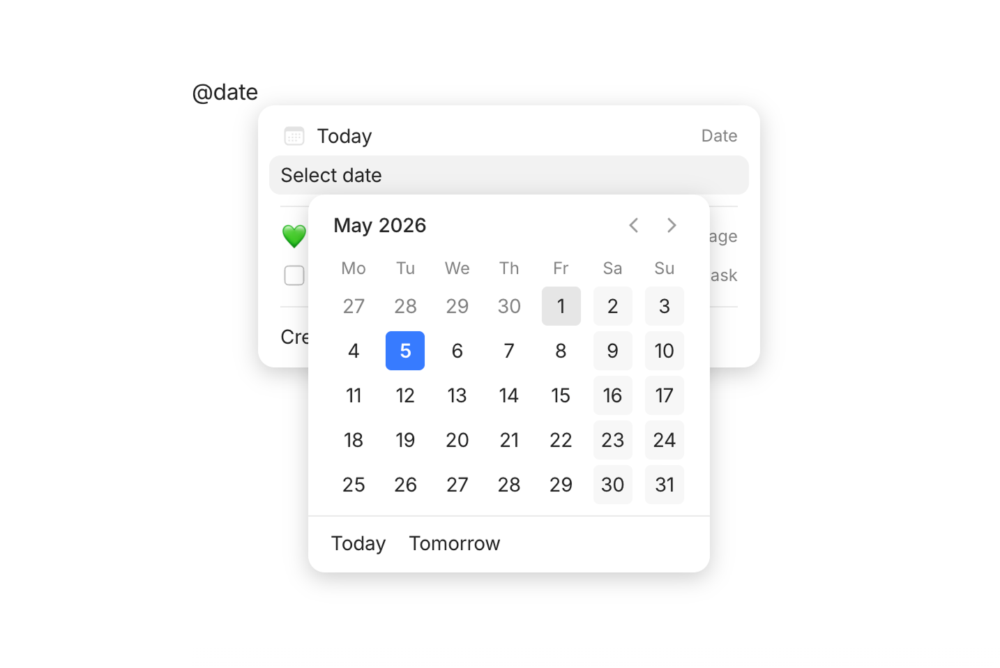
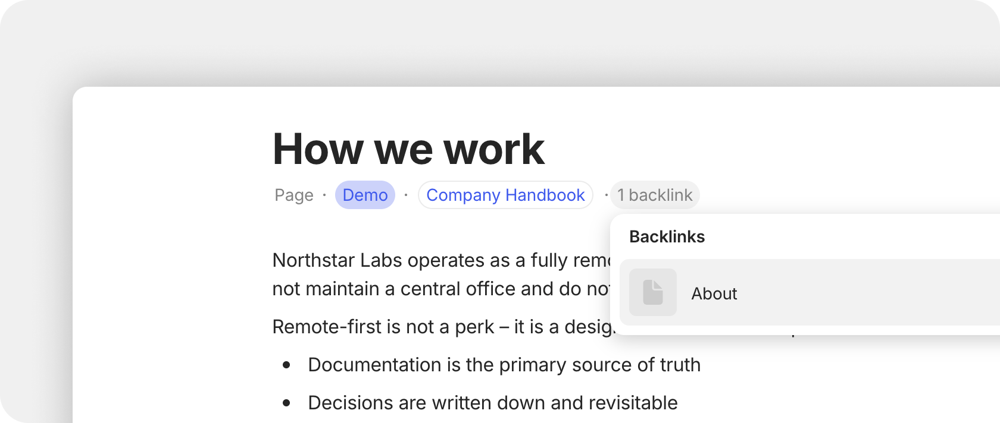

# Links

### Why link things?

Linking is what turns a collection of separate notes into a connected knowledge base. When you link Object A to Object B, you're saying "these are related" — and that relationship becomes visible in your Graph, in backlinks, and in the Flow view.

Over time, these connections become incredibly valuable. You can trace how ideas relate, see what's connected to a project, or discover patterns you didn't plan for.

### Three ways to link

Anytype offers three ways to create links, each useful in different situations:

| Method             | What it does                                       | Best for                                        |
| ------------------ | -------------------------------------------------- | ----------------------------------------------- |
| **Block Links**    | Adds a visible card or text link to another Object | Prominent references you want readers to see    |
| **Inline Links**   | Inserts a mention (@) inside your text             | Casual references within a sentence             |
| **Property Links** | Connects Objects through a typed Property          | Structured relationships (e.g., Task → Project) |

### Creating New Links

#### Link to another Object in Anytype

Directly through the editor by using:

1. **Block Links.** Type "/" to invoke a command bar, and then look for the `Link to Object` option in the menu. These can appear either as text or as cards.
2. **Inline Links**. Type @ or \[\[ to invoke the Object picker menu.

<figure><figcaption>
Link Blocks
</figcaption></figure> <figure><figcaption>
Inline Mentions
</figcaption></figure>

With Properties by assigning an Object Property Type in the Object menu.

<figure><figcaption></figcaption></figure>

#### Link to external Object on your device

If you want to add a link to an external Object on your desktop, please use the links starting with **file:///** plus the local file destination. For example:

* `file:///Users/Filip/Downloads/Protocol-Berg.pdf` — to open PDFs;
* `file:///Users/Filip/Downloads/my_budget.xlsx` — to open spreadsheets (Excel, Numbers).

To add such a link, pick up "Link to website" just like when you add a new link to a website.

#### Date mentions

It's also possible to use `@date` or `/date` to quickly open the date selection menu.

<figure><figcaption></figcaption></figure>

#### Link aliases

You can use regular links to link to a specific object in your space using a different name.

1. Write the name of your link first.
2. Select the name and press `Cmd / Ctrl + Shift + K`.
3. Search for the object you want to link, and select it.

### Checking Existing Links

#### Properties on the Graph

In your documents you may have multiple references or connections which could be attached to other work in your library. The Graph is the visualizer for this. Objects connected to other Objects, connected to Humans, or Tasks.

Learn more about [relations.md](../types/relations.md "mention") & the [graph.md](../../advanced/feature-list-by-platform/graph.md "mention") here.

#### Backlinks

You can use the Backlinks property to check which Objects link to the currently opened one.

<figure><figcaption></figcaption></figure>
