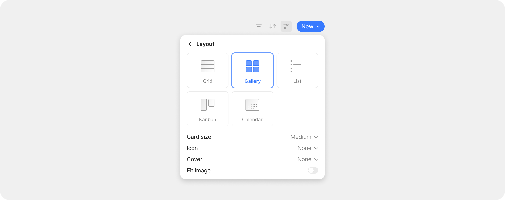
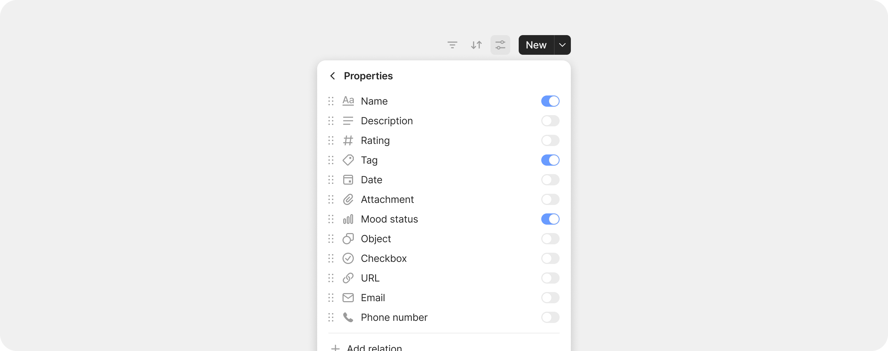

# Queries

### What is a Query?

When you create a [Type](../types/), Anytype automatically gives you a built-in Query — open the Type and you see every Object of that Type in one view. **For most people, this is all you need to find things.**

<figure><figcaption></figcaption></figure>

If you've used spreadsheet filters or smart playlists, Queries work the same way.

### When to use a Query

A **Query** is what you create when you want to go further: a filtered, sorted, custom-laid-out slice of Objects. "Tasks where Status is In Progress." "Books I've rated 4 stars or more." "Notes modified this week."&#x20;

<figure><figcaption></figcaption></figure>

Use a Query when you want to:

* **Slice a Type by Property values** — not all your Tasks, just the active ones: Task Tracker. Not all your Books, just the ones you're currently reading.
* **Create a saved filtered view** — pin "Tasks where Status = In Progress" to your sidebar so you don't filter every time.
* **Build a dashboard** — combine multiple [Inline Queries](../../advanced/feature-list-by-platform/inline-queries.md) on a single Object for an at-a-glance view of your work.
* **Cross multiple Types via a Property** — every Object that has a Date Property, regardless of Type.
* **Customize the view independently** — a Type's built-in Query has one default view; a custom Query can have many.

### How a Query is structured

Every Query has three layers:

1. **Source** — the universe of Objects to query. Either _Type_ (e.g., all Tasks) or _Property_ (e.g., all Objects with a "Reviewed" property).
2. **Filters and sorts** — narrow down and order the source.
3. **Views** — different visual presentations of the same data (Grid, List, Board, etc.).

Each Query can have multiple Views — same data, different layouts. A Tasks Query might have a Board View grouped by Status and a Grid View showing all Properties as columns. Switch between Views in one click.

### Creating a Query

#### From the sidebar

1. Click the **+** button in the sidebar.
2. Hover over **Query** and choose either **Query by Type** or **Query by Property**.
3. Pick the Type or Property to query.
4. Configure filters, sort, and view.

<figure><figcaption></figcaption></figure>

#### From the slash menu

Type `/query` in any editor to insert an [Inline Query](../../advanced/feature-list-by-platform/inline-queries.md) — a Query embedded inside another Object.

### Filters

Filters narrow your Query to Objects matching specific conditions. Each filter has:

* **Property** — which Property to check
* **Operator** — how to compare (is, is not, contains, is greater than, etc.)
* **Value** — what to compare against, including [dynamic values](../../advanced/feature-list-by-platform/advanced-filters.md#dynamic-filter-values) like Current User and This Object

Multiple filters are joined by AND by default. For OR logic, grouping, and complex conditions, see [Advanced Filters](../../advanced/feature-list-by-platform/advanced-filters.md).

### Sorts

Click the sort icon to add a sort. Pick a Property and choose ascending or descending. Multiple sorts apply in priority order — drag to rearrange.

In list views, you can also drag and drop Objects to **manually reorder** them. The order is saved per-View.

### Views

A View is one specific layout + filter + sort configuration. Every Query starts with one default View, but you can add more.

<figure><figcaption></figcaption></figure>

#### Layout types

| Layout       | Best for                                                                           |
| ------------ | ---------------------------------------------------------------------------------- |
| **Grid**     | Spreadsheet-style — every Property as a column. Best for batch editing and detail. |
| **Gallery**  | Visual cards with cover image. Best for media, books, projects.                    |
| **List**     | Compact — minimal Properties shown, more rows visible.                             |
| **Kanban**   | Board — Objects grouped into columns by a chosen Property.                         |
| **Calendar** | Date-based — Objects appear on the date of their Date Property.                    |


Kanban (Board), Calendar, and Graph views are available on desktop only.


New Queries use **Grid** as the default layout — Properties are immediately visible as columns.

#### Adding and switching Views

1. Click the View name at the top of the Query.
2. Click **+ Create New View**.
3. Pick a layout type and name the View.

Each View has its own filters, sorts, visible Properties, and grouping. Switch between Views with one click using the View tabs.

### Toggling Properties

Each View shows a subset of Properties as columns or fields. To change which Properties are visible:

1. Click the layout settings icon (or right-click a column header in Grid view).
2. Toggle Properties on or off.
3. Drag to reorder them.

<figure><figcaption></figcaption></figure>

### Editing Objects in Grid view

Grid view supports inline editing for all Property types. Click a cell to enter edit mode. Tab between cells. Multi-select with Shift + Click for bulk updates.

A toggle in **Vault Settings > Application > Preferences** controls click behavior in Grid view:

* **Click to edit** (default) — clicking the title puts you in edit mode
* **Click to open** — clicking the title opens the Object directly

### Grouping

In Grid view, group Objects by a Property:

1. Click the layout settings icon.
2. Choose **Group by**.
3. Pick a Property (Select, Multi-select, or Object Properties work best).

Each group becomes a section header with a count. With [Formulas](../../advanced/feature-list-by-platform/formulas.md) enabled, each group shows subtotals.

### Dragging Objects between Views

Drag an Object from one View to another inside the same Query. When you drop it into another View, its Properties update to match that View's filters automatically.

For example: drag a task from your "To Do" View to your "Done" View, and the Status Property updates to "Done."

### Tips


**Don't create a Query if the Type's built-in Query is enough.**&#x20;



**Save filter combinations as Views, not new Queries.** If you find yourself filtering the same Query the same way repeatedly, save it as a View. View tabs let you switch between filter configurations in one click.



**For manually-curated groupings, use a** [**Collection**](collections.md) **instead.** Queries are filter-driven; Collections are hand-picked.

