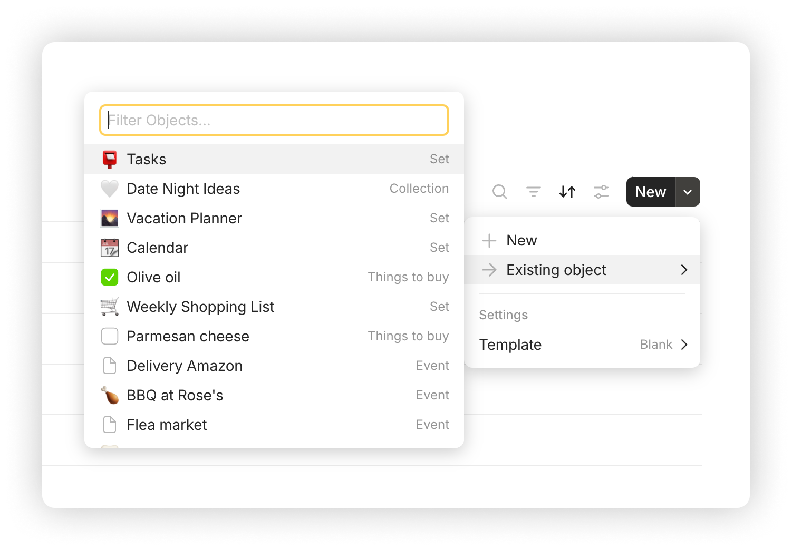

# Collections

Collections can be used to organize a variety of different objects and store them in one place.

You are not restricted to viewing only one Object Type at a time, this means you can have multiple different types within one collection.

If you are organizing your meal prep for the week, you might have a list of recipes, as well as ingredients and a shopping list.

The main types you may have could be Recipes and Ingredients.

In a Collection, you can organize all of this Types together seamlessly.


The main difference between Queries and Collections is that Queries draw Objects from your entire Graph, whereas Collections work more like a traditional database, where they start empty and you have to add Objects to them manually.


### Adding Objects

To add new Objects to a Collection, simply click on the New buttons either in the top right corner or at the bottom of a collection.

<figure><figcaption></figcaption></figure> <figure><figcaption></figcaption></figure>

To add an existing Object to a Collection while in the collection view, you can hover over the Existing object menu option under the arrow menu.

<figure><figcaption></figcaption></figure>

To add an existing Object to a Collection outside of the collection view, you can use the Add to Collection menu option from the object menu.

<figure><figcaption></figcaption></figure>
