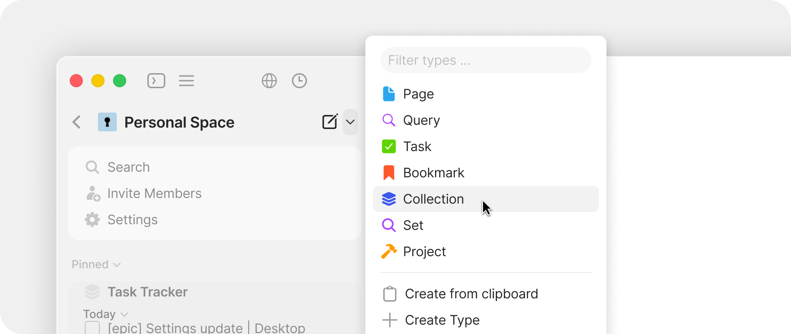

# Collections

### What is a Collection?

A **Collection** is a Channel-level container for hand-picked Objects. You decide what goes in. The Objects stay until you remove them. Different Types live side by side — a project Collection might hold tasks, notes, files, and references all in one place.

### Why Collections matter

Most things you organize don't share a clean rule. They belong together because of context: the same project, the same trip, the same person, the same theme. A Collection is the place to gather them.

Collections shine when:

* **A project mixes Types** — tasks, design files, meeting notes, references all in scope. A "Q1 Marketing" Collection holds them all without forcing them into a single Type.
* **You're curating, not filtering** — your favorite recipes, your top references, your reading list. These aren't "all books" or "books with rating ≥ 4" — they're the ones you specifically chose.
* **You want a project hub** — open the Collection and you're inside the project. Add new Objects directly. Pin it to the sidebar for one-click access.
* **You're onboarding someone** — a Collection of "everything a new team member should see" is hand-picked, not filter-defined.

### Creating a Collection

*

    <figure><figcaption></figcaption></figure>

#### From the sidebar

1. Click the **+** dropdown.
2. Choose **Collection**.
3. Name it (e.g., "Q1 Marketing").
4. The empty Collection opens. Add Objects with **+ New** or **Existing object**.

#### From the editor

Type `/collection` in any Object to insert an **Inline Collection** — embedded right inside the page. It works the same as a standalone Collection but lives within another Object.

### Adding Objects

#### Create new Objects directly

1. Open the Collection.
2. Click **New** to create a new Object inside.
3. Pick the Type — Tasks, Notes, Pages, anything.

The new Object is created in your Channel and added to the Collection in one step.

#### Add existing Objects

1. Hover over the **▾** next to the **New** button.
2. Click **Existing object**.
3. Search for any Object in your Channel and select it.

The Object joins the Collection. It still lives in its original location.

<figure><figcaption></figcaption></figure>

#### From outside the Collection

Open any Object you want to add. Click the three-dot menu > **Add to Collection** > pick the Collection.

This is the fastest path when you've already opened an Object and decide it belongs somewhere.

#### Drop a folder of files

Drag a folder of files from your operating system onto the sidebar. Anytype creates a new Collection mirroring the folder structure — files become [File Objects](../files-and-media.md) inside.

The fastest way to bring an existing on-disk archive (a photo collection, a project folder, a music library) into your Channel.

### Removing Objects

Right-click the Object in the Collection's view > **Remove from Collection**. The Object stays in your Channel — only its membership in this Collection is removed.

To delete the Object entirely, use **Move to Bin** instead. Removing from a Collection ≠ deleting.

### Views in a Collection

Collections support the same View types as Type pages: Grid, Gallery, List, Kanban, Calendar. Each View has its own layout, visible Properties, sort, and filters.

<figure><figcaption></figcaption></figure>

New Collections use **Grid** as the default layout — Properties show as columns immediately.

#### Filters within a Collection

You can apply filters to a Collection's View. Filters narrow which _members_ are shown — they don't pull in new Objects from outside the Collection. Useful when:

* A Collection has many Objects and you want to focus on a subset
* You want a Board view of just the Tasks in a mixed-Type project Collection
* You want a Calendar view of just the Date-bearing Objects

For more on filtering, see [Advanced Filters](../../advanced/feature-list-by-platform/advanced-filters.md).

### Multiple Views per Collection

A "Q1 Marketing" Collection might have:

* **Tasks (Board)** — only Tasks, grouped by Status
* **Documents (Gallery)** — only Documents, with cover images
* **All (Grid)** — everything, sortable

Switch between Views with the View tabs at the top.

### Dragging between Views

Drag an Object from one View to another inside the same Collection. When you drop it into another View, its Properties update to match that View's filters — same as creating a new Object directly there.

Drag a task from "To Do" to "Done" and its Status updates automatically.

### Full-text search in a Collection

Collections support full-text search across Object **content**, not just titles. Press Cmd/Ctrl + F inside a Collection View.

The fastest way to find "the Object I added that mentions X" without opening each one.

### Inline Collections

Embed a Collection inside another Object using `/collection > Inline`. The Collection becomes a block in the editor — add Objects to it from within that page.

This works well for:

* Project hub pages with an inline Collection of project Objects
* Reference pages with curated Object lists embedded in context
* Templates where the inline Collection holds the structure-relevant Objects

### Collections vs Queries

The two are easy to confuse, so it's worth being explicit:

|                  | Collection                              | Query                                                  |
| ---------------- | --------------------------------------- | ------------------------------------------------------ |
| Membership       | Hand-picked                             | Auto-filtered by criteria                              |
| Mixed Types      | Natural fit                             | Possible via Property queries, but not the common case |
| Adding an Object | Manual action                           | Happens automatically when the Object matches          |
| Best for         | Projects, curated lists, reading queues | Filtered slices, dashboards, "everything matching X"   |

Often you'll use both. A project Collection populated by hand, with an [Inline Query](../../advanced/feature-list-by-platform/inline-queries.md) inside it showing live status — like "Tasks in this Collection where Status = In Progress."

### Tips


**Pin project Collections to your sidebar.** A pinned project Collection acts as a project hub — one click to see everything in scope.



**Use Gallery layout for visual Collections.** Reading lists, recipe collections, photo archives benefit from cover images. Switch in the layout switcher.



**Drop folders onto the sidebar to import.** This is the fastest way to onboard an on-disk archive — Anytype creates the Collection and converts files automatically.



**Don't worry about choosing between Collection and Query right away.** You can convert in either direction later — and you can use both for the same project. Start with whatever feels natural.

