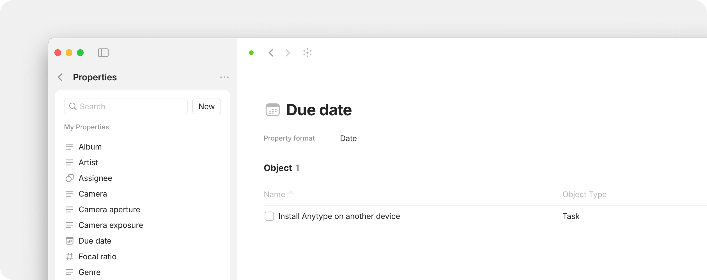
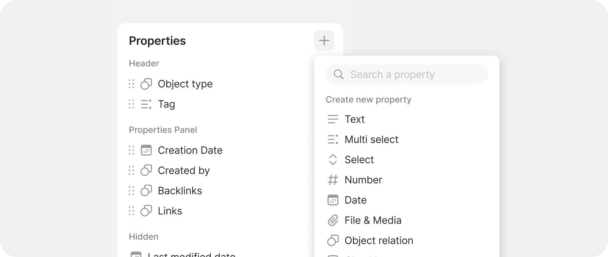

# Properties

### What are Properties?

**Properties** are the details you attach to an Object. If an Object is a "thing" in Anytype, Properties are what you know _about_ that thing — its status, due date, author, priority, tags, or any other attribute you care about.

<figure><figcaption></figcaption></figure>

### Why they matter

Properties turn your Objects from plain documents into structured data. Once your Objects have Properties, you can sort, filter, and query them — like finding all Tasks with Priority set to High, or all Books where Status is "Reading."

### How it works

Properties serve two functions:

**1. Describing an Object (attributes)** Add details like Status, Priority, Due Date, or Rating. For example, a Task might have:

* Status: In Progress
* Priority: High
* Due Date: Next Friday

**2. Connecting Objects (relations)** Link one Object to another through a Property. For example, a Task might have:

* Assigned To: → Alex (a Person object)
* Project: → Website Redesign (a Project object)

### Worked example: Setting up a reading list

Let's say you have several Book objects and want to track your reading:

1. Open any Book object and click the Properties icon (bullet list) in the top right corner.
2. Add a **Select** property called "Status" with options: Want to Read, Reading, Finished.
3. Add a **Number** property called "Rating" (1-5).
4. Add an **Object** property called "Recommended By" and link it to a Person object.
5. Now open a Type: Book. Toggle on your new Properties — you'll see them as columns, and you can sort by Rating or filter by Status.

This same pattern works for any Type: define the Properties that matter, then use Queries to slice and view your data.

### Create a New Property

#### Creating Properties from the Type Edit Menu

While editing any [Type in your Space settings](./#creating-types-from-space-settings), you can use the `+` button in the top right corner of the Properties section to either add an existing property to the current Type or to create a new one.

<figure><figcaption></figcaption></figure>

#### Creating Properties from Space Settings

Open your [space.md](../vault-and-key/space.md "mention") settings, and navigate to `Content Model > Properties`. Afterwards, simply click on `New` button to create a new Property.

From here, you can choose a name and a type for your new Property.

<figure><figcaption></figcaption></figure>

If you've decided that this Property is no longer relevant, you can use the context menu (mouse right-click) to delete the Property from your Channel.

#### Creating Properties from the Object Editor

You can add a Property to your Objects as you would with any other block in the editor: by using the `+` button or the in-line `/` menu.

<figure><figcaption></figcaption></figure>

Any Property you create from the object editor will be available for editing in your Channel settings using the steps above.

#### Types of Properties 

Here are the currently available Property types within Anytype:

* **Text**: accepts free-form text as input.
* **Number**: for all numbers. Different formats are coming soon.
* **Date**: date, with optional time.
* **Select**: categorical property with a predefined list of options. You can choose one.
* **Multi-select**: categorical property with a predefined list of options. You can choose multiple, with no limit.
* **Email/Phone/URL**: special formats for email addresses, phone numbers, or URLs.
* **Checkbox**: a boolean (true/false) value.
* **File & Media**: attach audio, video, or images to view, play, or download.
* **Object**: reference to another object, such as a person, task, or document.

### Managing Properties

You can also manage the Properties for a given Object via **Edit Type** (three-dots menu in the top right corner of any Object).

<figure><figcaption></figcaption></figure>

The Properties icon lets you view the properties of a specific object, while the Set up menu allows you to manage the properties of its Type – you can add, remove and organize them into different sections:

* **Header** properties appear in the header part of every object of that Type
* **Panel** properties are those that will be shown by pressing Properties icon
