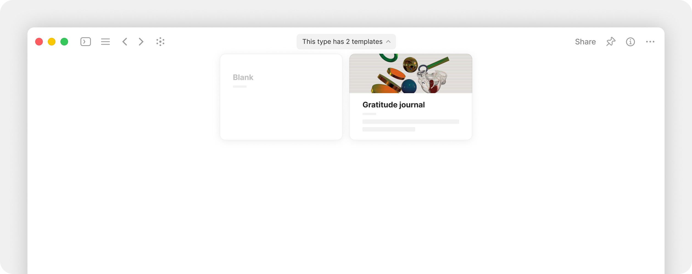
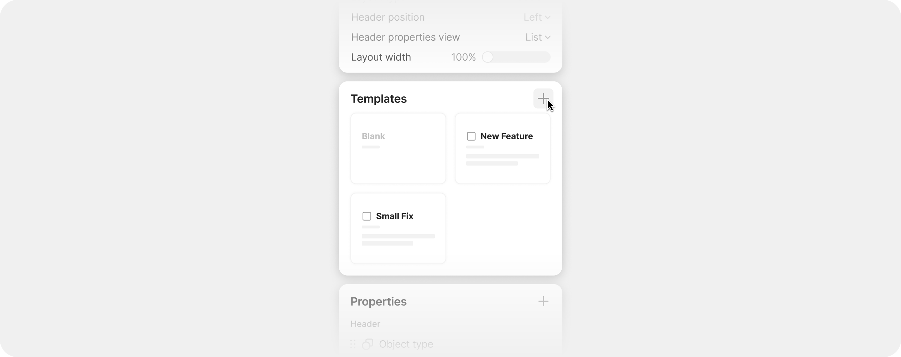
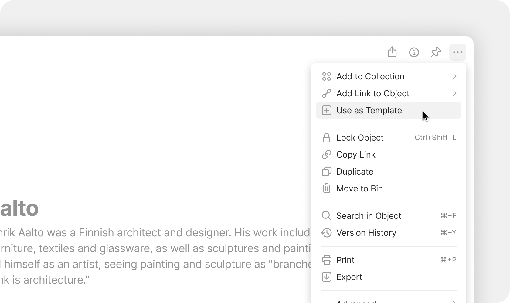
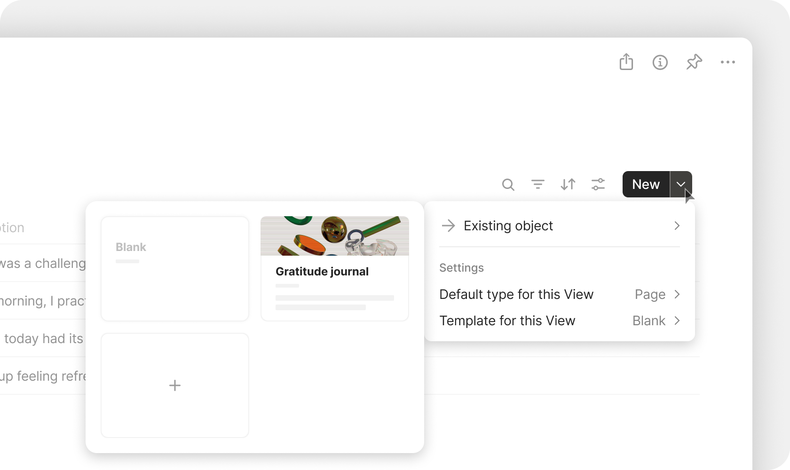

# Templates

### What is a Template?

A **Template** is a saved layout for a Type. Instead of starting every new Note, Task, or Page from a blank screen, you define what a "good starting point" looks like once — preset Properties, headings, sample blocks — and reuse it whenever you create a new Object of that Type.

<figure><figcaption></figcaption></figure>

### How it works

Templates are saved per-Type. Each Type can have:

* **Multiple Templates** — for example, a "Note" Type might have separate Templates for "Meeting Note", "Reading Note", and "Idea"
* **A default Template** — applied automatically when creating a new Object (unless the user picks a different one)
* **A default per-View Template** — for Lists, Queries, and Collections, you can set a different default Template than the Type-level default

### Creating a Template

#### From Channel Settings

1. Open **Channel Settings > Content Model > Object Types**.
2. Click the Type you want to add a Template to.
3. Find **Templates** section in the right panel.
4. Click **+** to start a new Template.
5. Give the Template a name and start adding Properties, headings, and content.

<figure><figcaption></figcaption></figure>


The Template auto-saves as you edit. Close it when you're done.


#### From the Edit Type menu

You can also manage templates directly from any Object's Editing Type menu — accessible from the three-dot menu at the top of an Object.

#### From an existing Object

If you've built an Object you'd like to reuse as a Template:

1. Open the Object.
2. Click the three-dot menu in the top-right corner.
3. Choose **Use as a Template**.
4. The Object's content (blocks, Properties, layout) is saved as a new Template for its Type.

<figure><figcaption></figcaption></figure>


The original Object is unchanged — you've made a copy as a Template.


#### From a Query, Collection, or List View

Inside any list-style view, the **+** button has a dropdown:

1. Click the **▾** next to the **New** button in the top-right.
2. The Templates picker opens.
3. Click **+** to create a new Template.

<figure><figcaption></figcaption></figure>

### Editing an existing Template

1. Open **Channel Settings > Content Model > Object Types > \[Your Type] > Templates**.
2. Click the Template you want to edit.
3. The Template opens in the editor — make your changes.

Changes apply to **future Objects only**, not Objects already created from earlier versions of the Template.

### Setting the default Template

#### Type-level default

Open the Type's Templates list and click the star (or "Set as default") next to the Template you want as the default.

<figure><figcaption></figcaption></figure>

#### View-level default

In a List, Query, or Collection View:

1. Click the **▾** next to the **New** button.
2. Hover over a Template.
3. Click **Set as default for this View**.

This Template applies when you create Objects from this specific View — overriding the Type-level default. Useful when:

* Different Views correspond to different workflows (e.g., a "Bug" View for the Issue Type uses a Bug Report Template)
* Different teams in a shared Channel want different starting structures

### Using Templates

When you create a new Object:

* **Type-default applied** — the default Template is applied automatically
* **No default** — you'll be asked to choose from available Templates

The Template Picker shows all available Templates for the Type with a preview:

<figure><figcaption>
The Template Picker
</figcaption></figure>

### Template name pre-fill

Templates can include a default name that's pre-filled into new Objects.&#x20;

To control this behavior:

1. Edit the Template.
2. In the header, you'll see a toggle between **Pre-fill name** and **Empty name**.
3. **Pre-fill name** — new Objects start with the Template's name (which you can replace by typing)
4. **Empty name** — new Objects start with a blank title, ready for you to type

Use **Empty name** when the Template's name is just for _finding_ the Template (e.g., "Daily Journal" is the Template name, but you don't want every entry to start with "Daily Journal" as the title).

<figure><figcaption></figcaption></figure>

### Multiple Templates per Type

You can have many Templates for the same Type. The Picker organizes them in the order you specify (drag to reorder in the Templates list).

Common patterns:

* **Note Type** — Templates for "Daily Journal", "Meeting Note", "Reading Note", "Idea Capture"
* **Task Type** — Templates for "Bug Report", "Feature Request", "Research Spike", "Recurring Maintenance"
* **Document Type** — Templates for "RFC", "Tech Spec", "Postmortem", "One-Pager"

### Templates and Properties

Templates can pre-set Property values:

* **Status** = "Draft" by default for new RFCs
* **Priority** = "Medium" by default for new Tasks
* **Author** = "Current User" (uses the dynamic value)
* **Tags** = pre-applied tags relevant to the Template

When you create an Object from the Template, these defaults are applied. You can override them on the new Object — the Template values are starting points, not locks.

### Duplicating Templates

To make a variant of an existing Template:

1. Open the Type's Templates list.
2. Find the Template you want to copy.
3. Click the three-dot menu > **Duplicate**.
4. The duplicate is created with " (copy)" appended to the name.
5. Edit the copy to make it your variant.

Useful for incremental refinement or for creating role-specific versions of the same base Template.

### Deleting Templates

1. Open the Type's Templates list.
2. Click the three-dot menu next to the Template > **Delete**.

The Template is removed. **Objects created from this Template are not affected** — they keep the content the Template gave them. The Template file just no longer exists for future Object creation.

### Tips


**Use "Use as a Template" after refining a real Object.** Build the layout you want on a real Object first, iterate until it's right, then save it as a Template. This is more reliable than designing a Template from scratch in the abstract.



**Set a per-View default for shared Channels.** A team Channel where one View is "Bug Tracker" and another is "Feature Requests" benefits from per-View Templates — Bug Tracker's New button uses the Bug Report Template, Feature Requests uses a different one. Members create the right kind of Object without thinking about it.

