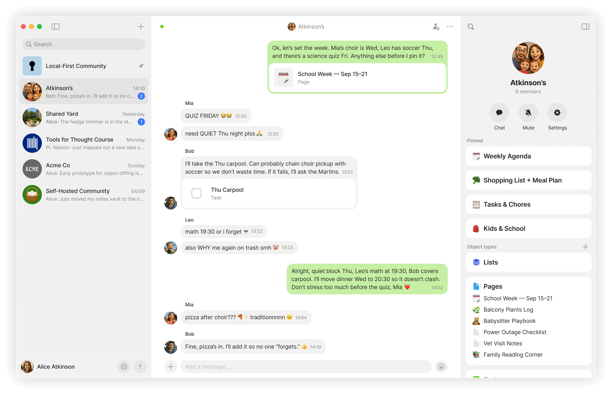

# Chats

Chat is a new type of channel in Anytype, designed for fast, conversational flow.

<figure><figcaption></figcaption></figure>

It gives you the familiar rhythm of chatting – replying, reacting, sharing files – but with a powerful twist: you can create and edit objects together in real time.

* Create Objects right from your chat window – turn thoughts into Pages, Tasks, or any other Type.
* Share existing Objects – anything you drop into Chat can be opened and edited right away.
* Keep things organized – uploads are added to the relevant Types (Audio, Images) and everything stays searchable and structured in your sidebar.
* Invite with ease – bring new members into a conversation instantly with links that don’t require approval.
