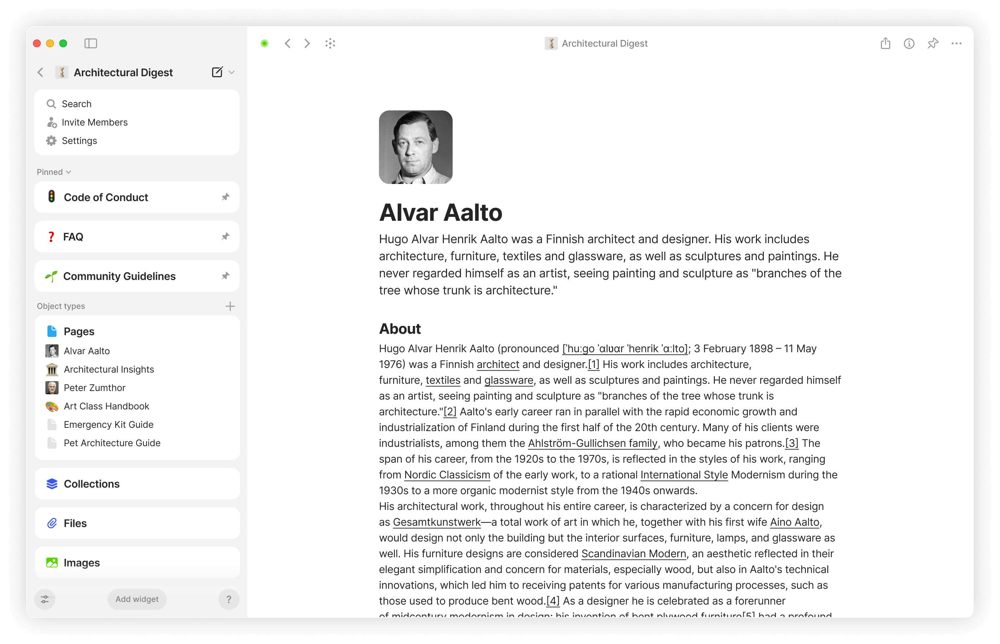

# Spaces

Inside your Vault, you have **Spaces**. A **Space** is a container for your graph of objects.

Similar to vault, space is an encrypted container. Unlike your Vault - each space has unique access rights - you can decide who has access to each space.

You’re able to create multiple separate spaces, each with their own graph of objects, sidebar, and privacy settings.

<figure><figcaption></figcaption></figure>


It's currently impossible to recover deleted spaces unless you've previously exported them, so be careful when deleting them.


Use the vault sidebar to navigate between your existing spaces.

To create a new space, simply click on the plus button at the bottom of the list.

<figure><figcaption></figcaption></figure>

If you would like to customize or delete your space, please take a look at [space-settings.md](../../advanced/settings/space-settings.md "mention").
