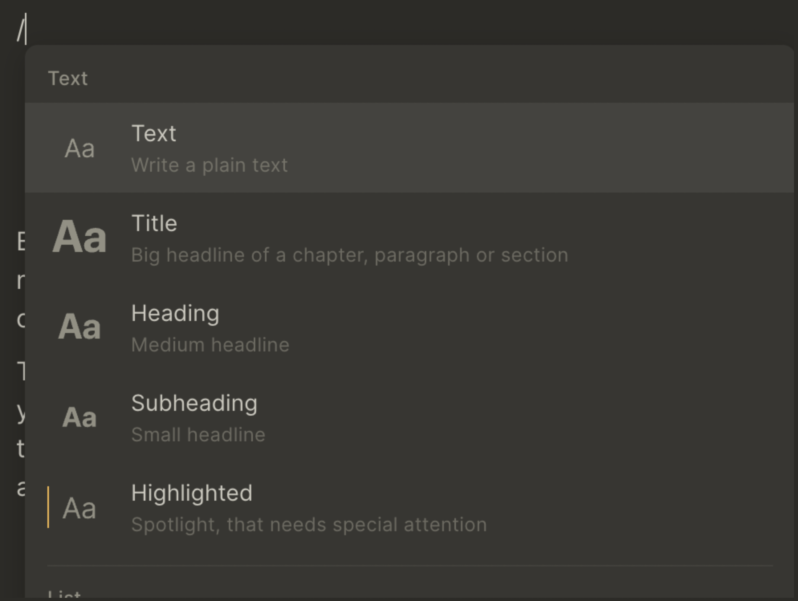
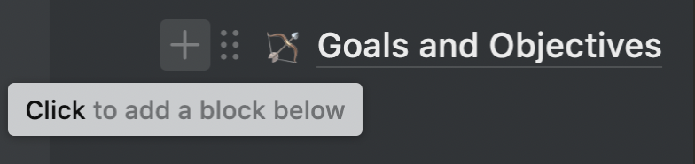
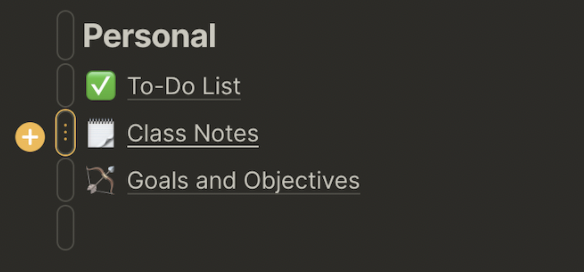
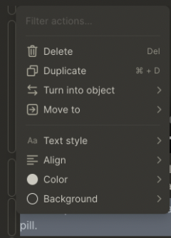
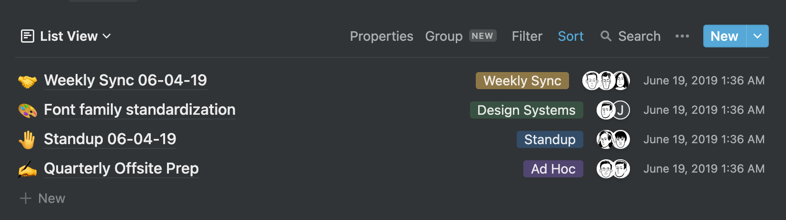
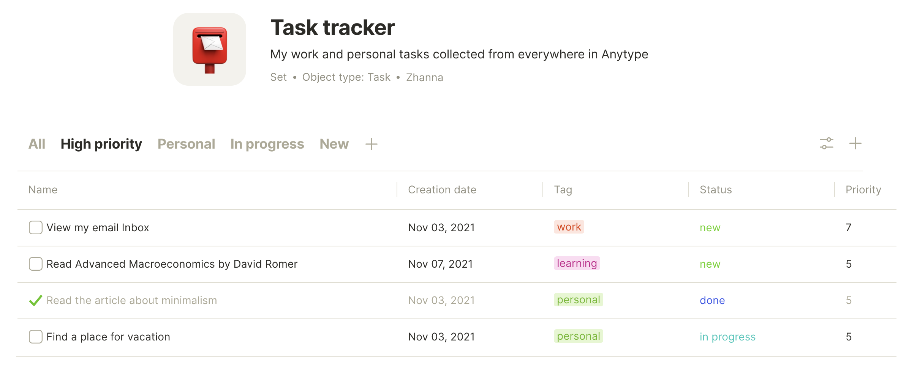
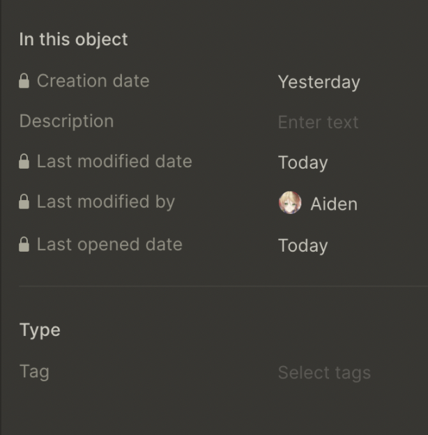
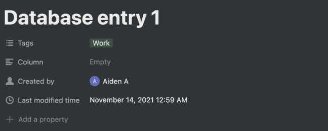

# Architecture and Fundamentals comparison

## Architecture and Fundamentals

Are you now ready to move your workflow over to Anytype? Sounds great... but there are a few things that you'll need to understand first.

Notion and Anytype operate based on two different architectures. This might sound just a bit unnerving, but once you grasp it, you'll be able to use Anytype just like you use Notion right now in no time. Read on to find out more.

## The Page Canvas and Blocks

If you've used Notion and its Pages and Blocks, you'll have no difficulty in understanding Anytype's equivalent, which is its Object Canvas and Blocks.\
Each object has a canvas, and blocks can be placed within it.

### Create a Block

Notion's command palette works almost precisely like Anytype's. Use the forward-slash `/` to open the command palette. Type to search, use the arrow keys to navigate up and down, or scroll through the list with your mouse. Press `Enter`, or click on the block type you want to create the desired block. By default, when you start typing on an Anytype object canvas, the block type will be plain text.

Want to create a block between, below, or even above another block? You'd have used the `+` button with Notion to only make a block below the current block.\

Anytype's system is more flexible. Hover over the block dragger (shaped like a pill with three dots inside it), and a `+` button will pop out to your left.\

Move your mouse over to the `+` button that just appeared, and you'll see a yellow line appear. This line indicates where your new block will be inserted. Click the `+` button, and a new block will be created where the line is located.

{% embed url="https://files.gitbook.com/v0/b/gitbook-x-prod.appspot.com/o/spaces%2FJbcKxgThRdSa4vZyLbvH%2Fuploads%2FVTJWYXHXoTKTF1AGLHx8%2Fanytypeaddingblocks.mp4?alt=media&token=7192874d-2646-4eba-8816-5c1487331302" %}

With this, you can create a block below or between preexisting blocks, but unlike Notion, you can also create a block above another block.

Click on the block dragger to see options available for a block, such as deletion and duplication.\


To see a list of all available blocks, please check [Anytype-editor](../../self-onboarding/Anytype-editor/ "mention")


### Moving Blocks

Blocks can be moved around freely around a Notion page. Similarly, blocks can also be moved freely around an Anytype page. They can go below, above, inside or even next to other blocks like a column!

To move blocks around an Anytype page, use the three-dotted dragger that appears once you hover over a block to click, then drag the block around a page - just like how'd you use the dragger in Notion. You can also select or command-click to manipulate multiple objects at once!

{% embed url="https://files.gitbook.com/v0/b/gitbook-x-prod.appspot.com/o/spaces%2FJbcKxgThRdSa4vZyLbvH%2Fuploads%2FzYx6u9uXN8wkAD9nLyhD%2Fmovingblocks.mp4?alt=media&token=778ccec5-3160-45b2-83d4-d73aa89351a9" %}

There are some differences, however. You can also indent text blocks within other blocks by directly dragging a block over another block in Anytype. You are not limited by lists only like you are in Notion.

## Hierarchy, Page Linking, and Backlinks

Notion's pages operate in a **hierarchical** manner, like your computer's file system.

In your computer's file browser, folders **store** other folders and files. You can create shortcuts (or symbolic links) to refer to these files outside the hierarchy. If you delete a folder, all the folders and files within it will be deleted, and shortcuts to those files will be broken.

Similarly, in Notion, pages **store** other pages. You can also create backlinks to refer to pages outside of the hierarchy. Therefore, if you delete a page, all the pages within it will be deleted, along with backlinks referring to that page.

{% embed url="https://files.gitbook.com/v0/b/gitbook-x-prod.appspot.com/o/spaces%2FJbcKxgThRdSa4vZyLbvH%2Fuploads%2FtYR9UVe15pmMJRh4DUzB%2Fnotionfs.mp4?alt=media&token=30624906-375e-4a09-b1e3-b4cb55dc9ff4" %}

Anytype operates in a fundamentally different manner. For example, it acts as the World Wide Web rather than working like your computer's file system.

Any website from the World Wide Web can **link** to another website. Every link is a shortcut, as links don't **store** other webpages; they just refer to them.

If you delete a webpage or a link, the web pages that it linked to won't be affected or deleted. Other shortcuts will continue to work.

Similarly, in Anytype, other objects (pages in Notion's lingo) can link to another entity. This is how you organize objects within other objects. If you delete links within an object or the object itself, the objects it linked to won't be deleted, and other links to that object in other things will continue to function.


To see which objects your current object links to and have links from, check out [navigation.md](../../how-to/navigation.md "mention"). You will see also how to use a full-featured graph showing all the links between your objects.


That's also why backlinks in Notion are not a separate link-type in Anytype - every link is a backlink from another perspective.

Relations also link objects together with another. You'll learn more about this in later sections.

#### **What does this mean for me?**

Anytype's of object linking architecture are more flexible than Notion. You may be off-put by the different architecture, but coming from a user who switched his entire workflow over from Notion to Anytype, you'll come to understand the benefits in no time.

Having objects (or pages, if that's what you prefer) not be locked inside a hierarchical silo but instead linked together in a knowledge graph brings numerous advantages. You no longer need to think about \*where\* an object belongs in your tree or where to place it. You simply link it. This allows for a much more natural flow of information than storing data inside a hierarchical note system.


If you want to read further about the advantages and disadvantages a non-hierarchical architecture brings to Anytype, [author](https://github.com/jonathan2384) highly recommends reading this article: [https://www.nayuki.io/page/designing-better-file-organization-around-tags-not-hierarchies](https://www.nayuki.io/page/designing-better-file-organization-around-tags-not-hierarchies)


## Databases

Notion's relational databases are an incredibly flexible tool to help you categorize, organize, and **store** database entries - each of which is a fully-functioning page. Of course, anytype works differently, yet, you can achieve the same (and more) with Anytype's Sets, Types and Relations.

### Sets and Relations

Anytype's equivalent to Notion's databases are Sets. However, unlike Notion databases, Sets do not **store** objects. Instead, they **show**, not store, all objects which meet a specific criteria, kind of how search works. Currently, sets can only show things with a particular type of relation. Don't know what a Relation is? We'll cover it shortly.

This makes Anytype much more flexible than Notion. For example, if you wanted to create a database with Notion, you are stuck with it. You cannot move pages outside of the database, nor can you bring pages inside a database once they have already been created (without annoying workarounds and time-wasting steps.) Instead, with Anytype, you can get **any** existing object in view with a Set.

Have trouble understanding Anytype's databases?

* <mark style="background-color:yellow;">Think of an individual Notion database within Anytype as a Type.</mark>
* <mark style="background-color:yellow;">To create a "database" in Anytype, first, create a Type, then create a new Set to show all objects of that Type.</mark>


Learn more about this theme here: [Broken link](broken-reference "mention") and [set.md](../../self-onboarding/set.md "mention")


### Relations

In Notion's databases, you may be familiar with properties, which are attributes connected to each database entry to describe it.

In Anytype, relations (Anytype's equivalent of properties) are applied to individual database entries and applied to **every single object**. [relation.md](../../self-onboarding/relation.md "mention")s describe each Object. Many Notion properties are also applicable to Anytype's relations, such as `tags`, `URL`, `phone number`, `last modified by`, `descriptions`, `checkboxes`, and more.

Relations can be defined for a Type. This is the equivalent of using the `+` button in a Notion database to create a new property. All your relations will come for each new object created, and they can be configured in Type and not by properties in a particular database like in Notion\

\
You can configure a Set to show relations (properties in Notion's lingo) as columns. Furthermore, you can create different Views (like Notion) with different filtering and sorting settings based on the object's Relations.

Filtering, sorting and creating views in a Set work in a very similar manner to Notion, so you shouldn't have much trouble getting things sorted out. Check out the documentation on Sets for more information.

Have trouble understanding Relations in contrast to Notion's Databases?

* <mark style="background-color:yellow;">Consider Anytype's Relations to be Attributes within a Notion database.</mark>
* <mark style="background-color:yellow;">When you add an attribute to a Notion database, you use the</mark> <mark style="background-color:yellow;">`+`</mark> <mark style="background-color:yellow;">button to the right of the column header. Instead, in Anytype, to add an attribute to a database you can these options:</mark>
  1. <mark style="background-color:yellow;">Click the Options button at the top-right corner and press</mark> <mark style="background-color:yellow;">`+`</mark> <mark style="background-color:yellow;">to get existing relation or create a brand new one. This will end with exactly the same thing — Anytype will add a column</mark>
  2. <mark style="background-color:yellow;">Open the Library (square menu on the home screen) and click on the "Types" tab. Create new desired Type and add attributes - known as relations in Anytype's lingo.</mark>
     * <mark style="background-color:yellow;">Click "Create", then select Set of object to create a database view — you will see all the relations from Type as a columns. And additionally all of them will become accessible in object</mark> <mark style="background-color:yellow;">`/`</mark> <mark style="background-color:yellow;">menu and object's relations panel.</mark>

#### What does this mean for me?

Anytype's equivalent of Notion's databases may not seem quite as straightforward. Still, once you understand precisely how they work, they may end up being a more powerful and flexible tool than Notion's databases.

## Templates

Notion templates can provide predefined databases and several objects linked by theme.

Anytype template works for each particular object. So If you want to see several blocks, relations with values, and you want to have a repetitive structure, it will be helpful for you.
