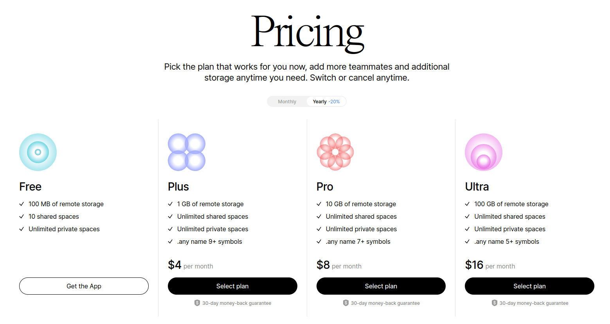

# Syncing & P2P

In the current alpha, all your data primarily syncs to the encrypted backup node. All data storage is at **no cost** to you. The application is always connected to the backup node and cannot be disconnected.

#### Local backups

Anytype is offline-first and our backup nodes are still in early testing (we can’t guarantee data recovery in 100% cases yet), it may be a good idea to do a regular backup of your Anytype folder (bottom-right question mark → Status → Folder path) to some safe place or with markdown Export.

#### Page history

We have history of the document changes that you can use you lose some data, you can restore previous versions. Overall risk of losing some data because of the bug is marginal/non existent. The only part that we can’t guarantee is total recovery from our backup node. It’s still in testing mode an Alpha.

### Syncing. How it works?

All objects are syncing separately. You can have 1 object in the actual state while another being downloading. Every object syncs with all historical changes being merged together. You can work being offline, with different devices, different document states.

The app will transfer small chunks (those changes) of data that will build the document back in forth to devices and backup node. When you open the document not in its actual state, you just need to wait.

Later we will introduce more features bringing transparency into syncing.

### P2P

We transfer objects directly between devices and backup node. That means that you can use the app on several devices in one network without a connection to worldwide web. Interconnections trying to establish with all devices being used with time intervals and if connected then checking changes, transfer data online. We can't broadcast every used device every second, so it can take some time to retrieve data from another device (restarting the app can help).

### Status

* Status `Synced` is shown when: The app is backed on one node at least. If the app retrieved that no changes were made
* Status `Syncing…` is shown when: For backup node: upload, download, pinning of files happening. For devices (direct interconnection): upload, download
* Status `No connection` is shown when: Anytype node doesn't connected. You can send the data directly between devices.
* Status `Not syncing` is shown when: The app failed to sync. It can be network problems or bugs.
* Status `Preparing...` is shown when: Warming up and initializing synchronization.

Overall status (for an object):

* If the Object is not fully synced with some device or backup node and something is syncing (like device) → then it is in `Syncing…` state

### Troubleshooting

If you encounter an error during sync:

You will need to send us the «Object diagnostics» for debug. They can be found in the menu bar under the file option. «Object diagnostics» are **confidential**. Please send it to support@anytype.io.

## Future Plans

In the future, we plan on giving users more control over the sync functionality. Some of the features that we are going to implement:

* [ ] Sync Control Options
* [ ] The Precise status of each Object
* [ ] The Naming of Sync Devices
* [ ] Ability to toggle sync for specific pages and objects
