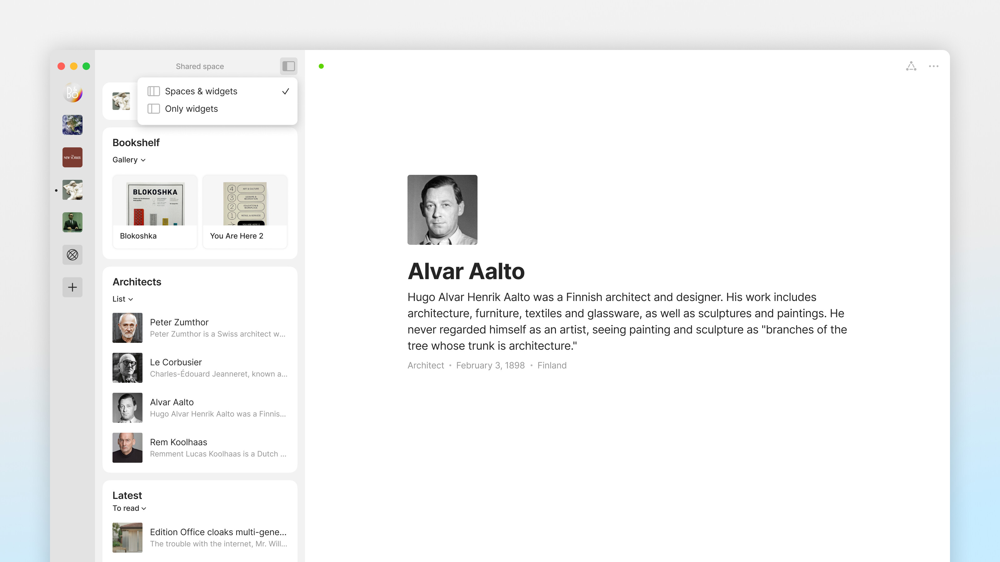

# Боковая панель и виджеты

Ваша боковая панель состоит из настраиваемых виджетов, которые позволяют вам просматривать и навигировать по вашим Объектам.

По умолчанию ваша боковая панель включает виджеты, которые ссылаются на вашу [Библиотеку](../anytype-library.md) и Корзину.

В общем, _любой_ объект, созданный с помощью редактора Anytype, может быть использован как виджет и отформатирован с помощью ссылочного или древовидного представления. Наборы и Коллекции - Объекты сами по себе - могут использоваться как виджеты со списком содержащихся в них объектов.

Кроме того, Anytype предоставляет несколько опций для _необъектных_ виджетов, которые вы можете добавить или удалить с вашей боковой панели, включая:

* Избранное: Все объекты, которые вы отметили как избранные, независимо от типа объекта
* Наборы: Все объекты типа Набор
* Коллекции: Все объекты типа Коллекция
* Недавно отредактированные: Ваши недавно отредактированные объекты (глобально синхронизируются между устройствами)
* Недавно открытые: Ваши недавно открытые объекты (специфичны для устройства)


[simple-dashboard.md](../../use-cases/simple-dashboard.md)


### Боковая панель пространства

Мы также недавно добавили новую боковую панель, которая позволяет быстро получать доступ к любым из ваших пространств.

<figure><figcaption></figcaption></figure>

### Настройка виджетов на боковой панели

В нижней части вашей боковой панели вы найдете кнопку "Редактировать виджеты", нажав на которую, вы сможете добавить или удалить виджеты с вашей боковой панели.

При нажатии "Добавить" вы сможете выбрать источник виджета. Источником виджета может быть любой объект, который вы ранее создали, или из списка опций виджетов выше.

На настольном компьютере вы также можете перетаскивать объекты прямо на боковую панель.

### Настройка внешнего вида виджетов

В зависимости от источника виджета, вы можете выбрать из множества макетов.

Можно просматривать виджеты, созданные из одного объекта, созданного в редакторе (Страницы, Заметки и т. д.), в виде "ссылки" или "дерева". Виджет ссылки отображает только название объекта, в то время как виджет дерева отображает все объекты, связанные с исходным объектом через соединения первой и второй степени.

<figure><figcaption>
Выше, виджет 'Self' отображается в древовидном представлении, тогда как виджет 'Home' отображается в виде ссылки.
</figcaption></figure>

При создании виджетов из наборов и коллекций, вы увидите варианты просмотра в виде "Списка" или "Компактного списка". Оба варианта отображают превью объектов, содержащихся в данном наборе/коллекции, с разницей в межстрочном интервале и предварительных описаниях.

<figure><figcaption>
Выше, виджет 'Disco Room' отображается в виде компактного списка (сверху) и списка (снизу).
</figcaption></figure>

Теперь вы также можете просто выбрать "Просмотр" в настройках просмотра виджета, чтобы ваш виджет следовал макету просмотра Набора. В настоящее время поддерживаются следующие макеты: Календарь, Канбан и Галерея (Граф скоро появится!).&#x20;

<figure><figcaption></figcaption></figure>

### Мобильные виджеты

#### Организация виджетов

Когда вы откроете Anytype на своем мобильном устройстве, вы увидите свои текущие **Виджеты** вместе с 3 параметрами навигации внизу.

Ваши **виджеты** настраиваются так же, как и на боковой панели вашего настольного приложения.

Чтобы редактировать и перемещать виджеты: прокрутите вниз список, под Корзиной вы найдете "Редактировать виджеты".

Когда вы нажмете на кнопку, в углу каждого блока появится маленький серый минус. Теперь вы можете удалять, добавлять или переставлять виджеты.

#### Использование виджетов

Для настройки и оптимизации мобильного использования Anytype, виджеты - ваш лучший друг.

Настройка виджетов для мобильных устройств позволяет вам создавать быстрый доступ и управлять вашими предпочитаемыми объектами для посещения.

Добавьте определенные Объекты наверх для быстрого доступа.

Добавьте Наборы в свои виджеты, например, менеджеры задач для быстрого просмотра того, что нужно сделать дальше.
