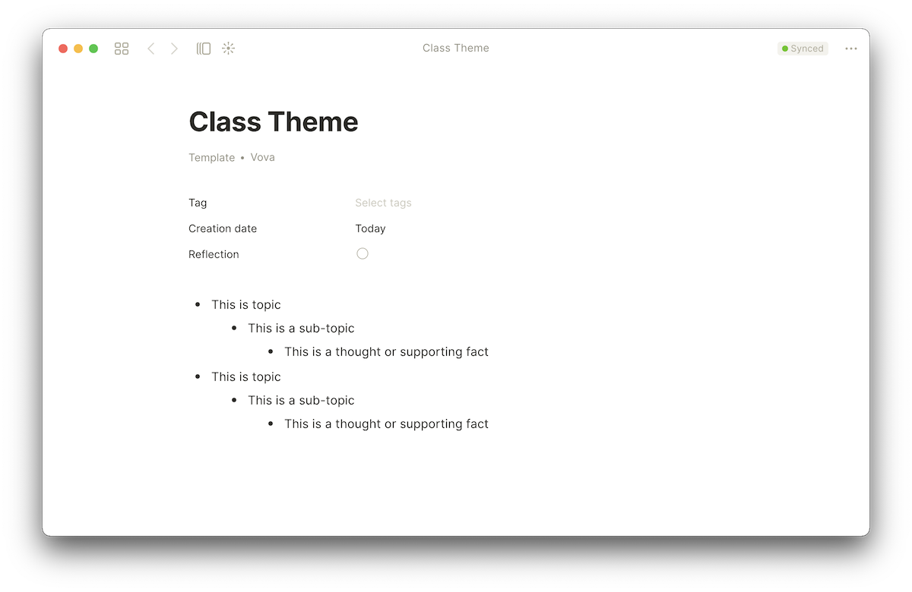

# Outline note-taking method

The Outline method is one of college students' most popular note-taking methods. It lets you organize your notes in a structured form. This method requires you to structure your notes in the form of an outline by using bullet points to represent different topics and their subtopics. Start writing main topics on the far left of the page and add related subtopics in bullet points below using the indents.&#x20;

The next few steps will explain step by step how to organize your Anytype notes using the Outline method by creating a new Object type, template, and set.


The outlining method emphasizes content as well as relationships between the material. It reduces the time needed for editing and allows for easy reviewing. [Click here for more information](https://e-student.org/outline-note-taking-method/)


### Add Outline Note type

1. Go to the Library and click the "Create a new type" button.​​​ By using a new type, you can customize templates and relations the way you want. Fill in the Type Title and choose the Icon you want\
    ​
2. Customize our type by adding your own Relations and choosing a layout. If you want to use a Title, you need to choose a Basic layout. Otherwise — Note. Due to the [Ebbinghaus forgetting curve](https://e-student.org/ebbinghaus-forgetting-curve/), it's always best to start the reciting and reviewing stage as soon as possible. Studies have shown that reviewing your notes within the [24-hour point](https://journals.plos.org/plosone/article?id=10.1371/journal.pone.0120644) achieves the best results. So we also propose to have a "Reflection" relation and "Tag" for categorization  ​​\
   ​

### Create Outline Note template

1. Press `+ New` button to create a new template for Outline Note type. Every template in Anytype can be used only within a Type. You can fill the content there and also add relation blocks to the canvas by typing `/` or by clicking `+` button. \
    
2. Fill in the canvas with Outline Method text structure.&#x20;
   * The **main topics** are recorded on the left side of the document;
   * The **subtopics** are added with an indent to the right of the main topics;
   * Any **supporting thoughts or facts** are added with another indent to the right of the subtopics;
   * All **further details** are added with more indentation.


You can add Tag under the Title by clicking ★ next to the relation in the relations panel. Check [#adding-relations](../../fundamentals/relation.md#adding-relations "mention") for that.


### Create a Set

So now we need to set up a home for all Outline Notes. Use [set.md](../../fundamentals/set.md "mention") for that.

You need to create a new Set from the Home screen. Sets collect all objects by given criteria. For this case, it's like **Type** == **Outline Note**. If you will add a new Outline Note anywhere inside the Anytype, and it will be shown here! Fill in the `Source` with "Outline Note" type. \
​​​ ​


Sets help you sort through and create specific database-like views to work with many objects at once. Read how [#sets-and-relations](../../migrating/start/fundamentaldifferences.md#sets-and-relations "mention") perform in comparison to Notion Databases


### Customize your workflow 

All the Outline Notes will be collected in the set. So you can create a flow to memorize them better. If you neglect your notes for a whole week after taking them, you'll lose out on a lot of retention and memorization. So let's create a View for that.

1. Add  "Reflection" relation and "Tag"  to the Set. Create a view calling "Inbox"\
    &#x20;
2.  Add filter "Reflection" is unchecked. You can also add filter by Creation Date, so you will see only newly created. You can review all your Outline Method notes in one place

    


1. You can add more templates and use them in different contexts
2. You can also change your default type in Settings to create every object with Outline Note by default

