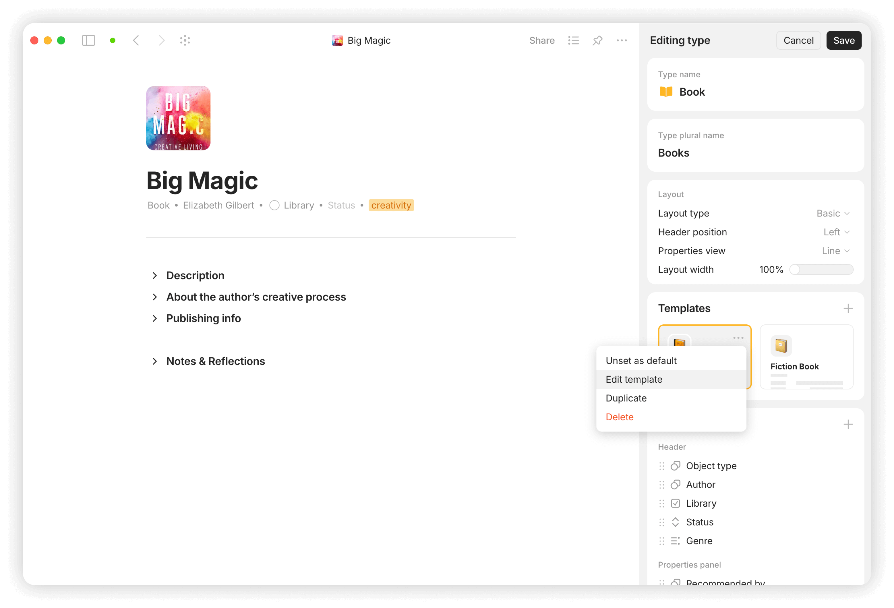

# 🗨️ Language Flashcards


You can import this use case to your space using this [link](https://gallery.any.coop/?experience=language_flashcards).


<figure><figcaption></figcaption></figure> <figure><figcaption></figcaption></figure> <figure><figcaption></figcaption></figure>

For more use cases, please check out our [ANY Experience Gallery](../advanced/community/any-experience-gallery.md). You can either access it directly from the app by navigating to the bottom of your spaces sidebar or by clicking [this link](https://gallery.any.coop/).
